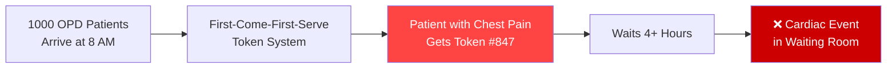
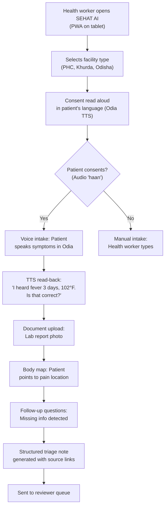
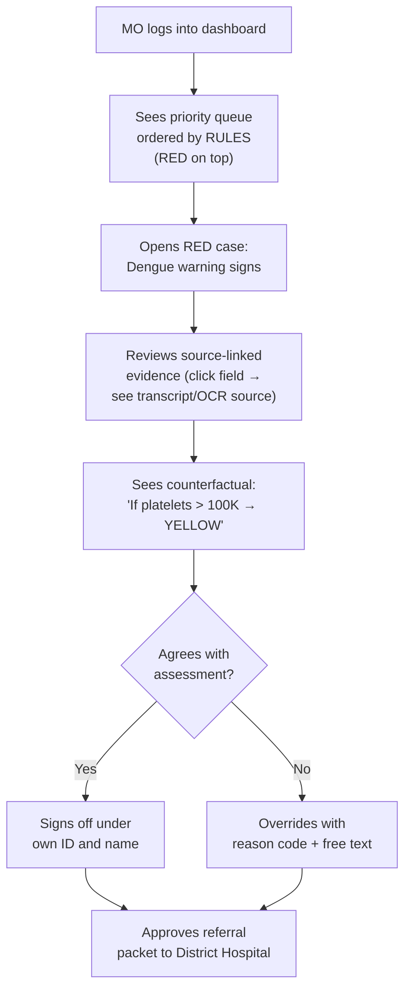
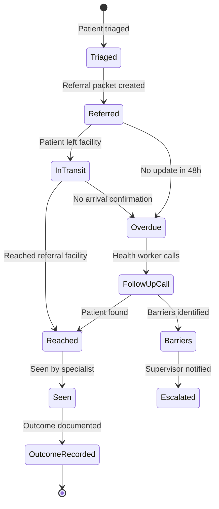

# SEHAT AI — Product Requirements Document (PRD)

> **Version:** 1.0 | **Date:** September 2026 | **Status:** Approved
> **Architecture Source:** [SEHAT AI v5.0 Final Architecture](sehat_ai_final_architecture__2.md)

---

## 1. Overview & One-Line Pitch

> *"Earlier virtual clinicians optimised diagnostic accuracy. We optimise safe handoff — with every field traced to its source, every urgency set by published Indian protocols, and every referral tracked to closure."*

**SEHAT AI** is a rules-first, evidence-linked, multimodal clinical handoff engine that helps government hospitals, primary health centres, public health camps, company clinics, industrial-estate health units, and campus health centres summarise patient-provided symptoms, uploaded reports, and basic visual inputs into a structured triage note for qualified human review.

**It is NOT a diagnostic tool.** It is an administrative triage support system that organises patient data for doctors — faster, safer, and with full traceability.

---

## 2. Problem Statement

### What PS03 Actually Asks

The hackathon problem statement (PS03) asks for a system that works across **6+ facility types** with varying infrastructure — from well-equipped hospitals to rural camps with no internet.

| Requirement (from PDF) | What It Actually Means | Priority |
|:---|:---|:---:|
| Summarise patient-provided symptoms, uploaded reports, and basic visual inputs into a structured triage note | **Multimodal input** (text + voice + images/OCR) → **Structured output** (not free text) | 🔴 Critical |
| For qualified review | **Human-in-the-loop is NON-NEGOTIABLE** — AI assists, human decides | 🔴 Critical |
| India-wide contexts where patient load, language diversity, specialist availability, and digital maturity vary significantly | Must handle: 22+ languages, low-literacy users, offline/low-connectivity, massive OPD volumes | 🔴 Critical |
| Explicitly non-diagnostic | **HARD CONSTRAINT: Must NEVER diagnose or prescribe** (TPG 5.4, ICMR 2023) | 🔴 Critical |
| Highlight urgency signals | Red-flag detection for emergencies | 🔴 Critical |
| Collect symptoms through text or voice | Voice input = Speech-to-Text in Indian languages | 🟡 High |
| Extract key details from sample medical reports | OCR for lab reports, prescriptions — **data extraction for doctors**, not diagnosis | 🟡 High |
| Summarise timelines, identify missing information | AI must detect GAPS — *"you mentioned fever but didn't say how long"* | 🟡 High |
| OCR for lab reports | Read printed/handwritten medical documents | 🟡 High |
| Translation between English/Hindi/regional languages | Real-time multilingual translation layer | 🟡 High |
| Risk-category tagging, queue prioritisation | AIIMS Red/Yellow/Green triage + priority queue | 🟡 High |
| Reviewer dashboard | Doctor/nurse-facing UI for reviewing AI assessments | 🟡 High |
| Referral preparation | Generate structured referral notes for higher facilities | 🟢 Medium |

### The Core Insight

> **PS03 asks for a safe clinical handoff engine, not an AI diagnostician.** 45% of the marks go to safety-first workflow, human review and escalation, and privacy controls. The brief explicitly rules out diagnosis and prescription.

---

## 3. Indian Healthcare Crisis — Hard Numbers (2026)

| Metric | Statistic | Source |
|:---|:---|:---|
| Doctor-Patient Ratio | **1:778** (improved from 1:1,456 in 2020, still inadequate in rural areas) | WHO/NMC July 2026 |
| Government OPD Load | **500–1,000 patients per session** in major govt hospitals | PGIMER Annual Report |
| Average Consultation Time | **2–4 minutes** per OPD patient | Lancet India Study |
| ABHA IDs Created | **97.8+ crore** (digital health identities) | ABDM Dashboard 2026 |
| Internet Connectivity (Rural) | Spotty — many PHCs have intermittent 2G/3G only | TRAI 2025 |
| Digital Literacy (Rural) | ~38% of rural adults can use a smartphone app | NSO Survey |
| Odisha CHC Specialist Vacancies | **74%** of specialist posts vacant | NITI Aayog |

### What Happens Without AI Triage?

**SEHAT AI ensures the chest pain patient is seen FIRST, regardless of token number.**

---

## 4. Target Users & Facilities

### Facility Types

| Facility Type | Infrastructure | Typical Staff | Key Challenges |
|:---|:---|:---|:---|
| **Government Hospital OPD** | Good connectivity, basic IT | Doctors, nurses | 500+ patients/day, 2-4 min consultations |
| **Primary Health Centre (PHC)** | Intermittent connectivity | Medical Officer, ANM | Limited specialists, referral dependency |
| **Community Health Centre (CHC)** | Variable | Specialists (often vacant) | 74% specialist vacancies in Odisha |
| **Public Health Camp** | No internet, battery-powered | Health workers, ANMs | Offline-only, low-literacy patients |
| **Company/Industrial Clinic** | Good connectivity | Occupational health staff | Hazard-specific triage, regulatory compliance |
| **Campus Health Centre** | Good connectivity | Campus doctor, nurse | Outbreak detection, ILI surveillance |

### User Roles

| Role | Interaction Mode | Key Needs |
|:---|:---|:---|
| **Patient** | Voice (Odia/Hindi/English), touch, body map | Low-literacy friendly, consent in own language |
| **Health Worker / ANM** | Assisted mode (operates device for patient) | Guided workflow, structured intake, offline |
| **Medical Officer (MO)** | Reviewer dashboard | Priority queue, source-linked evidence, sign-off |
| **District Supervisor** | Overview dashboard | Governance telemetry, overdue referrals, override rates |

---

## 5. Goals & Success Metrics

### Primary Goals

1. **Reduce triage time** from unstructured (token-based) to structured (urgency-based) priority
2. **Ensure zero missed critical cases** through deterministic red-flag detection
3. **Provide source-linked evidence** for every field in the triage note
4. **Track referrals to closure** — know if the referred patient actually reached the specialist
5. **Work offline** in health camps and rural PHCs with intermittent connectivity

### Success Metrics (Hackathon Evaluation)

| Criterion | Weight | Target | Our Approach |
|:---|:---:|:---:|:---|
| **Safety-first triage workflow** | **20%** | 19/20 | AIIMS Protocol (96.2% sensitive) + NEWS2 + qSOFA. LLM may only RAISE urgency. |
| **Extraction & summarisation quality** | **20%** | 18/20 | Source-linked notes. MAKER voting on critical values. Structured JSON extraction. |
| **Multimodal capability** | **15%** | 15/15 | Silero VAD → STT → Dakshini (Odia). Chandra OCR. MedGemma. Body map. Read-back confirmation. |
| **India-wide facility relevance** | **15%** | 14/15 | 7 scenario rule packs. Assisted mode. PWA offline-first. FHIR R4 + SNOMED. |
| **Human-review & escalation** | **15%** | 14/15 | Priority queue by RULES. Named sign-off. 3-min RED escalation timer. |
| **Privacy & responsible AI** | **10%** | 9/10 | Presidio PII redaction. NeMo Guardrails. DPDP-ready design. Tamper-evident audit. |
| **Demo quality** | **5%** | 5/5 | Odisha PHC: Odia voice → OCR → triage → sign-off → referral with closure tracking. |
| **TOTAL** | **100%** | **94/100** | |

---

## 6. Non-Goals

The following are **explicitly out of scope** and must be avoided:

| Non-Goal | Why |
|:---|:---|
| ❌ Diagnosis or prescription | Illegal under TPG 5.4 and ICMR 2023. Hard architectural constraint. |
| ❌ "AI Doctor" framing | Cognizant moved away from this in 2026. Use "triage-support note", "urgency signals". |
| ❌ Claiming diagnostic accuracy | No valid basis. Report honest metrics on synthetic test sets only. |
| ❌ Free-chat symptom collection | Oxford 2026 RCT: lay users with LLM did NO BETTER than control. Use protocol-driven intake. |
| ❌ LLM-ordered priority queue | Introduces AI bias. Rules engine orders the queue. |
| ❌ LLM lowering urgency flags | ESI under-triages 3.3%; bias worsens for minorities. LLM may only RAISE. |
| ❌ Interruptive alerts for everything | Clinicians accepted only 9.2% of drug-interaction alerts. Only RED interrupts. |
| ❌ Storing raw audio after sign-off | DPDP data minimisation. Delete after reviewer sign-off. |
| ❌ Sending unredacted PII to cloud APIs | Presidio redaction BEFORE any Azure OpenAI call. |
| ❌ Claiming DPDP compliance | Substantive duties start May 2027. Say "DPDP-ready by design". |
| ❌ Claiming CDSCO clearance | Research prototype. Say "not clinically validated". |
| ❌ Comparing against doctors | No valid basis for the claim. |

---

## 7. Core User Journeys

### Journey 1: Patient Intake (Health Worker Assisted)

### Journey 2: Medical Officer Review

### Journey 3: Referral Closure Tracking

---

## 8. Functional Requirements

### FR-1: Multimodal Input Capture

| ID | Requirement | Priority |
|:---|:---|:---:|
| FR-1.1 | Accept voice input in Odia, Hindi, and English with VAD-based speech detection | 🔴 Critical |
| FR-1.2 | Provide TTS read-back confirmation of extracted numbers and values | 🔴 Critical |
| FR-1.3 | OCR printed lab reports with table extraction | 🟡 High |
| FR-1.4 | OCR handwritten prescriptions with drug name validation (RxNorm) | 🟡 High |
| FR-1.5 | Accept medical images (X-ray, ECG, wound photos) and describe visual findings (not diagnose) | 🟡 High |
| FR-1.6 | Interactive body map for symptom location selection | 🟡 High |
| FR-1.7 | Text/form-based manual input as fallback | 🟡 High |

### FR-2: Triage & Rules Engine

| ID | Requirement | Priority |
|:---|:---|:---:|
| FR-2.1 | Implement AIIMS Red/Yellow/Green triage protocol | 🔴 Critical |
| FR-2.2 | Calculate NEWS2 scores when full vital set available | 🔴 Critical |
| FR-2.3 | Calculate qSOFA when infection suspected | 🟡 High |
| FR-2.4 | Support 7 scenario-specific rule packs (OPD, Maternal, Chronic NCD, Health Camp, Campus Fever, Occupational, Referral) | 🟡 High |
| FR-2.5 | LLM may only RAISE urgency, never lower it | 🔴 Critical |
| FR-2.6 | Missing vitals resolve to "needs human review", never "normal" | 🔴 Critical |

### FR-3: Extraction & Summarisation

| ID | Requirement | Priority |
|:---|:---|:---:|
| FR-3.1 | Extract into strict JSON schema (not free text) | 🔴 Critical |
| FR-3.2 | Link every extracted field to its source (audio timestamp, OCR bbox, manual entry) | 🔴 Critical |
| FR-3.3 | Detect missing required fields per scenario and generate follow-up questions in patient's language | 🟡 High |
| FR-3.4 | MAKER voting on critical values (hemoglobin, platelets, creatinine) | 🟡 High |
| FR-3.5 | Map extracted entities to SNOMED-CT codes | 🟢 Medium |

### FR-4: Human Review & Escalation

| ID | Requirement | Priority |
|:---|:---|:---:|
| FR-4.1 | Priority queue ordered by rules engine (not LLM) | 🔴 Critical |
| FR-4.2 | Named sign-off (reviewer identified by ID and name) | 🔴 Critical |
| FR-4.3 | Edit logging — every change tracked | 🟡 High |
| FR-4.4 | Override requires structured reason code | 🟡 High |
| FR-4.5 | 3-minute escalation timer for unacknowledged RED cases | 🟡 High |
| FR-4.6 | Counterfactual explanations ("If X were different, urgency would be Y") | 🟡 High |

### FR-5: Referral & Closure

| ID | Requirement | Priority |
|:---|:---|:---:|
| FR-5.1 | Generate structured referral packet with flags, evidence, and transport plan | 🟡 High |
| FR-5.2 | Track referral status (referred → in transit → reached → seen → outcome recorded) | 🟡 High |
| FR-5.3 | Overdue alerts when no update received within 48 hours | 🟡 High |
| FR-5.4 | FHIR R4 bundle export for interoperability | 🟢 Medium |

### FR-6: Privacy & Safety

| ID | Requirement | Priority |
|:---|:---|:---:|
| FR-6.1 | Layered consent in patient's language with TTS read-aloud and audio confirmation | 🔴 Critical |
| FR-6.2 | PII redaction (Presidio + India patterns) BEFORE any cloud LLM call | 🔴 Critical |
| FR-6.3 | Non-diagnostic language filter (block "diagnosed with", "prescribe", etc.) | 🔴 Critical |
| FR-6.4 | Tamper-evident audit log (hash-chained SHA-256) | 🟡 High |
| FR-6.5 | Prompt injection detection and blocking | 🟡 High |
| FR-6.6 | Data retention countdown — raw audio/images deleted after sign-off | 🟡 High |

---

## 9. Non-Functional Requirements

| Category | Requirement | Target |
|:---|:---|:---|
| **Latency** | Triage rules evaluation | < 200ms |
| **Latency** | PII redaction | < 50ms |
| **Latency** | Full pipeline (voice → triage note) | < 10 seconds |
| **Offline** | Full triage pipeline on 8GB tablet | ~3.1GB total footprint |
| **Offline** | Rules-only "Lite" mode without LLM | Always available as ICMR fallback |
| **Languages** | Primary support | Odia, Hindi, English |
| **Languages** | Translation capability | 22 scheduled Indian languages (IndicTrans2) |
| **Accessibility** | Low-literacy users | Voice-first input, TTS output, large touch targets |
| **Accessibility** | Health-worker-assisted mode | Worker operates device for patient |
| **Scalability** | OPD throughput | Handle 500+ patients/day per facility |
| **Security** | PII never reaches cloud unredacted | Presidio pre-processing enforced |
| **Availability** | PWA offline-first | Service Worker + local SQLite |

---

## 10. Constraints

### Regulatory Constraints

| Framework | Constraint | Our Position |
|:---|:---|:---|
| **TPG 2020 (Clause 5.4)** | AI cannot diagnose or prescribe | Non-diagnostic language filter, architectural enforcement |
| **ICMR AI Ethics 2023** | Mandatory human oversight, explainability | Human sign-off on every case, counterfactual XAI |
| **DPDP Act 2023** | Consent management, PII protection, right to erasure | "DPDP-ready by design" — consent flow + Presidio + retention countdown |
| **CDSCO SaMD (July 2026)** | Triage AI = Class B/C medical device | Position as "administrative triage support", mandatory disclaimer |
| **EU AI Act 2026** | High-risk AI system classification | Meaningful human oversight, counterfactual XAI, bias testing |

### Technical Constraints

| Constraint | Impact | Mitigation |
|:---|:---|:---|
| Single A100 (80GB) for cloud inference | ~36GB needed for all models | Quantisation (INT8/Q4), model scheduling |
| Rural PHCs have intermittent 2G/3G | Cannot depend on cloud | Offline-first PWA, edge models (~3.1GB) |
| Budget Android tablets at PHCs | Limited compute | Silero VAD (2MB), rules engine (100KB YAML), quantised models |
| No public Indian medical datasets | Training data scarcity | 10 public international datasets + custom synthetic data |
| 28-hour hackathon timeline | Must ship working demo | Phased plan with clear priorities (see [08_Implementation_28h_Plan.md](08_Implementation_28h_Plan.md)) |

---

## 11. Evaluation Criteria Mapping

| Criterion | Weight | What Earns Full Marks | Our Approach | Target |
|:---|:---:|:---|:---|:---:|
| **Safety-first triage** | **20%** | Deterministic rules override AI. Red flags caught even when LLM fails. No diagnosis/prescription. Missing data → "needs human review" | AIIMS Protocol (96.2% sensitive) + NEWS2 + qSOFA + scenario danger-sign packs. LLM may only RAISE urgency, never lower it. | **19/20** |
| **Extraction & summarisation** | **20%** | Every field links to source. Negations handled. Missing fields flagged. Timeline with completeness checklist. | Source-linked notes (Abridge pattern). MAKER voting on critical values. Structured JSON extraction. | **18/20** |
| **Multimodal capability** | **15%** | Voice in Indian languages. OCR of lab reports. Medical image understanding. | Silero VAD → STT → Dakshini (Odia). Chandra OCR 2 (INT8) + Surya. MedGemma (X-ray, ECG). Body map. Read-back confirmation. | **15/15** |
| **India-wide facility relevance** | **15%** | Scenario rule packs per facility. Odia/Hindi/English. Health-worker-operated mode. Offline. ABDM/FHIR. | 7 scenario rule packs. Assisted mode. PWA offline-first. FHIR R4 + SNOMED export. | **14/15** |
| **Human-review & escalation** | **15%** | Review queue, sign-off, edit logging, override reasons, urgency alerts, escalation timers, referral handoff | Priority queue ordered by RULES not LLM. Named sign-off. RED escalation timer (3 min). Lowering urgency needs reason code. | **14/15** |
| **Privacy & responsible AI** | **10%** | Consent, anonymisation, audit, role-based access, retention limits, prompt-injection defence, model card | Presidio PII → redact before LLM. NeMo Guardrails. DPDP-ready design. Tamper-evident audit log. Test evidence slide. | **9/10** |
| **Demo quality** | **5%** | One scripted end-to-end story | Odisha PHC: Odia voice → OCR → triage → sign-off → referral with closure tracking. Under 5 minutes. | **5/5** |
| **TOTAL** | **100%** | | | **94/100** |

---

## 12. Risks & Mitigations

| Risk | Likelihood | Impact | Mitigation |
|:---|:---:|:---:|:---|
| **LLM hallucination in medical context** | High | Critical | 5-layer anti-hallucination: CRAG + MAKER voting + HASSUM uncertainty + Output Guard + Human sign-off |
| **Indian ASR captures numbers poorly** (0.027-0.16 entity-dense token accuracy) | High | High | TTS read-back confirmation for every extracted number |
| **OCR errors on handwritten prescriptions** | High | High | Gödel self-verification + RxNorm cross-check + confidence-based human flagging |
| **Alert fatigue for reviewers** | Medium | High | Only RED alerts interrupt; YELLOW badge; GREEN silent |
| **Offline mode data loss** | Medium | High | SQLite local storage + encrypted sync on reconnect |
| **Prompt injection attacks** | Medium | Medium | LLM Guard pre-filter + NeMo Guardrails topic boundaries |
| **Code-mixing in Hindi/Odia** | High | Medium | Saaras V4 (code-mix optimised) + Presear Dakshini (native Odia) |
| **28-hour timeline too tight** | Medium | High | Strict phase prioritisation; P1-P8 = MVP; P9-P11 = stretch |
| **Automation bias** (doctors over-trust AI) | Medium | Critical | Counterfactual XAI + mandatory reason codes for overrides + governance telemetry |
| **Regulatory misclassification** | Low | Critical | "Research prototype" disclaimer everywhere; "DPDP-ready" not "compliant" |

---

> **Related Documents:**
> - [Features Checklist](02_Features_Checklist.md) — Prioritised feature list with evaluation mapping
> - [Technical Architecture](03_Technical_Architecture.md) — Implementation details
> - [Security & Privacy](04_Security_Privacy_Access.md) — DPDP-ready design details
> - [Demo Script](07_Demo_Script.md) — 5-minute demonstration plan
