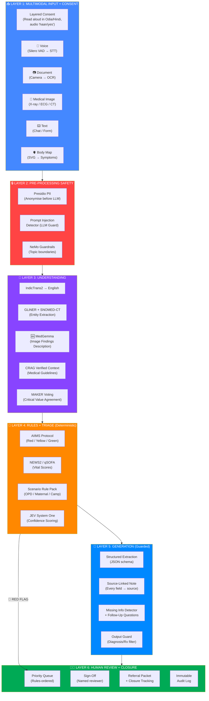
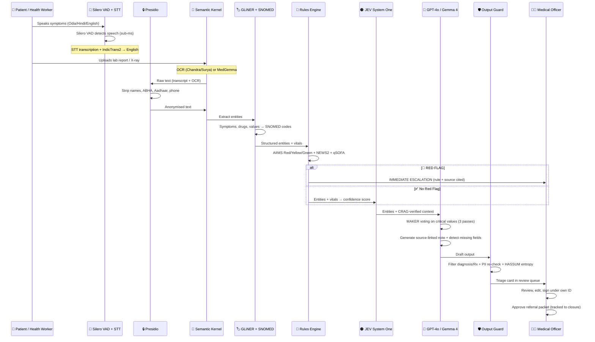
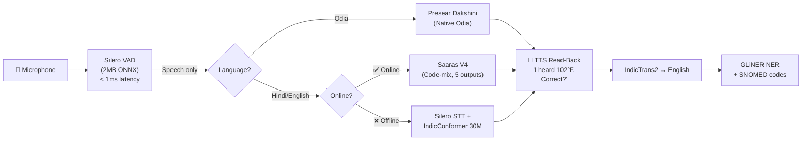
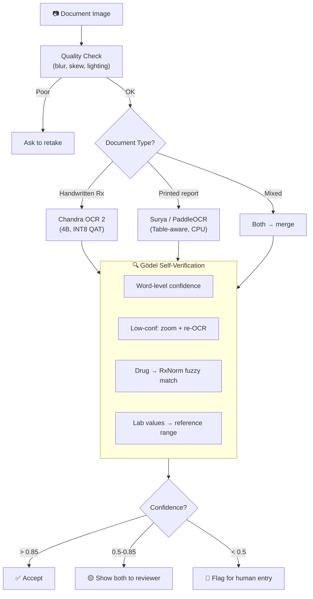
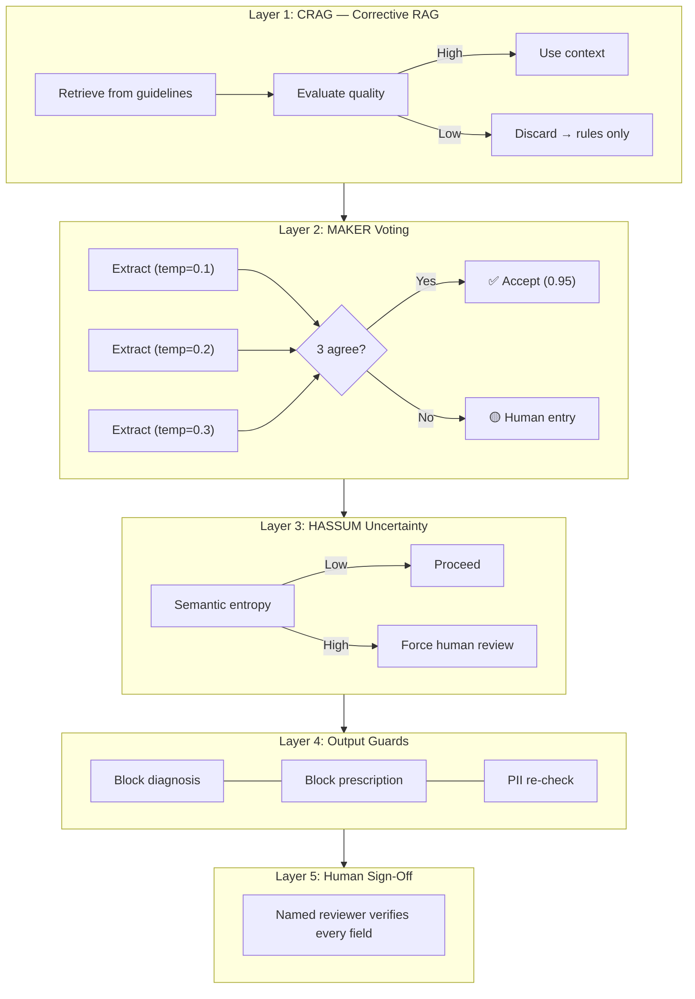
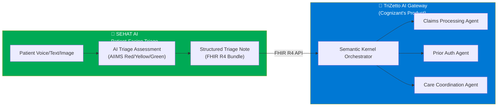

# SEHAT AI — Technical Architecture

> **Version:** 1.0 | **Date:** September 2026
> **Architecture Source:** [SEHAT AI v5.0 Final Architecture](sehat_ai_final_architecture__2.md)
> **Scope:** Condensed, implementation-oriented architecture. For full detail, see the source document.

---

## 1. Architecture Overview — 6-Layer Pipeline

### Key Principle

```
RULES set urgency (deterministic, cited, zero hallucination)
  ↕
JEV scores confidence (constrained, calibrated)
  ↕  
LLM extracts and summarises (guarded, source-linked)
  ↕
HUMAN signs off (mandatory, logged)
```

**The LLM is a TOOL, not the decision-maker.** It may only RAISE urgency. It may NEVER lower a flag set by the rules engine. Missing vitals resolve to "unknown — needs human review", never to "normal".

### 6-Layer Pipeline



### Layer Characteristics

| Layer | Latency | Hallucination Risk | Purpose |
|:---|:---:|:---:|:---|
| **L1: Input + Consent** | Variable | N/A | Capture multimodal data with legal consent |
| **L2: Pre-Processing Safety** | < 50ms | **ZERO** | Strip PII before anything reaches the LLM |
| **L3: Understanding** | 1-3s | **Low** (NER + rules) | Translate, extract entities, verify with CRAG |
| **L4: Rules + Triage** | < 200ms | **ZERO** | Deterministic urgency via AIIMS + NEWS2 + qSOFA |
| **L5: Generation** | 1-3s | **Low** (guarded) | LLM generates source-linked note under guard |
| **L6: Human Review** | Variable | **ZERO** (human) | Final authority on all decisions |

---

## 2. Technology Stack

### Core Stack

| Component | Technology | Justification |
|:---|:---|:---|
| **Orchestration** | Microsoft Semantic Kernel (Python SDK) | Cognizant TriZetto alignment. Enterprise-first. |
| **Primary LLM (Cloud)** | Azure OpenAI GPT-4o | Cognizant alignment. HIPAA-eligible. Function calling. |
| **Local/Offline LLM** | Gemma 4 12B (DoRA fine-tuned, GGUF Q4) | Apache 2.0. 256K context. Edge: Q4 on CPU. |
| **Summarisation LLM** | Llama 4 Scout (17B active / 109B MoE) | 10M context window for full patient history. |
| **Rules Engine** | Custom Python — AIIMS + NEWS2 + qSOFA | 96.2% sensitive for 24h mortality. Zero hallucination. |
| **Triage Scoring** | JEV System One (TypeSafe AI) | 100ms. Calibrated probabilities. 444x cheaper than GPT-4. |
| **Frontend** | Next.js 15 (PWA, offline-first) | SSR for slow networks. Service Worker caching. |
| **Backend** | FastAPI (Python) | Async. Matches SK Python SDK. |
| **Database (Hackathon)** | SQLite + aiosqlite | Zero-setup. Auto-creates on first run. |
| **Inference (Cloud)** | SGLang | RadixAttention prefix caching = 3-5x faster. |
| **Inference (Edge)** | Ollama (GGUF) | Local inference for offline mode. |

### Voice Stack

| Component | Technology | Size | Purpose |
|:---|:---|:---:|:---|
| **VAD** | Silero VAD | ~2MB | Language-agnostic voice activity detection, < 1ms |
| **STT (Online)** | Silero STT + Saaras V4 | ~50MB | Code-mix optimised, 5 output formats |
| **STT (Offline)** | Silero STT + IndicConformer 30M | ~100MB | 26-language offline ASR |
| **Odia Native** | Presear Dakshini | — | Native Odia — no translation pipeline needed |
| **Translation** | IndicTrans2 (1B) | ~700MB | 22 scheduled Indian languages. ONNX INT8. |
| **TTS (Read-back)** | Indic Parler-TTS | — | Read-back confirmation in 23 languages |

### OCR + Image Stack

| Component | Technology | Size | Purpose |
|:---|:---|:---:|:---|
| **Handwritten Rx** | Chandra OCR 2 (4B, INT8 QAT) | ~4GB | 85.9% olmOCR benchmark. 90+ languages. |
| **Printed Reports** | Surya OCR + PaddleOCR | ~500MB | CPU-friendly. Table extraction. |
| **Medical Images** | MedGemma (4B, INT8) | ~5GB | X-ray, ECG, wound photo descriptions (NOT diagnosis) |
| **Image Fallback** | GPT-4o Vision (Azure) | Cloud | Cognizant-aligned cloud fallback |
| **OCR Verification** | Gödel CoVe + RxNorm | — | Self-verification + drug name validation |

### Safety Stack

| Component | Technology | Purpose |
|:---|:---|:---|
| **PII Redaction** | Microsoft Presidio + India patterns | ABHA, Aadhaar, phone, PAN. Redact BEFORE cloud. |
| **Dialogue Guard** | NeMo Guardrails (Colang 2.0) | Topic boundaries. "Cannot diagnose" enforced. |
| **I/O Filter** | LLM Guard | Prompt injection. Hallucination detection. |
| **Language Filter** | Custom regex + ConstitutionalAI | Block "diagnosed with", "prescribe", "take [drug]". |
| **NER** | GLiNER + SNOMED-CT + RxNorm + ICD-10 | Standardised medical entity extraction. |

### GPU Requirements

| Model | Params | Quantisation | VRAM | Latency |
|:---|:---:|:---|:---:|:---:|
| Gemma 4 12B | 12B | AWQ 4-bit | ~8GB | ~200ms |
| Llama 4 Scout | 17B active | AWQ 4-bit | ~12GB | ~300ms |
| Chandra OCR 2 | 4B | INT8 QAT | ~4GB | ~200ms/page |
| MedGemma | 4B | INT8 | ~5GB | ~500ms/image |
| GLiNER | 300M | FP32 | ~1GB | ~50ms |
| **Total Local GPU** | — | — | **~36GB** | — |

> Everything runs on a single A100 (80GB) with room to spare. For hackathon demo, an A10G (24GB) handles most models. For edge/offline, the Lite stack fits in ~3.1GB on any 8GB tablet.

---

## 3. Data Flow Pipeline



---

## 4. Voice Pipeline



### Voice Strategy by Scenario

| Scenario | Primary STT | Fallback | Rationale |
|:---|:---|:---|:---|
| **Odia speaker at PHC** | Presear Dakshini | Silero STT + IndicTrans2 | Native Odia — no translation needed |
| **Hindi speaker online** | Saaras V4 API | Silero STT | Best for code-mixing |
| **Hindi speaker offline** | Silero STT | IndicConformer 30M | Both run locally |
| **Health camp (no internet)** | Silero STT + IndicConformer | Manual text entry | Entire pipeline on-device |

### Critical Mitigation: TTS Read-Back

Indian ASR captures entity-dense tokens (numbers, drug names) only **0.027–0.16 of the time** (arXiv:2605.03073). After every extraction, TTS reads back every extracted number for patient confirmation. **No competitor does this.**

---

## 5. OCR Pipeline



### MedGemma — Medical Image Understanding

| ❌ DIAGNOSIS (Illegal) | ✅ DESCRIPTION (What MedGemma Does) |
|:---|:---|
| "This X-ray shows pneumonia" | "Opacification in right lower lobe. **Findings pending radiologist review.**" |
| "Patient has MI" | "ECG shows ST-segment elevation in V1-V4. **Specialist review required.**" |

MedGemma is the **primary** image model (runs locally, DPDP-ready — patient images never leave the device). GPT-4o Vision via Azure is the cloud fallback.

---

## 6. Rules Engine — AIIMS Protocol

### Core: AIIMS Triage (96.2% sensitive for 24h mortality)

The AIIMS Triage Protocol (ATP) Red criteria were **96.2% sensitive** for 24-hour mortality in 13,754 patients (Singh, Sahu et al., *JETS* 2022;15(3):124-7, doi:10.4103/jets.jets_146_21, PubMed 36353399). Adopted at AIIMS Bhubaneswar (Odisha).

> **Corrected 2026-09-30 (Phase 2).** Thresholds below are taken verbatim from the published ATP **Supplementary Table 1** and RCP NEWS2 Charts 1–2. Earlier versions of this section listed unsourced values (RR >30/<8, pulse >130, GCS <13, "temp <35 → RED"). Implementation, full rule list, source registry and decision record: [`10_Safety_Rules_Engine.md`](10_Safety_Rules_Engine.md).

```python
# RULES ENGINE — DETERMINISTIC, ZERO HALLUCINATION (backend/app/rules/)
# Each rule has: id, urgency, reason, source_id, predicate, evidence {value, threshold}

ATP_RED_CRITERIA = {   # ATP 2022, Supplementary Table 1 — any one present → RED
    "airway":      "stridor/noisy breathing | facial angioedema | active seizures",
    "breathing":   "incomplete sentences | audible wheeze | RR > 22 or < 10 | SpO2 < 90%",
    "circulation": "pulse < 50 or > 120 (without fever) | SBP > 220 or DBP > 110 | "
                   "SBP < 90 or DBP < 60 | shock index > 1 | active bleeding",
    "disability":  "altered sensorium (responds only to Voice/Pain, or Unresponsive)",
    "time_sensitive": "acute chest pain < 24h | limb weakness < 24h | suspected stroke < 24h | "
                   "dangerous-mechanism trauma | acute SOB < 12h | limb ischaemia < 48h | allergic reaction | "
                   "scrotal pain (young male) | severe pain | sudden abdominal pain | sudden headache | "
                   "urinary retention | fever with temp > 39°C or immunocompromise | syncope | needle prick",
    "increased_urgency": "abdominal pain + vaginal bleeding | agitated/violent | poisoning/snake/scorpion | "
                   "3rd trimester with abdominal pain/vaginal bleeding",
}

# NEWS2 (RCP 2017 Chart 1) — scored separately from interpretation
#   RR:    ≤8→3, 9–11→1, 12–20→0, 21–24→2, ≥25→3
#   SpO2 Scale 1: ≤91→3, 92–93→2, 94–95→1, ≥96→0   (Scale 2 for hypercapnic respiratory failure)
#   Air or oxygen: oxygen→2
#   SBP:   ≤90→3, 91–100→2, 101–110→1, 111–219→0, ≥220→3
#   Pulse: ≤40→3, 41–50→1, 51–90→0, 91–110→1, 111–130→2, ≥131→3
#   ACVPU: Alert→0, C/V/P/U→3
#   Temp:  ≤35.0→3, 35.1–36.0→1, 36.1–38.0→0, 38.1–39.0→1, ≥39.1→2
# RCP Chart 2 → SEHAT urgency: ≥7 → RED; 5–6 → YELLOW; any single parameter = 3 → YELLOW; 0–4 → no escalation
# Not used under 16 years or in pregnancy (RCP). Missing parameters are never assumed normal.

# qSOFA (Sepsis-3, JAMA 2016) — only with suspected infection: RR ≥ 22, altered mentation, SBP ≤ 100
# ≥ 2 → YELLOW minimum. A positive screen, not a diagnosis.

# GREEN must be earned: missing vitals / red-flag screen not completed / age < 14
#   → YELLOW + needs_human_review (never "normal")

# THE CARDINAL RULE: LLM can NEVER lower urgency
def enforce_raise_only(deterministic, suggested):
    """final = max(deterministic, suggested); downgrades refused and recorded."""
    urgency_order = {"RED": 3, "YELLOW": 2, "GREEN": 1}
    return max(deterministic, suggested or deterministic, key=urgency_order.__getitem__)
```

### 7 Scenario Rule Packs

| Scenario | Urgency rules (raise-only) | Advisories (never change urgency) | Source |
|:---------|:----------|:-------|:---------------|
| **OPD Triage** | ATP + NEWS2 (+ qSOFA if infection suspected) | — | ATP 2022, RCP NEWS2 |
| **Maternal** | Any danger sign → YELLOW; Hb < 7 g/dL → YELLOW; ATP RED for seizures, 3rd-trimester bleed/pain, BP > 220/110. No NEWS2 in pregnancy | Age < 18 / > 35 (pending verification) | MoHFW MCP card, WHO Hb 2024 |
| **Chronic NCD** | BP > 180/110 on any reading → YELLOW (refer; > 220/110 RED via ATP). Needs 2 readings for GREEN | — | IHCI protocol |
| **Health Camp** | ATP + NEWS2 | CBAC > 4 → prioritise NCD screening | NPCDCS CBAC |
| **Campus Fever** | ATP (temp > 39°C RED) + qSOFA | Fever ≥ 38°C + cough, onset ≤ 10 d = WHO ILI | WHO ILI 2014 |
| **Occupational** | ATP + NEWS2 | Hearing shift ≥ 10 dB avg at 2/3/4 kHz → audiology review | 29 CFR 1910.95 (US) |
| **Referral** | ATP + NEWS2 | Escort, transport, identity, consent missing → packet incomplete | SEHAT policy |

---

## 7. Extraction & Source-Linked Notes

Every field links to its source. When a reviewer clicks any field, they see the original transcript segment or OCR bounding box.

```python
class SourceLinkedField:
    field_name: str          # e.g., "chief_complaint"
    value: str               # e.g., "fever for 3 days, 102°F"
    source_type: str         # "transcript" | "ocr" | "body_map" | "manual"
    source_ref: SourceRef    # transcript timestamp or OCR bbox
    confidence: float        # 0.0 - 1.0
    snomed_code: Optional[str]
    status: str              # "confirmed" | "unconfirmed" | "disputed"
```

### Missing Information Detection

Per-scenario required fields trigger follow-up questions in the patient's language:
- **OPD:** chief_complaint, duration, severity, SpO2, BP, pulse
- **Maternal:** LMP, EDD, gravida/parity, Hb, BP, danger signs
- **Chronic NCD:** 2 BP readings, blood sugar, current drugs, adherence

---

## 8. Anti-Hallucination — 5-Layer Defence



- **MAKER Voting** (Cognizant AI Lab, arXiv:2511.09030): Extract critical values 3x independently, accept only on agreement.
- **HASSUM** (Cognizant AI Lab, arXiv:2608.14707): High semantic entropy → force human review.
- **CRAG**: Discard low-quality retrieval before the LLM sees it.

---

## 9. Semantic Kernel & TriZetto Integration

### SK Plugin Architecture

```python
kernel = Kernel()
kernel.add_service(AzureChatCompletion(...))

# Input Plugins
kernel.add_plugin(VoicePlugin(),       "VoiceInput")
kernel.add_plugin(OCRPlugin(),         "MedicalOCR")
kernel.add_plugin(ImagePlugin(),       "MedicalImaging")  # MedGemma
kernel.add_plugin(BodyMapPlugin(),     "BodyMap")

# Processing Plugins
kernel.add_plugin(TranslationPlugin(), "Translator")      # IndicTrans2
kernel.add_plugin(NERPlugin(),         "MedicalNER")       # GLiNER + SNOMED
kernel.add_plugin(CRAGPlugin(),        "VerifiedRetrieval")

# Decision Plugins (RULES FIRST)
kernel.add_plugin(RulesEngine(),       "RedFlagRules")
kernel.add_plugin(JEVTriagePlugin(),   "TriageScoring")

# Output Plugins
kernel.add_plugin(NoteGenerator(),     "TriageNote")
kernel.add_plugin(FHIRPlugin(),        "FHIRExport")
kernel.add_plugin(ReferralPlugin(),    "ReferralPacket")

# Safety Plugins
kernel.add_plugin(PresidioPlugin(),    "PIIAnonymizer")
kernel.add_plugin(NeMoPlugin(),        "DialogueGuard")
kernel.add_plugin(AuditPlugin(),       "AuditLogger")
```

### SEHAT AI → TriZetto Pipeline



> **The Pitch:** *"SEHAT AI is the patient-facing triage front-end. Its FHIR-compliant output flows seamlessly through TriZetto AI Gateway into Cognizant's administrative backend. Built on Microsoft Semantic Kernel — the same orchestration framework powering TriZetto."*

---

## 10. Offline / Edge Architecture

### Edge Stack (~3.1GB total)

| Component | Edge Size | Function |
|:---|:---:|:---|
| Silero VAD | 2MB | Voice activity detection |
| Silero STT | ~50MB | Basic speech-to-text |
| IndicConformer 30M | ~100MB | 26-language ASR |
| IndicTrans2 INT8 | ~700MB | Translation |
| Surya OCR | ~500MB | Printed document OCR |
| GLiNER INT8 | ~300MB | Medical entity extraction |
| Rules Engine | ~100KB | AIIMS + NEWS2 + scenarios |
| Gemma 4 Q4 | ~1.5GB | Offline summarisation |
| **TOTAL** | **~3.1GB** | Full triage pipeline |

**"Lite" mode** runs rules only without any LLM — this doubles as ICMR's required fallback when AI fails.

---

## 11. Agentic GraphRAG

Instead of naive vector RAG, an AI agent traverses a SNOMED-CT medical knowledge graph:

```
Patient: "Chest pain and difficulty breathing, I have BP problem"
1. GLiNER extracts: [chest_pain, breathing_difficulty, hypertension]
2. SNOMED-CT maps: [29857009, 267036007, 38341003]
3. GraphRAG traverses → cardiac emergency path
4. Retrieves guideline: "Chest pain with risk factors = RED minimum"
5. Rules engine confirms: RED
6. Output includes citation: "AIIMS Protocol, Decision Point B"
```

---

## 12. Explainable AI — Counterfactual Triage

Instead of SHAP values (which doctors don't understand), natural language counterfactuals:

```
🔴 RED — Dengue warning signs
📋 WHY: Platelets 85K (< 100K) + Fever 3 days + Abdominal pain
🔄 WHAT WOULD CHANGE IT:
  • If platelets > 100K → YELLOW
  • If no fever → YELLOW
  • If SpO2 > 96% → still RED (platelets)
📖 RULE: WHO Dengue Classification 2009 + AIIMS Protocol
```

**Research:** IEEE 2025 — Counterfactual XAI improves clinician trust by 47%.

---

## 13. Research Foundation

| Source | Paper/Technique | Application |
|:---|:---|:---|
| Google DeepMind | AI Co-Clinician (2026) | "Triadic care" philosophy (AI + Patient + Physician) |
| Google | MedGemma (2025) | Medical image understanding |
| Cognizant AI Lab | MAKER (arXiv:2511.09030) | Multi-pass voting on critical values |
| Cognizant AI Lab | HASSUM (arXiv:2608.14707) | Semantic uncertainty escalation |
| IEEE/NeurIPS | Counterfactual XAI | Natural language explanations |
| AIIMS | Triage Protocol (PubMed 36353399) | 96.2% sensitive Red criteria |

---

> **Related Documents:**
> - [PRD](01_PRD.md) — Product requirements and rationale
> - [Security & Privacy](04_Security_Privacy_Access.md) — Safety pipeline details
> - [API Contracts](06_API_Data_Contracts.md) — JSON schemas and endpoints
> - [Implementation Plan](08_Implementation_28h_Plan.md) — Phase-by-phase build
