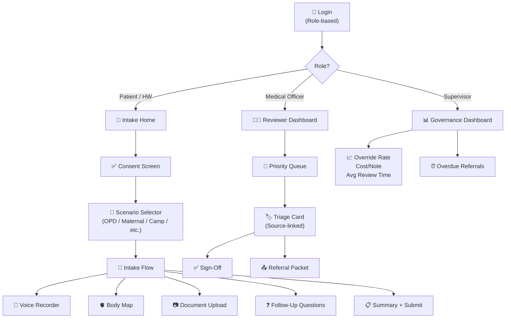

# SEHAT AI — Frontend Specification

> **Version:** 1.0 | **Date:** September 2026
> **Architecture Source:** [SEHAT AI v5.0 Final Architecture](sehat_ai_final_architecture__2.md) — §15, §18, §20
> **Stack:** Next.js 15 (PWA, offline-first) | Service Worker + local SQLite

---

## 1. Design Principles

| Principle | Implementation |
|:---|:---|
| **Voice-first** | Primary input is speech. Text/form is fallback. |
| **Low-literacy friendly** | Large touch targets, icons, TTS output, minimal text input |
| **Health-worker-operated** | Worker operates device on behalf of patient |
| **Offline-first** | PWA with Service Worker cache. Full pipeline on-device. |
| **Source-linked** | Every field is clickable → shows original source |
| **Non-diagnostic** | No output presents as diagnosis. Mandatory disclaimers. |
| **Colour-coded urgency** | 🔴 RED = critical, 🟡 YELLOW = urgent, 🟢 GREEN = routine |

---

## 2. Screen Map



---

## 3. Intake Screens (Patient / Health Worker)

### 3.1 Consent Screen

```
┌─────────────────────────────────────────┐
│  🏥 SEHAT AI — Triage Assistant         │
│                                          │
│  📋 Data will be used to prepare a       │
│  triage summary for doctor review.       │
│                                          │
│  [🔊 Read Aloud in Odia]                │
│                                          │
│  Your data is redacted before AI         │
│  processing. You can delete your data    │
│  at any time.                            │
│                                          │
│  ┌──────────┐  ┌──────────┐             │
│  │ ✅ I Agree │  │ ❌ Decline │             │
│  └──────────┘  └──────────┘             │
│                                          │
│  🎤 Say "haan" or "yes" to consent      │
│                                          │
│  ⚠️ Emergency? We can proceed without    │
│  full consent (DPDP §7f). [Emergency →]  │
└─────────────────────────────────────────┘
```

- TTS reads consent aloud in patient's selected language
- Audio "haan/yes" recorded as consent evidence
- Emergency bypass for life-threatening situations (logged)

### 3.2 Scenario Selector

```
┌─────────────────────────────────────────┐
│  🏥 Select Assessment Type              │
│                                          │
│  ┌─────────┐  ┌─────────┐  ┌─────────┐ │
│  │ 🏨 OPD   │  │ 🤰 Maternal│  │ 💊 NCD  │ │
│  │ Triage   │  │ Care     │  │ Chronic │ │
│  └─────────┘  └─────────┘  └─────────┘ │
│  ┌─────────┐  ┌─────────┐  ┌─────────┐ │
│  │ ⛺ Health│  │ 🎓 Campus│  │ 🏭 Work  │ │
│  │ Camp     │  │ Fever    │  │ Health  │ │
│  └─────────┘  └─────────┘  └─────────┘ │
│                                          │
│  Each type loads its own rule pack       │
│  and required fields                     │
└─────────────────────────────────────────┘
```

### 3.3 Voice Recorder

```
┌─────────────────────────────────────────┐
│  🎤 Describe Your Symptoms              │
│  (Speak in Odia, Hindi, or English)     │
│                                          │
│        ┌──────────────────┐              │
│        │  🔴 Recording...  │              │
│        │  0:04 / 2:00 max │              │
│        └──────────────────┘              │
│                                          │
│  📋 I heard:                             │
│  "Fever for 3 days, temperature 102°F,  │
│   headache and body pain"               │
│                                          │
│  🔊 [Listen to Read-Back]               │
│                                          │
│  ✅ That's correct   ❌ Let me re-record │
│                                          │
│  💡 Tips: Mention how long, how severe, │
│  any medicines you've taken             │
└─────────────────────────────────────────┘
```

### 3.4 Interactive Body Map

```
┌─────────────────────────────────────────┐
│  🫀 Where does it hurt? Tap to select   │
│                                          │
│           ○ Head                         │
│          /|\                             │
│         / | \                            │
│        ○  ○  ○ Chest / Abdomen          │
│           |                              │
│          / \                             │
│         /   \                            │
│        ○     ○ Legs                      │
│                                          │
│  Selected: [Chest ✕] [Head ✕]           │
│                                          │
│  For each location:                      │
│  Pain type: [Sharp ▾]                   │
│  Severity:  [●●●●○] (4/5)              │
│  Duration:  [2 days ▾]                  │
│                                          │
│  [Continue →]                            │
└─────────────────────────────────────────┘
```

- SVG-based interactive body map with tap-to-select regions
- Each region captures: pain type, severity (1-5 scale), duration
- Maps to SNOMED-CT body site codes

### 3.5 Document Upload

```
┌─────────────────────────────────────────┐
│  📷 Upload Medical Documents            │
│                                          │
│  ┌───────────┐  ┌───────────┐           │
│  │ 📄 Lab     │  │ 💊 Prescri- │          │
│  │ Report     │  │ ption      │          │
│  └───────────┘  └───────────┘           │
│  ┌───────────┐  ┌───────────┐           │
│  │ 🩻 X-ray / │  │ 📋 Discharge│          │
│  │ ECG        │  │ Summary    │          │
│  └───────────┘  └───────────┘           │
│                                          │
│  📷 [Take Photo]  📁 [Choose File]      │
│                                          │
│  ⚡ Processing...                        │
│  ┌─────────────────────────────────┐    │
│  │ ✅ Extracted:                    │    │
│  │ Hb: 8.5 g/dL (🟡 Low)          │    │
│  │ Platelets: 85K (🔴 Critical)    │    │
│  │ Confidence: 92%                  │    │
│  │                                   │    │
│  │ ⚠️ AI-extracted, pending review  │    │
│  └─────────────────────────────────┘    │
└─────────────────────────────────────────┘
```

### 3.6 Follow-Up Questions

```
┌─────────────────────────────────────────┐
│  ❓ Additional Information Needed       │
│                                          │
│  Based on your symptoms, we need:       │
│                                          │
│  1. How long have you had fever?        │
│     [1 day] [2-3 days] [4+ days] [?]    │
│                                          │
│  2. Any bleeding from nose or gums?     │
│     [Yes] [No] [Not sure]               │
│                                          │
│  3. SpO2 reading (if available)?        │
│     [___]% or [Not available]           │
│                                          │
│  🎤 Or speak your answer                │
│                                          │
│  [Submit →]                              │
└─────────────────────────────────────────┘
```

- Questions generated per scenario based on missing required fields
- Displayed in patient's language (Odia/Hindi/English)
- Voice input accepted for answers

---

## 4. Reviewer Dashboard (Medical Officer)

### 4.1 Priority Queue

```
┌─────────────────────────────────────────────────────────────┐
│  👨‍⚕️ Dr. Patel — Reviewer Dashboard         [⏰ 10:42 AM] │
│                                                              │
│  🔴 RED (2)  🟡 YELLOW (5)  🟢 GREEN (12)   Total: 19     │
│                                                              │
│  ┌────────────────────────────────────────────────────────┐ │
│  │ 🔴 Token PHC-2026-0451 │ ⏰ 0:47 since arrival       │ │
│  │ Chest pain, 2 hours, severe                            │ │
│  │ ST elevation V1-V4 (ECG) │ Troponin 2.8 (🔴 Critical)│ │
│  │ RED FLAGS: Chest pain, Troponin, ST elevation          │ │
│  │ [Open Case →]                                          │ │
│  └────────────────────────────────────────────────────────┘ │
│  ┌────────────────────────────────────────────────────────┐ │
│  │ 🔴 Token PHC-2026-0453 │ ⏰ 1:23 since arrival       │ │
│  │ Dengue warning signs: Platelets 85K, abdominal pain   │ │
│  │ RED FLAGS: Platelets < 100K + fever 3 days             │ │
│  │ [Open Case →]                                          │ │
│  └────────────────────────────────────────────────────────┘ │
│  ┌────────────────────────────────────────────────────────┐ │
│  │ 🟡 Token PHC-2026-0449 │ ⏰ 2:15 since arrival       │ │
│  │ Maternal: 28w, BP 145/95, headache                    │ │
│  │ NEWS2: 5 (increased observation)                       │ │
│  │ [Open Case →]                                          │ │
│  └────────────────────────────────────────────────────────┘ │
│                                                              │
│  Queue ordered by: RULES ENGINE (not AI)                    │
│  ⏰ Escalation: RED unacknowledged > 3 min → auto-escalate │
└─────────────────────────────────────────────────────────────┘
```

### 4.2 Triage Card (Detailed View)

```
┌─────────────────────────────────────────────────────────────┐
│ 🔴 RED — Token PHC-2026-0453                                │
│ Scenario: OPD Triage │ Facility: PHC Khurda, Odisha        │
│                                                              │
│ ─── CHIEF COMPLAINT ───                                     │
│ Fever for 3 days (102°F), severe headache, abdominal pain  │
│   📎 [Audio 0:04-0:18] "Teen din se bukhar..."             │
│   Source: Voice (Odia → English via Dakshini)               │
│   Confidence: 0.94                                           │
│                                                              │
│ ─── VITALS ───                                               │
│ Temp: 102°F (🔴)    │ SpO2: 96%       │ BP: 110/70         │
│ Pulse: 98 bpm        │ RR: 20          │ GCS: 15 (Alert)    │
│                                                              │
│ ─── LAB VALUES (OCR) ───                                    │
│ Platelets: 85,000/μL (🔴 CRITICAL)                         │
│   📎 [View lab report image]                                │
│   OCR Confidence: 0.91 │ Gödel verified ✅                  │
│ Hb: 11.2 g/dL (Normal)                                     │
│   📎 [View lab report image]                                │
│                                                              │
│ ─── RED FLAGS TRIGGERED ───                                 │
│ 1. 🔴 Platelets < 100K + Fever ≥ 3 days                   │
│    Rule: WHO Dengue Warning Signs                            │
│ 2. 🔴 Abdominal pain with thrombocytopenia                 │
│    Rule: Scenario Pack — Dengue                              │
│ NEWS2 Score: 4                                               │
│                                                              │
│ ─── COUNTERFACTUAL ───                                      │
│ 🔄 WHAT WOULD CHANGE IT:                                    │
│   • If platelets > 100K → 🟡 YELLOW                        │
│   • If no fever → 🟡 YELLOW                                │
│   • If SpO2 < 94% → still 🔴 RED (platelets)               │
│                                                              │
│ ─── AI SUMMARY ───                                          │
│ "28-year-old patient presenting with 3-day history of       │
│ high-grade fever, thrombocytopenia, and abdominal pain      │
│ consistent with dengue warning signs..."                     │
│ ⚠️ AI-drafted, pending review by qualified clinician        │
│                                                              │
│ ─── MISSING INFORMATION ───                                 │
│ ⚠️ Tourniquet test not recorded                             │
│ ⚠️ Fluid intake/output not documented                       │
│                                                              │
│ ┌──────────┐ ┌──────────────┐ ┌──────────┐ ┌───────────┐ │
│ │ ✅ Approve │ │ 📤 Refer NOW  │ │ ✏️ Edit   │ │ ⬇️ Lower   │ │
│ └──────────┘ └──────────────┘ └──────────┘ └───────────┘ │
│                                                              │
│ Reviewer: Dr. _______ (sign-off required)                   │
└─────────────────────────────────────────────────────────────┘
```

### 4.3 Override Flow

When a reviewer clicks "⬇️ Lower Urgency":

```
┌─────────────────────────────────────────┐
│  ⚠️ Lower Urgency — Reason Required     │
│                                          │
│  Current: 🔴 RED                        │
│  New:     🟡 YELLOW ▾                   │
│                                          │
│  Reason Code:                            │
│  ○ Clinical re-assessment               │
│  ○ Additional information available      │
│  ○ Lab values not applicable             │
│  ○ Patient condition improved            │
│  ○ Other (specify below)                 │
│                                          │
│  Free text: ___________________________  │
│                                          │
│  ⚠️ This override will be logged in the │
│  audit trail with your name and ID.      │
│                                          │
│  [Confirm Override] [Cancel]             │
└─────────────────────────────────────────┘
```

### 4.4 Escalation Timer

```
┌─────────────────────────────────────────┐
│  ⏰ RED CASE UNACKNOWLEDGED             │
│                                          │
│  Token PHC-2026-0451 has been in RED     │
│  queue for 3:00 without acknowledgement. │
│                                          │
│  🔊 AUDIO ALERT active                  │
│                                          │
│  Auto-escalating to:                     │
│  District Medical Officer (Dr. Sharma)   │
│                                          │
│  [Acknowledge NOW]                       │
└─────────────────────────────────────────┘
```

- 3-minute timer for unacknowledged RED cases
- Audio alert + visual pulse animation
- Auto-escalation to district supervisor if not acknowledged

---

## 5. Referral Tracking

### 5.1 Referral Packet Creation

```
┌─────────────────────────────────────────┐
│  📤 Create Referral Packet              │
│                                          │
│  Referring: PHC Khurda                   │
│  To: District Hospital, Bhubaneswar ▾   │
│                                          │
│  Urgency: 🔴 RED                        │
│  Flags: Dengue warning signs             │
│                                          │
│  Included Evidence:                      │
│  ✅ Triage note (source-linked)         │
│  ✅ Lab report image                    │
│  ✅ Vital signs                          │
│  ✅ RED flag citations                   │
│                                          │
│  Transport Plan:                         │
│  ○ 108 Ambulance (auto-called)          │
│  ○ Own vehicle                           │
│  ○ Public transport                      │
│                                          │
│  Escort: ○ Required ○ Not required      │
│                                          │
│  [Send Referral →]                       │
└─────────────────────────────────────────┘
```

### 5.2 Closure Tracking Status

```
┌─────────────────────────────────────────┐
│  📊 Referral Tracking — PHC Khurda      │
│                                          │
│  Active Referrals: 7                     │
│  ┌─────────────────────────────────────┐ │
│  │ PHC-0453 🔴 → DH Bhubaneswar      │ │
│  │ Status: 🚑 In Transit (45 min ago)  │ │
│  └─────────────────────────────────────┘ │
│  ┌─────────────────────────────────────┐ │
│  │ PHC-0441 🟡 → DH Bhubaneswar      │ │
│  │ Status: ✅ Seen by specialist       │ │
│  └─────────────────────────────────────┘ │
│  ┌─────────────────────────────────────┐ │
│  │ PHC-0439 🟡 → SDH Jatni           │ │
│  │ Status: ⏰ OVERDUE (52h, no update) │ │
│  │ [📞 Call Patient] [📤 Escalate]     │ │
│  └─────────────────────────────────────┘ │
│                                          │
│  ⏰ Overdue: 2 │ In Transit: 3          │
│  ✅ Seen: 2                              │
└─────────────────────────────────────────┘
```

---

## 6. Governance Dashboard (District Supervisor)

```
┌──────────────────────────────────────────────────────────┐
│  📊 Governance — Khurda District          [Last 7 Days]  │
│                                                           │
│  ┌────────────┐ ┌────────────┐ ┌────────────┐           │
│  │ Override    │ │ Avg Review │ │ Cost/Note  │           │
│  │ Rate: 12%  │ │ Time: 90s  │ │ ₹3.20      │           │
│  └────────────┘ └────────────┘ └────────────┘           │
│                                                           │
│  ┌────────────┐ ┌────────────┐ ┌────────────┐           │
│  │ RED Caught │ │ Referral   │ │ Overdue    │           │
│  │ 23 (100%)  │ │ Closure: 78%│ │ Referrals: 4│          │
│  └────────────┘ └────────────┘ └────────────┘           │
│                                                           │
│  ⚠️ Alerts:                                              │
│  • Dr. Mishra override rate = 34% (threshold: 25%)       │
│  • PHC Jatni has 4 overdue referrals                     │
│  • Campus ILI cluster: 8 cases in Hostel B this week     │
│                                                           │
│  [View Full Report] [Export CSV]                          │
└──────────────────────────────────────────────────────────┘
```

---

## 7. Multilingual Strategy

| Element | How Localised |
|:---|:---|
| Consent text | Pre-translated in Odia, Hindi, English + TTS read-aloud |
| Voice input | Silero STT (Hindi/English), Dakshini (Odia), IndicConformer (22 langs offline) |
| Follow-up questions | LLM generates in patient's detected language |
| Body map labels | Localised SVG text elements |
| Reviewer dashboard | English-only (doctors work in English) |
| Triage note | English (standardised for clinical handoff) |
| Read-back confirmation | TTS in patient's language |

---

## 8. Offline / PWA Architecture

| Capability | Online | Offline |
|:---|:---|:---|
| **Voice input** | Saaras V4 / Dakshini | Silero STT + IndicConformer |
| **OCR** | Chandra OCR (GPU) | Surya OCR (CPU) |
| **Translation** | IndicTrans2 (server) | IndicTrans2 INT8 (local) |
| **Rules engine** | Cloud | Local (YAML rules, < 200ms) |
| **LLM summary** | GPT-4o / Gemma 4 | Gemma 4 Q4 (local) or rules-only |
| **Triage note** | Stored in cloud DB | Stored in local SQLite |
| **Sync** | Real-time | Encrypted batch sync on reconnect |
| **Reviewer dashboard** | Full features | Read-only queue from local cache |

### PWA Manifest

```json
{
  "name": "SEHAT AI — Triage Assistant",
  "short_name": "SEHAT AI",
  "start_url": "/",
  "display": "standalone",
  "background_color": "#0F172A",
  "theme_color": "#00AA55"
}
```

---

## 9. Responsive Targets

| Device | Breakpoint | Primary Use |
|:---|:---:|:---|
| Budget Android phone | 360px | Patient intake (voice + body map) |
| Android tablet (10") | 768px | Health worker assisted mode |
| Desktop/laptop | 1024px+ | Reviewer dashboard, governance |

---

> **Related Documents:**
> - [PRD](01_PRD.md) — User journeys and personas
> - [API Contracts](06_API_Data_Contracts.md) — Data shapes for each screen
> - [Technical Architecture](03_Technical_Architecture.md) — Voice, OCR, and rules pipeline
> - [Demo Script](07_Demo_Script.md) — Demo walkthrough of these screens
