# SEHAT AI — 28-Hour Implementation Plan

> **Version:** 1.0 | **Date:** September 2026
> **Architecture Source:** [SEHAT AI v5.0 Final Architecture](sehat_ai_final_architecture__2.md) — §24
> **Objective:** Ship a working demo in 28 hours covering **85%+ of evaluation marks** by P8, with P9-P11 as stretch goals.

---

## Timeline Overview

```mermaid
gantt
    title SEHAT AI — 28-Hour Build Plan
    dateFormat  HH:mm
    axisFormat  %H:%M
    
    section Foundation
    P1 Foundation + Scaffold    :p1, 00:00, 3h
    
    section Safety Core
    P2 Rules Engine             :p2, after p1, 3h
    P3 Consent + PII + Audit    :p3, after p2, 2h
    
    section Multimodal
    P4 Voice Pipeline           :p4, after p3, 3h
    P5 OCR Pipeline             :p5, after p4, 3h
    
    section Intelligence
    P6 Extraction + Summary     :p6, after p5, 3h
    
    section UI
    P7 Patient Intake UI        :p7, after p6, 3h
    P8 Reviewer Dashboard       :p8, after p7, 3h

    section Stretch
    P9 Referral + Closure       :p9, after p8, 2h
    P10 Demo Data + Evidence    :p10, after p9, 2h
    P11 Edge / Offline          :p11, after p10, 1h
```



**MVP stop-point: After P8 (23 hours) — complete demo covering ~85% of marks.**

---

## Phase Details

### P1: Foundation + Scaffold (Hours 0–3)

| Item | Detail |
|:---|:---|
| **Duration** | 3 hours |
| **Goal** | Running FastAPI + Next.js app with SQLite, auth, and SK orchestrator |

#### Deliverables

| # | Deliverable | Definition of Done |
|:---:|:---|:---|
| 1 | FastAPI backend scaffold | `uvicorn main:app --reload` starts without errors |
| 2 | SQLite database + schema | Tables: `cases`, `consent`, `triage_notes`, `audit_events`, `referrals` auto-created |
| 3 | Next.js 15 frontend scaffold | `npm run dev` shows landing page |
| 4 | JWT authentication | Login endpoint returns token; protected routes reject invalid tokens |
| 5 | Semantic Kernel setup | SK Kernel initialised with Azure OpenAI service registered |
| 6 | Role-based routing | Patient → intake flow, MO → dashboard, Supervisor → governance |
| 7 | Health check endpoint | `GET /api/v1/health` returns `{"status": "ok"}` |

#### Dependencies
- Azure OpenAI API key configured
- Node.js 20+ and Python 3.11+ installed

---

### P2: Rules Engine (Hours 3–6)

| Item | Detail |
|:---|:---|
| **Duration** | 3 hours |
| **Goal** | Deterministic AIIMS + NEWS2 + qSOFA triage with scenario rule packs |
| **Eval Impact** | Safety (20%), Review (15%) |

#### Deliverables

> Implemented 2026-09-30 — see [`10_Safety_Rules_Engine.md`](10_Safety_Rules_Engine.md). Thresholds corrected to published ATP 2022 / RCP NEWS2 (ADR-5, ADR-6); dengue pack deferred (ADR-7).

| # | Deliverable | Definition of Done |
|:---:|:---|:---|
| 1 | ATP Red rules + YELLOW/GREEN logic | All computable ATP 2022 Supplementary Table 1 criteria → RED. YELLOW from NEWS2/qSOFA/scenario rules/safety floor. GREEN only when data complete. |
| 2 | NEWS2 scoring | Full RCP Chart 1 (7 parameters, SpO2 Scale 1/2). ≥ 7 → RED, 5–6 or any single 3 → YELLOW. |
| 3 | qSOFA scoring | Only when infection suspected. ≥ 2 → YELLOW minimum (screen, not diagnosis). |
| 4 | Scenario rule packs | All 7 packs (OPD, Maternal, Chronic NCD, Health Camp, Campus Fever, Occupational, Referral). |
| 5 | Cardinal rule enforcement | `enforce_raise_only()` returns max(deterministic, suggestion). LLM can NEVER lower. |
| 6 | Rules API endpoint | `POST /api/v1/triage/process` → urgency + triggered rules with citations and evidence. |
| 7 | Unit tests | Boundary tests for every ATP/NEWS2/qSOFA threshold, every flag, every pack, override matrix. |

#### Test Cases (Examples)

```python
# Chest pain < 24h → RED (ATP time-sensitive)
assert triage(red_flags_present=["chest_pain_acute_24h"]).urgency == "RED"

# Multiple abnormal vitals → RED (ATP RR/SpO2/BP/pulse/shock index + NEWS2 ≥ 7)
assert triage(vitals={"resp_rate": 32, "spo2": 88, "sbp": 85, "dbp": 55, "pulse": 135, "temp_c": 34.0}).urgency == "RED"

# LLM says GREEN but rules say RED → final is RED
assert enforce_raise_only(red_result, "GREEN").final_urgency == "RED"

# Missing vitals → YELLOW + needs_human_review (never GREEN)
r = triage(scenario="opd", age_years=30)
assert r.urgency == "YELLOW" and r.needs_human_review and "vitals.spo2" in r.missing_fields
```

---

### P3: Consent + PII + Audit (Hours 6–8)

| Item | Detail |
|:---|:---|
| **Duration** | 2 hours |
| **Goal** | Layered consent, PII redaction, tamper-evident audit |
| **Eval Impact** | Privacy (10%) |

#### Deliverables

| # | Deliverable | Definition of Done |
|:---:|:---|:---|
| 1 | Consent recording API | `POST /consent` stores consent with method, language, timestamp |
| 2 | Consent gate | Intake endpoints reject if no consent record for case_id |
| 3 | Presidio PII redaction | Names, ABHA, Aadhaar, phone, PAN stripped before LLM call |
| 4 | India-specific patterns | Custom Presidio recognisers for ABHA (14-digit), Aadhaar (12-digit), PAN |
| 5 | Tamper-evident audit log | Hash-chained SHA-256 entries. Insert + query working. |
| 6 | Non-diagnostic language filter | Regex patterns block "diagnosed with", "prescribe", "take [drug]" |
| 7 | Data deletion endpoint | `DELETE /consent/{case_id}` removes PII, retains anonymised audit |

---

### P4: Voice Pipeline (Hours 8–11)

| Item | Detail |
|:---|:---|
| **Duration** | 3 hours |
| **Goal** | Odia/Hindi/English voice intake with read-back confirmation |
| **Eval Impact** | Multimodal (15%) |

#### Deliverables

| # | Deliverable | Definition of Done |
|:---:|:---|:---|
| 1 | Audio recording UI component | Record button, waveform visualisation, max 2 minutes |
| 2 | Silero VAD integration | Speech segments detected, silence trimmed |
| 3 | STT transcription | Audio → text via Silero STT (or Saaras V4 fallback) |
| 4 | IndicTrans2 translation | Non-English transcript → English translation |
| 5 | TTS read-back | Extracted numbers read back for patient confirmation |
| 6 | Source reference linking | Each transcript segment linked to audio timestamp |
| 7 | Voice intake API | `POST /intake/voice` processes audio → structured transcript |

---

### P5: OCR Pipeline (Hours 11–14)

| Item | Detail |
|:---|:---|
| **Duration** | 3 hours |
| **Goal** | Lab report OCR with verification and medical image description |
| **Eval Impact** | Multimodal (15%), Extraction (20%) |

#### Deliverables

| # | Deliverable | Definition of Done |
|:---:|:---|:---|
| 1 | Document upload UI | Camera capture + file upload with document type selector |
| 2 | Printed report OCR (Surya) | Extract text + values from printed lab reports |
| 3 | Handwritten Rx OCR (Chandra) | Extract drug names from handwritten prescriptions |
| 4 | Gödel self-verification | Word confidence → re-OCR low-confidence blocks |
| 5 | RxNorm drug validation | Fuzzy match extracted drug names against RxNorm |
| 6 | Reference range checking | Flag out-of-range lab values (12 common Indian tests) |
| 7 | Bounding box source linking | Click extracted value → see original image region |
| 8 | MedGemma integration (stretch) | Medical image → structured findings description (if time permits) |

---

### P6: Extraction + Summary (Hours 14–17)

| Item | Detail |
|:---|:---|
| **Duration** | 3 hours |
| **Goal** | Source-linked structured extraction with MAKER voting |
| **Eval Impact** | Extraction (20%) |

#### Deliverables

| # | Deliverable | Definition of Done |
|:---:|:---|:---|
| 1 | Structured JSON extraction | LLM extracts to TriageNote schema (not free text) |
| 2 | Source-linked fields | Every field has source_type + source_ref |
| 3 | MAKER voting on critical values | Hb, platelets, creatinine extracted 3x → accept on agreement |
| 4 | Missing information detection | Per-scenario required fields checked → follow-up questions generated |
| 5 | Follow-up questions in patient's language | LLM generates questions in Odia/Hindi/English |
| 6 | AI summary generation | Source-linked narrative summary with mandatory disclaimer |
| 7 | Counterfactual generation | "If X were different → urgency would be Y" |
| 8 | HASSUM entropy check (stretch) | High uncertainty → force human review flag |

---

### P7: Patient Intake UI (Hours 17–20)

| Item | Detail |
|:---|:---|
| **Duration** | 3 hours |
| **Goal** | Complete patient intake interface |
| **Eval Impact** | India (15%), Multimodal (15%) |

#### Deliverables

| # | Deliverable | Definition of Done |
|:---:|:---|:---|
| 1 | Consent screen with TTS | Consent text displayed + read aloud in selected language |
| 2 | Scenario selector | 6 tiles (OPD, Maternal, NCD, Camp, Campus, Occupational) |
| 3 | Voice recorder component | Record, waveform, read-back, confirm/re-record |
| 4 | Interactive body map | SVG body outline with tap-to-select regions |
| 5 | Document upload component | Camera + file + processing animation + extracted values |
| 6 | Follow-up questions screen | Dynamic questions with voice/button answers |
| 7 | Summary + submit screen | Review all collected data before submission |

---

### P8: Reviewer Dashboard (Hours 20–23) ← MVP STOP-POINT

| Item | Detail |
|:---|:---|
| **Duration** | 3 hours |
| **Goal** | Priority queue, triage cards, sign-off, override |
| **Eval Impact** | Review (15%), Safety (20%) |

#### Deliverables

| # | Deliverable | Definition of Done |
|:---:|:---|:---|
| 1 | Priority queue | Cases sorted by rules-engine urgency (RED → YELLOW → GREEN) |
| 2 | Triage card view | Full source-linked triage note with clickable evidence |
| 3 | Named sign-off | Reviewer ID + name recorded on approval |
| 4 | Override with reason code | Urgency change requires structured reason + free text |
| 5 | Escalation timer | RED cases > 3 min unacknowledged → audio alert + auto-escalation |
| 6 | Counterfactual display | "What would change it" section in triage card |
| 7 | WebSocket real-time updates | New cases appear without page refresh |

> **After P8:** The system has a complete end-to-end flow. All 7 evaluation criteria are addressed. Marks coverage: ~85%.

---

### P9: Referral + Closure Tracking (Hours 23–25) — Stretch

| # | Deliverable | Definition of Done |
|:---:|:---|:---|
| 1 | Referral packet creation | Auto-filled with flags, evidence, transport plan |
| 2 | Closure tracking UI | Status progression: referred → in transit → reached → seen → outcome |
| 3 | Overdue alerts | 48h no-update → alert displayed on dashboard |
| 4 | FHIR R4 export | `GET /export/fhir/{case_id}` returns valid FHIR Bundle |

---

### P10: Demo Data + Evidence (Hours 25–27) — Stretch

| # | Deliverable | Definition of Done |
|:---:|:---|:---|
| 1 | 50 synthetic triage vignettes | Covering all 7 scenario packs + edge cases |
| 2 | Synthetic lab reports + prescriptions | 5 images for OCR demo |
| 3 | Red-flag sensitivity test | Run 50 vignettes → report sensitivity/specificity |
| 4 | Prompt injection test | 10 injection attempts → all blocked |
| 5 | Test evidence slide | Screenshot evidence for presentation |
| 6 | Model card | Capabilities, limitations, intended use |
| 7 | Governance telemetry tile | Override rate, cost/note, avg review time |

---

### P11: Edge / Offline (Hours 27–28) — Stretch

| # | Deliverable | Definition of Done |
|:---:|:---|:---|
| 1 | Service Worker caching | PWA manifest + offline fallback page |
| 2 | Local SQLite storage | Triage notes stored locally when offline |
| 3 | Rules-only "Lite" mode | Triage works without LLM (ICMR fallback) |
| 4 | Encrypted sync-on-reconnect | Local → cloud sync when connectivity returns |

---

## Risk Mitigation During Build

| Risk | Mitigation |
|:---|:---|
| Voice pipeline takes longer than 3h | Skip Dakshini; use Silero STT + manual language selection |
| OCR integration issues | Use pre-extracted JSON; demo OCR from screenshots |
| MedGemma unavailable | Skip image understanding; focus on OCR + voice |
| Azure OpenAI rate limits | Pre-cache responses for demo scenario; fall back to Gemma 4 local |
| Frontend polish insufficient | Focus on reviewer dashboard (highest eval weight); patient UI can be simpler |
| Time runs out at P7 | P1-P7 already covers multimodal + safety + extraction. Dashboard can be simplified. |

---

## Demo Readiness Checklist (End of P10)

- [ ] **End-to-end flow works:** Consent → Voice → OCR → Triage → Review → Sign-off → Referral
- [ ] **Odia voice input** transcribes correctly with read-back
- [ ] **Lab report OCR** extracts and verifies values
- [ ] **Rules engine** fires correctly (dengue RED, normal GREEN)
- [ ] **Priority queue** orders by rules (not by LLM)
- [ ] **Sign-off** records reviewer name and ID
- [ ] **Override** requires reason code
- [ ] **Escalation timer** fires at 3 minutes for RED
- [ ] **PII redaction** strips names before LLM
- [ ] **Audit log** has hash-chained entries
- [ ] **Non-diagnostic filter** active
- [ ] **Demo script rehearsed** under 5 minutes
- [ ] **Fallback plan tested** — pre-cached responses ready

---

## Evaluation Coverage by Phase

| Phase | Cumulative Eval Coverage |
|:---|:---|
| P1 (Foundation) | Infrastructure only — 0% |
| P2 (Rules Engine) | Safety 20% partially |
| P3 (Consent + PII) | + Privacy 10% |
| P4 (Voice) | + Multimodal 15% partially |
| P5 (OCR) | + Extraction 20% partially |
| P6 (Extraction) | Safety 20% + Extraction 20% fully |
| P7 (Patient UI) | + India 15% + Multimodal 15% fully |
| **P8 (Dashboard)** | **+ Review 15% → ~85% total** |
| P9 (Referral) | + Closure tracking differentiation |
| P10 (Evidence) | + Demo 5% → ~94% total |
| P11 (Offline) | Full India 15% coverage |

---

> **Related Documents:**
> - [Features Checklist](02_Features_Checklist.md) — Feature-to-phase mapping
> - [Technical Architecture](03_Technical_Architecture.md) — Tech stack for each phase
> - [Demo Script](07_Demo_Script.md) — What the demo needs to show
> - [Security & Privacy](04_Security_Privacy_Access.md) — P3 implementation details
