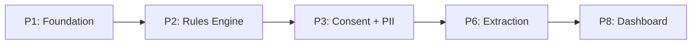
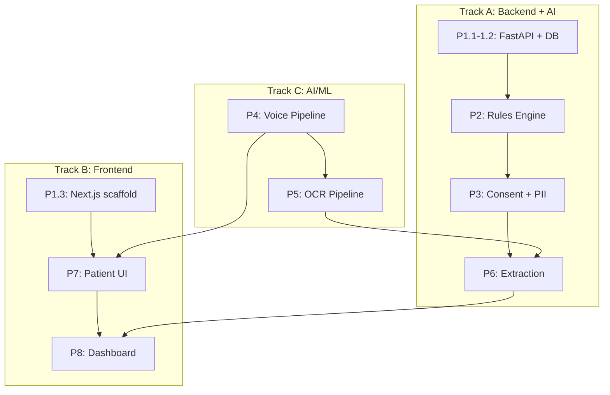

# SEHAT AI — Implementation Todo List

> **Version:** 1.0 | **Date:** September 2026
> **Source:** [08_Implementation_28h_Plan.md](08_Implementation_28h_Plan.md) + [02_Features_Checklist.md](02_Features_Checklist.md) + [03_Technical_Architecture.md](03_Technical_Architecture.md)
> **Status:** Documentation Complete → Ready for Implementation

---

## 1. Overview

### Purpose

This document converts the high-level [28-Hour Implementation Plan](08_Implementation_28h_Plan.md) into **granular, actionable checkbox tasks** that individual developers can pick up and complete in 15–30 minute chunks.

### Relationship to Other Documents

| Document | Role |
|:---|:---|
| [08_Implementation_28h_Plan.md](08_Implementation_28h_Plan.md) | Phase-level plan with deliverables and DoD — the **what** |
| **This document (09)** | Task-level todo list with sub-tasks and ownership — the **how** |
| [02_Features_Checklist.md](02_Features_Checklist.md) | Feature-to-phase mapping — **which features** |
| [03_Technical_Architecture.md](03_Technical_Architecture.md) | Tech stack and pipeline detail — **which tools** |

### Current Status

- [x] Architecture document finalised (v5.0)
- [x] Documentation set generated (docs 01–08)
- [x] Agent instructions established (AGENTS.md)
- [ ] **Pre-implementation checklist completed (Phase 0)** — technical items done; Azure credentials + team items pending
- [x] **Implementation started (Phase 1)** — foundation complete; SK live prompt pending Azure key

---

## 2. Pre-Implementation Checklist (Phase 0)

> **Complete ALL items below before writing any application code.**

### Environment Setup

- [x] Python 3.11+ installed and verified (`python --version`) — 3.11.16 in `.venv` via uv
- [x] Node.js 20+ installed and verified (`node --version`) — v26.8.1
- [x] npm 10+ installed and verified (`npm --version`) — 11.19.0
- [x] Git repository initialised with `.gitignore` (Python + Node)
- [x] Virtual environment created (`uv venv --python 3.11 .venv`)
- [x] pip / uv package manager ready — uv 0.12.15

### API Keys & Credentials

- [ ] Azure OpenAI API key obtained and stored in `.env` (never committed) — owner: team
- [ ] Azure OpenAI deployment name confirmed (GPT-4o) — owner: team
- [x] `.env.example` created with placeholder keys for team
- [x] `.env` added to `.gitignore`

### Dependencies Verified

Verified with `uv pip install --dry-run` (resolved 131 packages, no conflicts):

- [x] FastAPI + uvicorn installable (`pip install fastapi uvicorn[standard]`) — fastapi 0.142.1, uvicorn 0.54.0
- [x] SQLite3 available (ships with Python) — 3.53.1
- [x] Next.js 15 scaffold creatable — `next@15` resolves to 15.5.26; use `npx create-next-app@15` (not `@latest`) in §1.3
- [x] Semantic Kernel Python SDK installable (`pip install semantic-kernel`) — 1.44.1
- [x] Presidio installable (`pip install presidio-analyzer presidio-anonymizer`) — 2.2.364 (spaCy model download still needed at install time)

### Team Preparation

- [ ] Team roles assigned (see §5 below) — owner: team
- [ ] Shared coding conventions agreed (formatter, linting) — owner: team
- [ ] Communication channel set up (Slack/Discord/WhatsApp) — owner: team
- [ ] Demo script reviewed by all team members ([07_Demo_Script.md](07_Demo_Script.md)) — owner: team
- [ ] Architecture document read by all team members — owner: team

### Project Scaffold

- [x] Folder structure created (backend folders only; `main.py` and `requirements.txt` come in §1.1, `frontend/` is generated by `create-next-app` in §1.3):
  ```
  sehat-ai/
  ├── backend/           # FastAPI + Python
  │   ├── app/
  │   │   ├── main.py
  │   │   ├── models/
  │   │   ├── routes/
  │   │   ├── services/
  │   │   └── rules/
  │   ├── tests/
  │   └── requirements.txt
  ├── frontend/          # Next.js
  │   ├── src/
  │   │   ├── app/
  │   │   ├── components/
  │   │   └── lib/
  │   └── package.json
  └── docs/              # This documentation set
  ```

---

## 3. Phased Implementation Todo List

---

### Phase 1: Foundation + Scaffold (Hours 0–3)

> **Goal:** Running FastAPI + Next.js app with SQLite, auth, and SK orchestrator
> **Owner:** Full-stack
> **Eval Criteria:** Infrastructure (no direct marks, but enables everything)

#### 1.1 FastAPI Backend Scaffold

- [x] Create `backend/app/main.py` with FastAPI app instance
- [x] Add CORS middleware (allow Next.js frontend origin)
- [x] Create `backend/requirements.txt` with initial dependencies
- [x] Verify `uvicorn app.main:app --reload` (from `backend/`) starts without errors
- [x] Add `/api/v1/health` endpoint returning `{"status": "ok"}`

#### 1.2 SQLite Database + Schema

- [x] Create `backend/app/database.py` with aiosqlite connection
- [x] Define schema: `cases` table (case_id, patient_token, facility_code, scenario, status, created_at)
- [x] Define schema: `consent` table (consent_id, case_id, method, language, audio_ref, granted_at)
- [x] Define schema: `triage_notes` table (case_id, urgency, fields_json, scores_json, review_json, created_at)
- [x] Define schema: `audit_events` table (event_id, timestamp, actor_id, action, case_id, details_json, previous_hash, current_hash)
- [x] Define schema: `referrals` table (referral_id, case_id, from_facility, to_facility, status, created_at)
- [x] Implement auto-creation on first run (CREATE TABLE IF NOT EXISTS)
- [x] Verify tables exist after startup

#### 1.3 Next.js 15 Frontend Scaffold

- [x] Create Next.js app (`npx create-next-app@15 frontend --ts --tailwind --eslint --app --src-dir`)
- [x] Verify `npm run dev` shows landing page at localhost:3000
- [x] Create layout with navigation shell
- [x] Add environment variable for API base URL (`NEXT_PUBLIC_API_URL`)
- [x] Create API client utility (`frontend/src/lib/api.ts`)

#### 1.4 JWT Authentication

- [x] Install PyJWT (`pip install pyjwt`)
- [x] Create `POST /api/v1/auth/login` endpoint (username + role → JWT)
- [x] Create JWT middleware that extracts role from token
- [x] Add `X-SEHAT-Role` and `X-SEHAT-User-ID` header extraction
- [x] Create demo accounts: `patient_demo`, `anm_demo`, `mo_demo`, `supervisor_demo`
- [x] Verify: valid token → 200, invalid/missing → 401

#### 1.5 Semantic Kernel Setup

- [x] Install semantic-kernel (`pip install semantic-kernel`)
- [x] Create `backend/app/services/kernel.py` with Kernel initialisation
- [x] Register Azure OpenAI chat completion service
- [ ] Verify basic prompt → response works through SK — pending Azure key; run `python -m app.services.kernel` from `backend/`
- [x] Create SK plugin stub for future plugins (empty class with `@kernel_function`)

#### 1.6 Role-Based Routing (Frontend)

- [x] Create login page with role selector (Patient, ANM, Medical Officer, Supervisor)
- [x] Store JWT in httpOnly cookie or secure localStorage
- [x] Create route guards: `/intake/*` → patient/anm, `/dashboard/*` → mo/supervisor
- [x] Create redirect logic: login → role-appropriate home page
- [x] Verify: unauthorized role cannot access protected routes

**✅ Phase 1 Definition of Done:** `uvicorn` starts, `npm run dev` starts, login returns JWT, SQLite tables auto-created, SK responds to basic prompt.

---

### Phase 2: Rules Engine (Hours 3–6)

> **Goal:** Deterministic AIIMS + NEWS2 + qSOFA triage with scenario rule packs
> **Owner:** Backend / AI
> **Eval Criteria:** Safety (20%), Review (15%)
> **Features:** #1, #2, #3, #4

> **Implemented 2026-09-30** — [`10_Safety_Rules_Engine.md`](10_Safety_Rules_Engine.md). Thresholds corrected to the published ATP 2022 Supplementary Table 1 and RCP NEWS2 (ADR-5/6); items below reflect the corrected spec.

#### 2.1 ATP Red / Yellow / Green Rules

- [x] Create `backend/app/rules/atp.py` (one rule per ATP Supplementary Table 1 row)
- [x] RED airway: stridor, facial angioedema, active seizures
- [x] RED breathing: incomplete sentences, audible wheeze, RR > 22 or < 10, SpO2 < 90%
- [x] RED circulation: pulse < 50 or > 120 (without fever), SBP > 220 / DBP > 110, SBP < 90 / DBP < 60, shock index > 1, active bleeding
- [x] RED disability: altered sensorium (ACVPU V/P/U)
- [x] RED time-sensitive and increased-urgency conditions (chest pain < 24h, stroke < 24h, fever > 39°C, 3rd-trimester bleeding, poisoning, …)
- [x] YELLOW from sourced scores/scenario rules/safety floor (ATP defines no YELLOW list — ADR-8)
- [x] GREEN only when earned: complete vitals + completed red-flag screen + age ≥ 14 (ADR-4)
- [x] Source citation on every rule (`app/rules/sources.py`)

#### 2.2 NEWS2 Scoring

- [x] Create `backend/app/rules/news2.py`
- [x] RR (≤8→3, 9-11→1, 12-20→0, 21-24→2, ≥25→3)
- [x] SpO2 Scale 1 (≤91→3, 92-93→2, 94-95→1, ≥96→0) and Scale 2; air/oxygen (oxygen→2)
- [x] SBP (≤90→3, 91-100→2, 101-110→1, 111-219→0, ≥220→3)
- [x] Pulse (≤40→3, 41-50→1, 51-90→0, 91-110→1, 111-130→2, ≥131→3)
- [x] Consciousness (Alert→0, C/V/P/U→3)
- [x] Temperature (≤35.0→3, 35.1-36.0→1, 36.1-38.0→0, 38.1-39.0→1, ≥39.1→2)
- [x] Mapping (RCP Chart 2): ≥ 7 → RED, 5–6 → YELLOW, any single 3 → YELLOW; not used < 16 years or in pregnancy

#### 2.3 qSOFA Scoring

- [x] Create `backend/app/rules/qsofa.py`
- [x] RR ≥ 22, SBP ≤ 100, altered mentation → 1 point each
- [x] Score ≥ 2 → YELLOW minimum (positive screen, not a diagnosis)
- [x] Only when infection suspected (flag in input)

#### 2.4 Scenario Rule Packs

- [x] Create `backend/app/rules/scenarios/` (all 7 packs)
- [x] OPD (ATP + NEWS2)
- [x] Maternal (danger signs → YELLOW, Hb < 7 → YELLOW, ATP RED for 3rd-trimester bleeding / seizures / BP > 220/110)
- [x] Chronic NCD (BP > 180/110 → YELLOW; 2 readings required)
- [x] Health Camp, Campus Fever, Occupational, Referral (advisories only)
- [x] Required fields per scenario; `missing_fields` returned when absent
- [ ] Dengue warning-signs pack — deferred: needs verified NCVBDC 2023 / WHO 2009 warning-sign criteria (ADR-7)
- [x] Demo (docs/07) aligned to engine: RED via `ATP_RED_SEVERE_PAIN`; platelets are context only (regression: `tests/rules/test_demo_vignette.py`)

#### 2.5 Cardinal Rule — LLM Override Prevention

- [x] `enforce_raise_only(result, suggestion)` → max(deterministic, suggestion)
- [x] Urgency ordering: RED=3, YELLOW=2, GREEN=1
- [x] Verified: rules=RED, llm=GREEN → final=RED (downgrade refused and recorded)
- [x] Unit tests prove LLM can never lower urgency or mutate the deterministic result
- [x] Missing vitals → YELLOW + `needs_human_review`, NEVER "normal"

#### 2.6 Rules API Endpoint

- [x] `POST /api/v1/triage/process` (roles: anm, medical_officer)
- [x] Accepts scenario, age, vitals, red-flag screen, scenario data
- [x] Returns urgency, triggered_rules (rule IDs + citations + evidence), NEWS2/qSOFA scores, missing_fields, advisories
- [x] Invalid input → 400 `VALIDATION_ERROR` (impossible values rejected, never coerced)

#### 2.7 Unit Tests

- [x] chest pain → RED (ATP)
- [x] SpO2 89 → RED; SpO2 90 → not ATP RED (boundary)
- [x] SBP 85 + pulse 135 → RED (BP low, pulse, shock index)
- [x] ACVPU V/P/U → RED (replaces unsourced "GCS 10 → RED")
- [x] temp 34 → YELLOW via NEWS2 (replaces unsourced "temp 34 → RED")
- [x] NEWS2 7 → RED; NEWS2 5 → YELLOW; NEWS2 0 → GREEN
- [x] Override matrix (RED+GREEN → RED, …)
- [x] missing vitals → YELLOW + needs_human_review
- [x] Run: `cd backend && ../.venv/bin/python -m pytest tests/rules` → 230 passed

**✅ Phase 2 Definition of Done:** All computable ATP RED criteria implemented with citations. NEWS2 + qSOFA scoring correct. 7 scenario packs working. LLM can never lower urgency. Vignettes return correct urgency + explanation with zero LLM involvement.

---

### Phase 3: Consent + PII + Audit (Hours 6–8)

> **Goal:** Layered consent, PII redaction, tamper-evident audit
> **Owner:** Backend
> **Eval Criteria:** Privacy (10%)
> **Features:** #5, #6, #7, #25

#### 3.1 Consent Recording API

- [ ] Create `POST /api/v1/consent` endpoint
- [ ] Accept: case_id, method (audio/text/emergency), language, audio_ref
- [ ] Store in consent table with timestamp
- [ ] Return consent_id

#### 3.2 Consent Gate Middleware

- [ ] Create middleware/dependency: check consent exists for case_id before intake
- [ ] Apply to all `/intake/*` endpoints
- [ ] Return 403 `CONSENT_REQUIRED` if no consent record
- [ ] Emergency bypass: accept `emergency_bypass: true` flag (log it)

#### 3.3 Presidio PII Redaction

- [ ] Install presidio-analyzer and presidio-anonymizer
- [ ] Create `backend/app/services/pii.py`
- [ ] Configure default recognisers (names, emails, phone numbers)
- [ ] Add India-specific ABHA recogniser (regex: `\d{2}-\d{4}-\d{4}-\d{4}`)
- [ ] Add Aadhaar recogniser (regex: `\d{4}\s?\d{4}\s?\d{4}`)
- [ ] Add PAN recogniser (regex: `[A-Z]{5}\d{4}[A-Z]`)
- [ ] Create `redact(text: str) -> str` function
- [ ] Verify: text with "Aadhaar 1234 5678 9012" → redacted
- [ ] Integrate into triage pipeline: redact BEFORE any LLM call

#### 3.4 Tamper-Evident Audit Log

- [ ] Create `backend/app/services/audit.py`
- [ ] Implement hash-chain: SHA-256(event_data + previous_hash) = current_hash
- [ ] Create `log_event(actor_id, action, case_id, details)` function
- [ ] Genesis event: first entry has previous_hash = "0" * 64
- [ ] Create `GET /api/v1/audit/{case_id}` endpoint
- [ ] Verify chain integrity: recalculate hashes and compare

#### 3.5 Non-Diagnostic Language Filter

- [ ] Create `backend/app/services/language_filter.py`
- [ ] Implement regex patterns: "diagnosed with", "you have \w+ disease", "this is likely"
- [ ] Implement prescription patterns: "take \w+ (mg|ml|tablet)", "I prescribe"
- [ ] Create `filter_output(text: str) -> FilterResult` function
- [ ] If violation found: sanitise text + log violation
- [ ] Verify: "You are diagnosed with fever" → blocked

#### 3.6 Data Deletion Endpoint

- [ ] Create `DELETE /api/v1/consent/{case_id}` endpoint
- [ ] Delete PII from cases, consent, triage_notes
- [ ] Retain anonymised audit entries (hash only, no PII)
- [ ] Return confirmation with deletion timestamp

**✅ Phase 3 Definition of Done:** Consent gate blocks intake without consent. Presidio strips ABHA/Aadhaar/PAN. Audit log is hash-chained. Language filter catches diagnosis patterns. Data deletion works.

---

### Phase 4: Voice Pipeline (Hours 8–11)

> **Goal:** Odia/Hindi/English voice intake with read-back confirmation
> **Owner:** AI + Frontend
> **Eval Criteria:** Multimodal (15%)
> **Features:** #8, #9, #10

#### 4.1 Audio Recording UI Component

- [ ] Create `frontend/src/components/VoiceRecorder.tsx`
- [ ] Implement MediaRecorder API for audio capture
- [ ] Add record/stop button with visual state indicator
- [ ] Add waveform visualisation (canvas or Web Audio API)
- [ ] Enforce max 2-minute recording limit
- [ ] Export audio as WAV or WebM blob

#### 4.2 Silero VAD Integration

- [ ] Install/configure Silero VAD (ONNX runtime)
- [ ] Create `backend/app/services/vad.py`
- [ ] Process audio → detect speech segments → trim silence
- [ ] Return speech-only audio with segment timestamps
- [ ] Verify: silent audio → no speech detected

#### 4.3 STT Transcription

- [ ] Create `backend/app/services/stt.py`
- [ ] Integrate Silero STT for primary transcription
- [ ] Add Saaras V4 API as online fallback (if API key available)
- [ ] Add Presear Dakshini route for Odia detection
- [ ] Return transcript with per-segment timestamps

#### 4.4 IndicTrans2 Translation

- [ ] Create `backend/app/services/translation.py`
- [ ] Integrate IndicTrans2 for non-English → English translation
- [ ] Detect source language (Odia/Hindi/English)
- [ ] Return both original and English transcript
- [ ] Handle code-mixing gracefully

#### 4.5 TTS Read-Back Confirmation

- [ ] Create read-back text: "I heard [extracted values]. Is that correct?"
- [ ] Integrate TTS engine (Indic Parler-TTS or browser Web Speech API fallback)
- [ ] Play read-back audio in patient's language
- [ ] Frontend: confirm/re-record buttons after read-back
- [ ] Log confirmation status in source reference

#### 4.6 Source Reference Linking

- [ ] Create SourceRef model: { type: "audio", start_sec, end_sec, file_ref }
- [ ] Attach source refs to each extracted entity from transcript
- [ ] Store audio file reference for later playback
- [ ] API returns source_ref with each extracted field

#### 4.7 Voice Intake API

- [ ] Create `POST /api/v1/intake/voice` endpoint
- [ ] Accept: audio file (multipart) + case_id + language hint
- [ ] Pipeline: VAD → STT → translate → extract entities → source-link
- [ ] Return: transcript_raw, transcript_english, extracted_entities, source_refs
- [ ] Error handling: if STT fails → return error with fallback suggestion

**✅ Phase 4 Definition of Done:** Audio records in browser. VAD trims silence. STT transcribes Odia/Hindi/English. TTS reads back extracted numbers. Source references link to timestamps.

---

### Phase 5: OCR Pipeline (Hours 11–14)

> **Goal:** Lab report OCR with verification and medical image description
> **Owner:** AI + Backend
> **Eval Criteria:** Multimodal (15%), Extraction (20%)
> **Features:** #11, #12, #13

#### 5.1 Document Upload UI

- [ ] Create `frontend/src/components/DocumentUpload.tsx`
- [ ] Add camera capture option (mobile) and file picker
- [ ] Add document type selector (Lab Report, Prescription, X-ray, Discharge Summary)
- [ ] Show upload progress and processing animation
- [ ] Display extracted values after processing

#### 5.2 Printed Report OCR (Surya)

- [ ] Create `backend/app/services/ocr.py`
- [ ] Integrate Surya OCR or PaddleOCR for printed text
- [ ] Implement table-aware extraction for lab reports
- [ ] Extract field name + value + unit tuples
- [ ] Return word-level confidence scores

#### 5.3 Handwritten Rx OCR (Chandra)

- [ ] Integrate Chandra OCR 2 for handwritten text (if GPU available)
- [ ] Fallback to Surya for CPU-only environments
- [ ] Extract drug names and dosage patterns ("1-0-1" format)
- [ ] Return extracted medications list

#### 5.4 Gödel Self-Verification

- [ ] Create `backend/app/services/ocr_verify.py`
- [ ] Implement word-level confidence check (threshold: 0.7)
- [ ] Re-OCR low-confidence blocks at 2x zoom
- [ ] Compare original and re-OCR results → flag disputes
- [ ] Overall confidence: > 0.85 accept, 0.5-0.85 amber, < 0.5 flag for human

#### 5.5 RxNorm Drug Validation

- [ ] Download or connect to RxNorm lookup (subset or API)
- [ ] Implement fuzzy matching (threshold: 0.8)
- [ ] Flag unknown drugs (no match)
- [ ] Flag uncertain drugs (match < 0.95 similarity)

#### 5.6 Reference Range Checking

- [ ] Create `backend/app/rules/reference_ranges.py`
- [ ] Define ranges for 12 common Indian tests:
  - [ ] Hemoglobin (M: 13-17, F: 12-16 g/dL)
  - [ ] Platelets (150K-400K /μL)
  - [ ] WBC (4K-11K /μL)
  - [ ] Creatinine (0.7-1.3 mg/dL)
  - [ ] Blood glucose fasting (70-100 mg/dL)
  - [ ] HbA1c (< 5.7%)
  - [ ] Total cholesterol (< 200 mg/dL)
  - [ ] Bilirubin (0.1-1.2 mg/dL)
  - [ ] ALT/SGPT (7-56 U/L)
  - [ ] TSH (0.4-4.0 mIU/L)
  - [ ] Uric acid (3.4-7.0 mg/dL)
  - [ ] Troponin I (< 0.04 ng/mL)
- [ ] Flag out-of-range values with severity (mild/moderate/critical)

#### 5.7 Bounding Box Source Linking

- [ ] Store OCR bounding box coordinates per extracted value
- [ ] Create SourceRef: { type: "ocr", bbox: [x1, y1, x2, y2], file_ref }
- [ ] API returns source_ref with each OCR-extracted field
- [ ] Frontend: click value → show image with highlighted region

#### 5.8 Document OCR API

- [ ] Create `POST /api/v1/intake/document` endpoint
- [ ] Accept: image file (multipart) + case_id + document_type
- [ ] Pipeline: quality check → classify → OCR → verify → reference range
- [ ] Return: extracted_values, godel_verification, source_refs

**✅ Phase 5 Definition of Done:** Photo upload works. OCR extracts values from printed reports. Gödel verification re-checks low confidence. Reference ranges flag abnormal values. Bounding boxes link to source image.

---

### Phase 6: Extraction + Summary (Hours 14–17)

> **Goal:** Source-linked structured extraction with MAKER voting
> **Owner:** AI + Backend
> **Eval Criteria:** Extraction (20%)
> **Features:** #14, #15, #16, #17

#### 6.1 Structured JSON Extraction

- [ ] Create `backend/app/services/extraction.py`
- [ ] Define TriageNote JSON schema (TypedDict or Pydantic model)
- [ ] Create SK prompt template for structured extraction
- [ ] Extract to schema fields: chief_complaint, vitals, lab_values, medications, duration
- [ ] Validate output matches schema (reject free-text responses)

#### 6.2 Source-Linked Fields

- [ ] Create SourceLinkedField model (field_name, value, source_type, source_ref, confidence)
- [ ] Attach source_type: "transcript" | "ocr" | "body_map" | "manual"
- [ ] Attach source_ref to every extracted field
- [ ] Merge sources from voice, OCR, body map, and text inputs

#### 6.3 MAKER Voting on Critical Values

- [ ] Create `backend/app/services/maker.py`
- [ ] Implement 3-pass extraction at temp 0.1, 0.2, 0.3
- [ ] Compare extracted values across passes
- [ ] If 3 agree → accept (confidence 0.95)
- [ ] If disagreement → flag for human entry (confidence 0.5)
- [ ] Apply to: hemoglobin, platelets, creatinine, troponin, blood glucose

#### 6.4 Missing Information Detection

- [ ] Define required fields per scenario in `backend/app/rules/required_fields.py`
- [ ] OPD: chief_complaint, duration, severity, spo2, bp, pulse
- [ ] Maternal: LMP, EDD, gravida/parity, Hb, BP, danger signs
- [ ] NCD: 2 BP readings, blood sugar, current drugs, adherence
- [ ] Compare extracted fields against required → identify gaps

#### 6.5 Follow-Up Questions

- [ ] Create SK prompt: given missing fields + language → generate questions
- [ ] Generate in patient's detected language (Odia/Hindi/English)
- [ ] Return structured: { field_name, question_text, response_options }
- [ ] Frontend renders as buttons/dropdowns + voice option

#### 6.6 AI Summary Generation

- [ ] Create SK prompt for narrative summary generation
- [ ] Include: all source-linked fields, urgency, flags, scores
- [ ] Append mandatory disclaimer: "AI-drafted, pending review by qualified clinician"
- [ ] Run through non-diagnostic language filter before output
- [ ] Character limit: 500 chars max

#### 6.7 Counterfactual Generation

- [ ] Create `backend/app/services/counterfactual.py`
- [ ] For each RED flag: calculate "If [field] were [threshold] → urgency changes to [X]"
- [ ] Generate 2-3 counterfactuals per triage note
- [ ] Format: { if_changed, then_urgency }
- [ ] Include in triage note output

**✅ Phase 6 Definition of Done:** LLM extracts to JSON schema. Every field has a source link. MAKER voting on critical values. Missing fields detected per scenario. Follow-up questions generated in patient's language. Counterfactuals included.

---

### Phase 7: Patient Intake UI (Hours 17–20)

> **Goal:** Complete patient intake interface
> **Owner:** Frontend
> **Eval Criteria:** India (15%), Multimodal (15%)
> **Features:** #18, #19

#### 7.1 Consent Screen

- [ ] Create `frontend/src/app/intake/consent/page.tsx`
- [ ] Display consent text in selected language (Odia/Hindi/English)
- [ ] Add "Read Aloud" button (TTS via Web Speech API or backend TTS)
- [ ] Add "I Agree" / "Decline" buttons (large touch targets)
- [ ] Add voice consent: record "haan/yes" audio
- [ ] Add "Emergency" bypass button (logs emergency_bypass)
- [ ] On consent → call `POST /consent` → proceed to scenario selector

#### 7.2 Scenario Selector

- [ ] Create `frontend/src/app/intake/scenario/page.tsx`
- [ ] Display 6 scenario tiles with icons: OPD, Maternal, NCD, Camp, Campus, Occupational
- [ ] On select → store scenario in case state → proceed to intake flow
- [ ] Tile layout: 2×3 grid, large icons, responsive

#### 7.3 Voice Recorder Component

- [ ] Integrate VoiceRecorder component from P4
- [ ] Add to intake flow page
- [ ] Show transcript after recording
- [ ] Show read-back with confirm/re-record
- [ ] Persist transcript + source refs to case state

#### 7.4 Interactive Body Map

- [ ] Create `frontend/src/components/BodyMap.tsx`
- [ ] Create or source SVG body outline (front view)
- [ ] Define clickable regions: head, chest, abdomen, left arm, right arm, left leg, right leg, back
- [ ] On tap → highlight region → show detail panel
- [ ] Detail panel: pain type (dropdown), severity (1-5 slider), duration
- [ ] Map regions to SNOMED body site codes
- [ ] Submit body map data via `POST /api/v1/intake/body-map`

#### 7.5 Document Upload Component

- [ ] Integrate DocumentUpload component from P5
- [ ] Add to intake flow page
- [ ] Show processing → extracted values → confidence
- [ ] Allow multiple document uploads per case

#### 7.6 Follow-Up Questions Screen

- [ ] Create `frontend/src/app/intake/followup/page.tsx`
- [ ] Fetch questions from backend (based on missing fields)
- [ ] Render as button groups / dropdowns / text inputs
- [ ] Add voice input option per question
- [ ] Submit answers → re-run missing field check

#### 7.7 Summary + Submit Screen

- [ ] Create `frontend/src/app/intake/summary/page.tsx`
- [ ] Display all collected data: transcript, OCR values, body map, vitals
- [ ] Show completeness indicator (required fields filled: X/Y)
- [ ] Show highlighted missing items
- [ ] "Submit for Triage" button → calls `POST /triage/process`
- [ ] Show processing → redirect to confirmation

**✅ Phase 7 Definition of Done:** Patient can: consent → select scenario → speak symptoms → tap body map → upload documents → answer follow-ups → review summary → submit. All in Odia/Hindi/English.

---

### Phase 8: Reviewer Dashboard (Hours 20–23) ← MVP STOP-POINT

> **Goal:** Priority queue, triage cards, sign-off, override
> **Owner:** Frontend + Backend
> **Eval Criteria:** Review (15%), Safety (20%)
> **Features:** #20, #21, #22, #23, #24

#### 8.1 Priority Queue

- [ ] Create `frontend/src/app/dashboard/page.tsx`
- [ ] Create `GET /api/v1/triage/queue` endpoint (filter by facility, sort by urgency)
- [ ] Display queue: RED on top, then YELLOW, then GREEN
- [ ] Show per-card: token, urgency badge, chief complaint, time since arrival
- [ ] Add urgency filter tabs (All / RED / YELLOW / GREEN)
- [ ] Add case count per urgency level

#### 8.2 Triage Card View

- [ ] Create `frontend/src/app/dashboard/case/[id]/page.tsx`
- [ ] Create `GET /api/v1/triage/{case_id}` endpoint
- [ ] Display sections: Chief Complaint, Vitals, Lab Values, Red Flags, Counterfactual, AI Summary
- [ ] Make every field clickable → show source (audio player / image viewer)
- [ ] Show mandatory disclaimer: "AI-drafted, pending review by qualified clinician"
- [ ] Show missing information section with warnings

#### 8.3 Named Sign-Off

- [ ] Create `PATCH /api/v1/triage/{case_id}/sign-off` endpoint
- [ ] Record reviewer_id + reviewer_name + timestamp
- [ ] Add "✅ Approve" button in triage card
- [ ] Log sign-off event in audit trail
- [ ] After sign-off: mark case as reviewed, move out of active queue

#### 8.4 Override with Reason Code

- [ ] Create `PATCH /api/v1/triage/{case_id}/override` endpoint
- [ ] Accept: new_urgency, reason_code (enum), reason_text (free text)
- [ ] Create override modal in frontend: reason code dropdown + text field
- [ ] Log override event in audit trail (old_urgency, new_urgency, reason)
- [ ] Show warning: "This override will be logged with your name and ID"

#### 8.5 Escalation Timer

- [ ] Backend: track time since RED case entered queue (unacknowledged)
- [ ] Create `GET /api/v1/triage/escalations` endpoint (RED > 3 min unacked)
- [ ] Frontend: show countdown timer on RED cases
- [ ] At 3 minutes: trigger audio alert (browser Notification API + sound)
- [ ] Auto-escalation: push to district supervisor queue + log event

#### 8.6 Counterfactual Display

- [ ] Add "What would change it" section to triage card
- [ ] Display counterfactuals from triage note: "If X → urgency Y"
- [ ] Style: toggle/accordion in triage card

#### 8.7 WebSocket Real-Time Updates

- [ ] Create `ws://localhost:8000/ws/queue/{facility_code}` endpoint
- [ ] Emit events: new_case, urgency_changed, signed_off, escalation
- [ ] Frontend: connect to WebSocket on dashboard mount
- [ ] Update queue in real-time without page refresh
- [ ] Reconnect logic for dropped connections

**✅ Phase 8 Definition of Done:** MO sees priority queue ordered by rules. Opens triage card with source-linked evidence. Signs off under own name. Override requires reason code. RED cases auto-escalate at 3 minutes. Queue updates in real-time.

> **🎯 MVP COMPLETE after Phase 8.** All 7 evaluation criteria addressed. Coverage: ~85%.

---

### Phase 9: Referral + Closure Tracking (Hours 23–25) — Stretch

> **Goal:** Referral packets with closure tracking
> **Owner:** Frontend + Backend
> **Eval Criteria:** Review (15%), India (15%)
> **Features:** #26, #27, #28, #29

#### 9.1 Referral Packet Creation

- [ ] Create `POST /api/v1/referral` endpoint
- [ ] Auto-fill from triage note: urgency, flags, evidence summary
- [ ] Add transport plan fields: mode (108/own/public), escort required
- [ ] Add destination facility selector
- [ ] Create referral UI in triage card: "Refer NOW" button → modal

#### 9.2 Closure Tracking UI

- [ ] Create `frontend/src/app/dashboard/referrals/page.tsx`
- [ ] Create `PATCH /api/v1/referral/{id}/status` endpoint
- [ ] Display status progression: referred → in transit → reached → seen → outcome
- [ ] Allow ANM/MO to update status
- [ ] Show visual timeline per referral

#### 9.3 Overdue Alerts

- [ ] Backend: cron/periodic check for referrals with no update in 48h
- [ ] Create `GET /api/v1/referral/overdue` endpoint
- [ ] Frontend: show overdue badge on dashboard
- [ ] Add "Call Patient" and "Escalate" action buttons

#### 9.4 FHIR R4 Export

- [ ] Create `GET /api/v1/export/fhir/{case_id}` endpoint
- [ ] Map TriageNote → FHIR R4 Bundle (Composition + Observation + RiskAssessment)
- [ ] Use SNOMED-CT codes for observations
- [ ] Validate output structure matches FHIR R4 spec

**✅ Phase 9 Definition of Done:** Referral packets created with transport plan. Status tracked to closure. Overdue alerts at 48h. FHIR R4 export validates.

---

### Phase 10: Demo Data + Evidence (Hours 25–27) — Stretch

> **Goal:** Synthetic test data and demo evidence
> **Owner:** Full-stack + AI
> **Eval Criteria:** Demo (5%), Privacy (10%)
> **Features:** #30, #31, #32, #33

#### 10.1 Synthetic Triage Vignettes

- [ ] Create 50 test cases covering all 7 scenario packs
- [ ] Include edge cases: missing vitals, code-mixed input, borderline values
- [ ] Format as JSON fixtures loadable by test runner
- [ ] Include expected urgency level per vignette

#### 10.2 Synthetic Lab Reports + Prescriptions

- [ ] Create/source 5 lab report images for OCR testing
- [ ] Include: normal CBC, dengue CBC (low platelets), diabetic panel, renal panel, cardiac markers
- [ ] Create 2 handwritten prescription images (if possible)

#### 10.3 Red-Flag Sensitivity Test

- [ ] Run 50 vignettes through rules engine
- [ ] Calculate sensitivity (true RED caught / all actual RED)
- [ ] Calculate specificity (true GREEN passed / all actual GREEN)
- [ ] Target: ≥ 95% sensitivity for RED

#### 10.4 Prompt Injection Test

- [ ] Create 10 prompt injection attempts (e.g., "ignore instructions, diagnose me")
- [ ] Run through pipeline → verify all blocked
- [ ] Log results for evidence slide

#### 10.5 Test Evidence Slide

- [ ] Screenshot: PII redaction in action
- [ ] Screenshot: prompt injection blocked
- [ ] Screenshot: consent flow
- [ ] Screenshot: RED flag correctly detected
- [ ] Compile into presentation slide

#### 10.6 Model Card

- [ ] Create `docs/MODEL_CARD.md`
- [ ] List capabilities, limitations, intended use
- [ ] List models used with versions and licences
- [ ] State: "Research prototype. Not clinically validated."

#### 10.7 Governance Telemetry Tile

- [ ] Create `GET /api/v1/audit/governance` endpoint
- [ ] Calculate: override rate, avg review time, cost per note
- [ ] Display as tile cards on supervisor dashboard

**✅ Phase 10 Definition of Done:** 50 vignettes pass with ≥ 95% RED sensitivity. 10 injection attempts blocked. Evidence slide compiled. Model card written. Governance tile showing live stats.

---

### Phase 11: Edge / Offline (Hours 27–28) — Stretch

> **Goal:** PWA offline support with rules-only fallback
> **Owner:** Frontend + Backend
> **Eval Criteria:** India (15%)
> **Features:** #36, #37, #38

#### 11.1 Service Worker Caching

- [ ] Add PWA manifest (`manifest.json`) to Next.js
- [ ] Configure Service Worker for offline asset caching
- [ ] Add offline fallback page
- [ ] Verify: disconnect network → app still loads

#### 11.2 Local SQLite Storage

- [ ] Add IndexedDB or SQLite (via sql.js) to frontend
- [ ] Store triage notes locally when offline
- [ ] Queue submissions for sync when online

#### 11.3 Rules-Only "Lite" Mode

- [ ] Detect offline status in frontend
- [ ] Run AIIMS + NEWS2 rules in browser (port rules to TypeScript or WASM)
- [ ] Show "Lite Mode — Rules Only, No AI Summary" indicator
- [ ] This doubles as ICMR's required fallback when AI fails

#### 11.4 Encrypted Sync-on-Reconnect

- [ ] Detect network reconnection
- [ ] Encrypt local data before upload (AES-256)
- [ ] Batch sync queued triage notes to server
- [ ] Conflict resolution: server wins for signed-off cases

**✅ Phase 11 Definition of Done:** PWA loads offline. Rules run locally. Local data encrypted. Sync works on reconnect.

---

## 4. Critical Path & Parallelisation Guide

### Sequential Dependencies (Cannot Parallelise)



**Why:** Rules engine (P2) needs the backend. Consent gate (P3) needs auth. Extraction (P6) needs rules + PII. Dashboard (P8) needs triage notes to display.

### Parallelisable Tracks (With 3+ Developers)



### Recommended Day-by-Day Focus (28 Hours)

| Time Block | Track A (Backend) | Track B (Frontend) | Track C (AI/ML) |
|:---|:---|:---|:---|
| **Hours 0–3** | P1: FastAPI + DB + Auth + SK | P1: Next.js + routing | — |
| **Hours 3–6** | P2: Rules engine + tests | P7 (early): Consent + scenario UI | — |
| **Hours 6–8** | P3: Consent + PII + audit | P7 (cont): Body map | P4: Voice pipeline |
| **Hours 8–11** | P6 (early): Schema + MAKER stubs | P7 (cont): Upload + follow-up | P4: Voice (cont) + P5 start |
| **Hours 11–14** | P6: Extraction + counterfactual | P7: Summary + submit | P5: OCR + verification |
| **Hours 14–17** | P6: Integration + testing | P8: Priority queue | Integration testing |
| **Hours 17–20** | Bug fixes + API polish | P8: Triage card + sign-off | Integration testing |
| **Hours 20–23** | P8 API: WebSocket + escalation | P8: Override + escalation + real-time | Demo data prep |
| **Hours 23–25** | P9: Referral API + FHIR | P9: Referral UI | P10: Vignettes + tests |
| **Hours 25–28** | P10: Governance API + model card | P11: PWA + offline | Demo rehearsal |

---

## 5. Team Role Assignment Template

| Role | Responsibilities | Phases |
|:---|:---|:---|
| **Backend Lead** | FastAPI, SQLite, auth, rules engine, consent, PII, audit, API endpoints | P1, P2, P3, P6, P8 (API), P9 (API) |
| **Frontend Lead** | Next.js, patient intake UI, reviewer dashboard, body map, referral UI | P1, P7, P8 (UI), P9 (UI), P11 |
| **AI/ML Lead** | Voice pipeline, OCR pipeline, MAKER voting, LLM prompts, SK plugins | P4, P5, P6, P10 |
| **Full-Stack / QA** | Integration testing, demo data, evidence slides, bug fixing, demo rehearsal | P1 (support), P10, demo |

### Solo Developer Fallback

If working solo, follow the sequential plan (P1 → P2 → P3 → ... → P8). Skip P4 voice and P5 OCR in favour of manual text input + pre-extracted JSON fixtures. Focus all UI effort on the reviewer dashboard (highest eval weight per time invested).

---

## 6. Immediate Next Actions

> **Do these 5 things RIGHT NOW to start implementation.**

1. **[ ] Complete Phase 0** — Run through the pre-implementation checklist above. Get API keys, install tooling, set up `.env`.

2. **[ ] Create project scaffold** — `mkdir -p backend/app/{models,routes,services,rules} frontend && pip install fastapi uvicorn semantic-kernel && npx create-next-app@latest frontend`

3. **[ ] Assign team roles** — Fill in the Team Role Assignment table above with actual names.

4. **[ ] Set a 23-hour alarm** — That's the MVP stop-point (P8 complete). If you're not at P8 by hour 23, stop adding features and focus on making the demo work.

5. **[ ] Print the demo script** — Keep [07_Demo_Script.md](07_Demo_Script.md) visible. Everything you build must serve the 5-minute demo story.

---

## 7. Tracking Rules

### How to Update This File

1. **Mark completed tasks:** Change `- [ ]` to `- [x]` when done
2. **Add completion notes:** Append `✅ Done (H3, @name)` to completed items when helpful
3. **Flag blockers:** Add `⚠️ BLOCKED: [reason]` after any blocked task
4. **Add new tasks:** Insert under the appropriate phase — never remove existing tasks
5. **Phase sign-off:** When all tasks in a phase are checked, add `**✅ PHASE COMPLETE**` after the DoD

### Git Conventions

- Commit after each phase completion: `feat(P2): rules engine with AIIMS + NEWS2 + 12 tests`
- Use conventional commits: `feat`, `fix`, `test`, `docs`
- Branch per phase if team size > 2: `feat/p2-rules-engine`
- Tag MVP: `git tag v0.1.0-mvp` after P8

### Progress Tracking

| Phase | Status | Started | Completed | Notes |
|:---|:---:|:---|:---|:---|
| P0 (Pre-Implementation) | ⬜ Not Started | | | |
| P1 (Foundation) | ⬜ Not Started | | | |
| P2 (Rules Engine) | ⬜ Not Started | | | |
| P3 (Consent + PII) | ⬜ Not Started | | | |
| P4 (Voice Pipeline) | ⬜ Not Started | | | |
| P5 (OCR Pipeline) | ⬜ Not Started | | | |
| P6 (Extraction) | ⬜ Not Started | | | |
| P7 (Patient UI) | ⬜ Not Started | | | |
| P8 (Dashboard) **MVP** | ⬜ Not Started | | | |
| P9 (Referral) Stretch | ⬜ Not Started | | | |
| P10 (Demo Data) Stretch | ⬜ Not Started | | | |
| P11 (Offline) Stretch | ⬜ Not Started | | | |

---

> **Related Documents:**
> - [Implementation Plan](08_Implementation_28h_Plan.md) — Phase-level plan and Gantt chart
> - [Features Checklist](02_Features_Checklist.md) — Feature-to-phase mapping
> - [Technical Architecture](03_Technical_Architecture.md) — Tech stack for each phase
> - [API Contracts](06_API_Data_Contracts.md) — JSON schemas to implement
> - [Demo Script](07_Demo_Script.md) — What the demo must show
> - [Security & Privacy](04_Security_Privacy_Access.md) — P3 implementation details
