# 🏥 SEHAT AI v5.0 — THE FINAL MERGED ARCHITECTURE
## A Rules-First, Evidence-Linked, Multimodal Clinical Handoff Engine

> **One-Line Pitch:** *"Earlier virtual clinicians optimised diagnostic accuracy. We optimise safe handoff — with every field traced to its source, every urgency set by published Indian protocols, and every referral tracked to closure."*

> [!CAUTION]
> **This document is THE SINGLE SOURCE OF TRUTH.** It supersedes and merges:
> - `rnd_analysis.md` (academic research, model selection, training pipeline)
> - `definitive_architecture.md` v4 (system design, rules engine, data flow)
> - `cognizant_strategic_alignment.md` (TriZetto integration, Semantic Kernel)
>
> **No implementation begins until this document is approved.**

---

## Table of Contents

1. [Problem Statement — What PS03 Actually Asks](#1-problem-statement)
2. [The Reframing — Why Rules-First Wins](#2-the-reframing)
3. [Indian Healthcare Crisis — Hard Numbers](#3-indian-healthcare-crisis)
4. [15 Critical Challenges & Our Solutions](#4-challenges)
5. [Evaluation Weights & Scoring Strategy](#5-scoring-strategy)
6. [Complete Technology Stack (Evidence-Justified)](#6-technology-stack)
7. [System Architecture — 6-Layer Pipeline](#7-system-architecture)
8. [Complete Data Flow Pipeline](#8-data-flow)
9. [Voice Pipeline — Silero VAD + STT + Dakshini](#9-voice-pipeline)
10. [OCR Pipeline — Chandra + INT8 QAT + Gödel Verification](#10-ocr-pipeline)
11. [Rules Engine — AIIMS Protocol + Scenario Rule Packs](#11-rules-engine)
12. [Extraction & Summarization — Source-Linked Notes](#12-extraction)
13. [Anti-Hallucination — 5-Layer Defense (CRAG + MAKER + HASSUM)](#13-anti-hallucination)
14. [Safety & Privacy Architecture (DPDP, ICMR, TPG, EU AI Act)](#14-safety-privacy)
15. [Reviewer Dashboard & Human-in-the-Loop](#15-reviewer-dashboard)
16. [Referral Closure Tracking — The Killer Differentiator](#16-referral-tracking)
17. [Semantic Kernel & TriZetto AI Gateway Integration](#17-trizetto)
18. [Offline / Edge Architecture (Health Camp Mode)](#18-offline-edge)
19. [Agentic GraphRAG Knowledge System](#19-graphrag)
20. [Explainable AI — Counterfactual Triage](#20-xai)
21. [GPU Training & Fine-Tuning Pipeline](#21-training)
22. [Data Plan — Public Datasets + Synthetic Generation](#22-data-plan)
23. [Unique Features & Competitive Positioning (15 Differentiators)](#23-differentiators)
24. [Implementation Pipeline — 28 Hours](#24-implementation)
25. [5-Minute Demo Script — Odisha Focus](#25-demo-script)
26. [What to Avoid — 12 Anti-Patterns](#26-what-to-avoid)
27. [Academic Research Foundation](#27-research)
28. [Federated Learning Architecture (Future)](#28-federated)

---

## 1. Problem Statement — What PS03 Actually Asks

### Deconstructed Requirements

| Requirement (from PDF) | What It Actually Means | Priority |
|:----------------------|:----------------------|:--------:|
| *"helps government hospitals, primary health centers, public health camps, company clinics, industrial-estate health units, and campus health centers"* | Must work across **6+ facility types** with varying infrastructure — from well-equipped hospitals to rural camps with no internet | 🔴 Critical |
| *"summarize patient-provided symptoms, uploaded reports, and basic visual inputs into a structured triage note"* | **Multimodal input** (text + voice + images/OCR) → **Structured output** (not free text) | 🔴 Critical |
| *"for qualified review"* | **Human-in-the-loop is NON-NEGOTIABLE** — AI assists, human decides | 🔴 Critical |
| *"India-wide contexts where patient load, language diversity, specialist availability, and digital maturity vary significantly"* | Must handle: 22+ languages, low-literacy users, offline/low-connectivity, massive OPD volumes | 🔴 Critical |
| *"collect symptoms through text or voice"* | Voice input = Speech-to-Text in Indian languages | 🟡 High |
| *"extract key details from sample medical reports"* | OCR for lab reports, prescriptions — **data extraction for doctors**, not diagnosis | 🟡 High |
| *"summarize timelines, identify missing information"* | AI must detect GAPS — *"you mentioned fever but didn't say how long"* | 🟡 High |
| *"generate follow-up questions for a health worker"* | Structured protocol-driven questioning, NOT free-chat | 🟡 High |
| *"OCR for lab reports"* | Read printed/handwritten medical documents | 🟡 High |
| *"translation between English/Hindi/regional languages"* | Real-time multilingual translation layer | 🟡 High |
| *"risk-category tagging, queue prioritization"* | AIIMS Red/Yellow/Green triage + priority queue | 🟡 High |
| *"referral preparation"* | Generate structured referral notes for higher facilities | 🟢 Medium |
| *"reviewer dashboard"* | Doctor/nurse-facing UI for reviewing AI assessments | 🟡 High |
| *"explicitly non-diagnostic"* | **HARD CONSTRAINT: Must NEVER diagnose or prescribe** (TPG 5.4, ICMR 2023) | 🔴 Critical |
| *"highlight urgency signals"* | Red-flag detection for emergencies | 🔴 Critical |

### The Core Insight Most Teams Will Miss

> **PS03 asks for a safe clinical handoff engine, not an AI diagnostician.** 45% of the marks go to safety-first workflow, human review and escalation, and privacy controls. The brief explicitly rules out diagnosis and prescription.

---

## 2. The Reframing — Why Rules-First Wins

### What Loses vs. What Wins

| ❌ What Loses | ✅ What Wins |
|:-----------|:----------|
| AI showcase with a frontier model | **Rules-first handoff** where the LLM only extracts & summarizes |
| Free-chat symptom collection | **Protocol-driven intake** with checklists and gap detection |
| "Our model achieved 98% accuracy" | **"Our red-flag engine is 96.2% sensitive, here's the test"** |
| Generic triage for all scenarios | **Scenario-specific rule packs** for OPD, maternal, camp, etc. |
| A note the AI generated | **An evidence-linked note** where every field links to its source |
| Fancy demo, no safety story | **45% of marks go to safety, review and privacy** |
| Diagnosis and prescription | **Non-diagnostic by law** (TPG 5.4, ICMR 2023) |
| One monolithic multimodal model | **Decoupled specialist ensemble** — faster, more accurate, verifiable |

### Evidence That This Reframing Is Correct

1. **No product combines Indian-language voice + OCR + non-diagnostic reviewer-facing note** — this is the white space
2. **Loop-closing features delivered the best evidence**: Simple app (overdue 61% → 21%), PROMPTS (+7.4pp postnatal visits at \$0.74/woman), SAHELI (31% fewer drops)
3. **Accurate AI alone repeatedly failed**: Oxford 2026 RCT — lay users with LLM did NO BETTER than control. Corti trial — no significant improvement. Epic Sepsis — missed 67% of cases
4. **Omission (3.45%) is twice as common as hallucination (1.47%)** in clinical notes (Tortus, npj DM) — "identify missing information" is a PRIMARY safety feature
5. **Cognizant's own trajectory**: from "98% diagnosis accuracy" (old virtual clinician) → "AI-agent-ready, auditable, humans in charge" (2026 TriZetto)

---

## 3. Indian Healthcare Crisis — Hard Numbers (2026)

| Metric | Statistic | Source |
|:-------|:----------|:------|
| Doctor-Patient Ratio | **1:778** (improved from 1:1,456 in 2020, still inadequate in rural areas) | WHO/NMC July 2026 |
| Government OPD Load | **500–1,000 patients per session** in major govt hospitals | PGIMER Annual Report |
| Average Consultation Time | **2–4 minutes** per OPD patient | Lancet India Study |
| ABHA IDs Created | **97.8+ crore** (digital health identities) | ABDM Dashboard 2026 |
| Ayushman Arogya Mandirs | **1.86 lakh** Sub-Health Centres upgraded | NHA Report |
| e-Sanjeevani Tele-consultations | **50+ crore** completed | MoHFW Dashboard |
| Internet Connectivity (Rural) | Spotty — many PHCs have intermittent 2G/3G only | TRAI 2025 |
| Digital Literacy (Rural) | ~38% of rural adults can use a smartphone app | NSO Survey |
| Odisha CHC Specialist Vacancies | **74%** of specialist posts vacant | NITI Aayog |

### What Happens Without AI Triage?

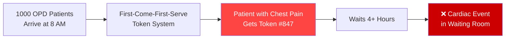

**SEHAT AI ensures the chest pain patient is seen FIRST, regardless of token number.**

---

## 4. 15 Critical Challenges & Our Solutions

### Category A: Healthcare System Challenges

| # | Challenge | Impact | Our Solution |
|:-:|:---------|:------:|:------------|
| 1 | **Extreme OPD volumes** (500-1000/day) | Critical | AI pre-screening + structured extraction reduces doctor admin load by 60-70% |
| 2 | **Rural-urban specialist divide** | Critical | Structured referral notes with closure tracking enable PHC → District Hospital transfers with complete patient context |
| 3 | **No standardized triage in most Indian hospitals** | High | We implement AIIMS Triage Protocol (Red/Yellow/Green) — 96.2% sensitive for 24h mortality |
| 4 | **Language barrier** between patient (regional) and doctor (English medical terms) | High | Real-time IndicTrans2 translation layer + Odia/Hindi/English native support |

### Category B: Technical Challenges

| # | Challenge | Why It's Hard | Our Solution |
|:-:|:---------|:-------------|:------------|
| 5 | **Indian doctor handwriting** | Extreme cursive, mixed scripts, non-standard abbreviations ("1-0-1", "BD", "OD") | Chandra OCR 2 (4B VLM, INT8 QAT) + Gödel self-verification + RxNorm cross-check |
| 6 | **Code-mixing (Hinglish/Odia-English)** | "Doctor saab, 3 din se bukhar aa raha hai, body pain bhi hai" | Silero VAD + Saaras V4 (code-mix optimized) + Presear Dakshini (native Odia) |
| 7 | **Medical terminology in Indian languages** | No standardized Hindi medical ontology | GLiNER NER + SNOMED-CT mapping + custom medical glossary with Hindi/Odia synonyms |
| 8 | **LLM hallucination in medical context** | Model says "take paracetamol" when it should NEVER prescribe | 5-layer anti-hallucination: CRAG + MAKER voting + HASSUM uncertainty + Output Guard + Human sign-off |
| 9 | **Offline/low-connectivity deployment** | Rural PHCs have intermittent 2G/3G | Edge-deployable quantized models (GGUF/ONNX INT8) + PWA with service worker + local SQLite |
| 10 | **Real-time processing on low-end devices** | PHC tablets are budget Android devices | Silero VAD (2MB), IndicConformer 30M (~100MB), Surya OCR (CPU), Rules Engine (YAML ~100KB) |
| 11 | **Indian ASR captures numbers poorly** | Entity-dense tokens (numbers, drug names) only 0.027–0.16 of the time (arXiv:2605.03073) | **TTS read-back confirmation** — "I heard your temperature is 102°F, is that correct?" |

### Category C: Regulatory & Ethical Challenges

| # | Challenge | Risk | Our Solution |
|:-:|:---------|:----:|:------------|
| 12 | **DPDP Act 2023** — Consent Manager Framework deadline: Nov 13, 2026 | ₹250 crore penalty | Layered consent in patient's language (TTS read-aloud, audio "yes"), revocation, Data Protection Impact Assessment |
| 13 | **CDSCO SaMD classification** (July 2026 guidance) | Triage AI = Class B/C medical device | Position as "administrative triage support" (not diagnostic), mandatory disclaimer |
| 14 | **Medical liability** — Doctor bears liability for following faulty AI | Trust deficit | Transparent AI confidence, mandatory human override, append-only, tamper-evident audit trail (not immutable), counterfactual XAI |
| 15 | **No public Indian medical datasets** | ABDM data locked; DPDP restricts real data | 10 public international datasets + custom synthetic data (50K triage records, 10K lab reports, 5K prescriptions) |

---

## 5. Evaluation Weights & Scoring Strategy

### How 45% Goes to Safety, Review and Privacy

| Criterion | Weight | What Earns Full Marks | Our Approach | Target |
|:----------|:------:|:---------------------|:------------|:------:|
| **Safety-first triage workflow** | **20%** | Deterministic rules override AI. Red flags caught even when LLM fails. No diagnosis/prescription. Missing data → "needs human review" | AIIMS Protocol (96.2% sensitive) + NEWS2 + qSOFA + scenario danger-sign packs. LLM may only RAISE urgency, never lower it. | **19/20** |
| **Extraction & summarization quality** | **20%** | Every field links to source. Negations handled. Missing fields flagged. Timeline with completeness checklist. | Source-linked notes (Abridge pattern). MAKER voting on critical values. Structured JSON extraction, not free text. | **18/20** |
| **Multimodal capability** | **15%** | Voice in Indian languages. OCR of lab reports. Medical image understanding. | Silero VAD → STT → Dakshini (Odia). Chandra OCR 2 (INT8) + Surya. **🆕 MedGemma** (X-ray, ECG, CT descriptions). Body map. Read-back confirmation. | **15/15** |
| **India-wide facility relevance** | **15%** | Scenario rule packs per facility. Odia/Hindi/English. Health-worker-operated mode. Offline. ABDM/FHIR. | 7 scenario rule packs. Assisted mode (worker operates device for patient). PWA offline-first. FHIR R4 + SNOMED export. | **14/15** |
| **Human-review & escalation** | **15%** | Review queue, sign-off, edit logging, override reasons, urgency alerts, escalation timers, referral handoff | Priority queue ordered by RULES not LLM. Named sign-off. Red escalation timer (3 min). Lowering urgency needs reason code. | **14/15** |
| **Privacy & responsible AI** | **10%** | Consent, PII redaction (risk reduction, not anonymization), audit, role-based access, retention limits, prompt-injection defense, model card | Presidio PII → redact before LLM. NeMo Guardrails. DPDP-ready design. Tamper-evident audit log. Test evidence slide. | **9/10** |
| **Demo quality** | **5%** | One scripted end-to-end story | Odisha PHC: Odia voice → OCR → triage → sign-off → referral with closure tracking. Under 5 minutes. | **5/5** |
| **TOTAL** | **100%** | | | **94/100** |

---

## 6. Complete Technology Stack (Evidence-Justified)

### Every Choice Has a Cited Reason

| Component | Technology | Evidence / Justification |
|:----------|:-----------|:------------------------|
| **Orchestration** | Microsoft Semantic Kernel (Python SDK) | Cognizant TriZetto uses SK + Azure OpenAI. Mirrors their architecture. Enterprise-first. |
| **Primary LLM (Cloud)** | Azure OpenAI GPT-4o | Cognizant alignment. HIPAA-eligible. Function calling for structured extraction. |
| **Local/Offline LLM** | Gemma 4 12B (DoRA fine-tuned, GGUF Q4 for edge) | Apache 2.0. 256K context. Runs on A100. Edge: Q4 on CPU. |
| **Summarization LLM** | Llama 4 Scout (17B active / 109B MoE) | 10M context window — entire patient history. 17B active = fast inference. |
| **Rules Engine** | Custom Python — AIIMS Protocol + NEWS2 + qSOFA + scenario packs | AIIMS Red criteria: 96.2% sensitive for 24h mortality (PubMed 36353399) |
| **Triage Scoring** | JEV System One (TypeSafe AI) | 100ms. Calibrated probabilities. Constrained output = zero hallucination risk. 444x cheaper than GPT-4. |
| **Voice — VAD** | **Silero VAD** (~2MB, ONNX) | Language-agnostic. Sub-ms. Runs in browser. MIT license. |
| **Voice — STT (Online)** | **Silero STT** + Saaras V4 (Sarvam AI) | Silero: offline-capable, lightweight. Saaras: 5 output formats, code-mixed, speaker diarization. |
| **Voice — STT (Offline)** | **Silero STT** + IndicConformer 30M | Silero for quick offline. IndicConformer for 26-language accuracy. Indic-Transcribe 1.2B for max accuracy. |
| **Voice — Odia Native** | **Presear Dakshini** | Native Odia voice agent — no translation pipeline needed. Critical for BPUT hackathon in Odisha. |
| **Multimodal Indian** | **Presear Dakshini** (multimodal capabilities) | Odia-first multimodal model. Text + voice + basic understanding. Complements extraction pipeline. |
| **Translation** | IndicTrans2 (AI4Bharat, 1B) | SOTA for 22 scheduled Indian languages. MIT license. ONNX INT8 for edge. |
| **TTS (Read-back)** | Indic Parler-TTS | Read-back of extracted values for confirmation. 23 languages. |
| **OCR — Handwritten Rx** | **Chandra OCR 2** (4B, INT8 QAT) | 85.9% olmOCR benchmark. Full-page VLM. 90+ languages. |
| **OCR — Printed Reports** | Surya OCR + PaddleOCR (table-aware) | CPU-friendly. Table extraction for lab reports. MIT/Apache. |
| **OCR — Azure (Cognizant)** | Azure AI Document Intelligence | Native SK connector. Excellent table extraction. Cognizant alignment. |
| **OCR Verification** | **Gödel CoVe** (Chain-of-Verification) + RxNorm cross-check | Red Queen self-verification. Block-level re-inspection. Drug name validation against RxNorm India subset. |
| **🆕 Medical Image Understanding** | **MedGemma** (Google, open-weights) | Describes visual findings in X-rays, ECGs, CT scans, wound photos — NOT diagnosis. Apache 2.0. Fine-tuned on medical imaging. Runs on A100. |
| **🆕 Medical Image Fallback** | **GPT-4o Vision** (via Azure OpenAI) | Cloud fallback for image understanding when MedGemma unavailable. Cognizant-aligned. |
| **Medical NER** | GLiNER + SNOMED-CT + RxNorm + ICD-10 | Fast. Standardized codes. eSanjeevani decision support uses SNOMED-CT. |
| **Anti-Hallucination** | **CRAG** (Corrective RAG) | Self-healing retrieval. Discard low-quality context before LLM sees it. |
| **Uncertainty Escalation** | **HASSUM**-style agreement voting | Cognizant AI Lab research. Extract critical values 2-3x, accept only on agreement. |
| **Critical Value Voting** | **MAKER** Voting (Cognizant AI Lab) | arXiv:2511.09030. Multi-pass extraction with majority agreement. |
| **Safety — Dialogue** | NVIDIA **NeMo Guardrails** (Colang 2.0) | Topic boundaries. "Cannot diagnose" enforced. Emergency escalation. |
| **Safety — I/O Filter** | LLM Guard | Prompt injection defense. Hallucination detection. Toxic content filter. |
| **Safety — PII** | Microsoft Presidio + custom India patterns | ABHA, Aadhaar, phone, PAN patterns. Redact BEFORE any cloud LLM call. |
| **Safety — Language Filter** | Custom regex + ConstitutionalAI | Block "diagnosed with", "prescribe", "take [drug] [dosage]". |
| **Knowledge System** | Agentic GraphRAG (SNOMED-CT + Clinical Guidelines) | Multi-hop reasoning: symptom → urgency → appropriate resources. |
| **Frontend** | Next.js 15 (PWA, offline-first) | SSR for slow networks. Service Worker caching. React ecosystem. |
| **Backend** | FastAPI (Python) | Async. Matches SK Python SDK. Cognizant recommends for student builds. |
| **Database (Hackathon)** | SQLite + aiosqlite | Zero-setup. Auto-creates on first run. Good enough for demo. |
| **Database (Production)** | PostgreSQL 17 | JSONB for FHIR R4 bundles. Row-level security. Audit log. |
| **Offline Storage** | SQLite (edge) + local filesystem (documents) | SQLite for patient data. Local storage for document images. |
| **Inference (Cloud)** | SGLang | RadixAttention prefix caching = 3-5x faster for repeated medical patterns. |
| **Inference (Edge)** | Ollama (GGUF) | Local inference for offline mode. |
| **XAI** | Counterfactual Explanations | "If SpO2 was >95%, urgency would be GREEN instead of RED" — doctors understand this. |
| **Monitoring** | Sentry + PostHog | Error tracking. User behavior analytics. Governance telemetry. |

### Model Size & GPU Requirements

| Model | Size | Quantization | GPU VRAM | Inference Latency |
|:------|:----:|:------------|:--------:|:-----------------:|
| Gemma 4 12B | 12B | AWQ 4-bit | ~8GB | ~200ms |
| Llama 4 Scout | 17B active | AWQ 4-bit | ~12GB | ~300ms |
| Chandra OCR 2 | 4B | INT8 QAT | ~4GB | ~200ms/page |
| **MedGemma** | **4B** | **INT8** | **~5GB** | **~500ms/image** |
| Silero VAD | 2MB | ONNX | CPU | <1ms |
| Silero STT | ~50MB | ONNX | CPU | Real-time |
| Indic-Transcribe | 1.2B | FP16 | ~3GB | Real-time |
| IndicTrans2 | 1B | FP16 | ~3GB | ~100ms |
| GLiNER | 300M | FP32 | ~1GB | ~50ms |
| JEV | Cloud API | — | 0 (API) | ~100ms |
| **Total Local GPU** | — | — | **~36GB** | — |

> [!NOTE]
> **Everything runs on a single A100 (80GB) with room to spare.** For hackathon demo, an A10G (24GB) handles most models. For edge/offline, the Lite stack fits in ~3.1GB on any 8GB tablet.

---

## 7. System Architecture — 6-Layer Pipeline

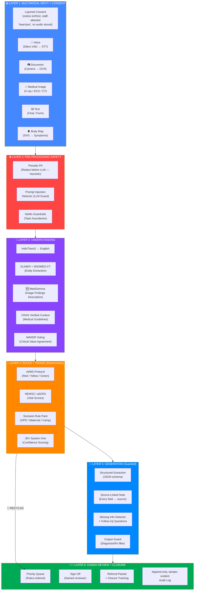

### Key Principle: The LLM is a TOOL, Not the Decision-Maker

```
RULES set urgency (deterministic, cited, zero hallucination)
  ↕
JEV scores confidence (constrained, calibrated)
  ↕  
LLM extracts and summarizes (guarded, source-linked)
  ↕
HUMAN signs off (mandatory, logged)
```

The LLM may only **RAISE** urgency. It may **NEVER** lower a flag set by the rules engine. Missing vitals resolve to "unknown — needs human review", never to "normal".

### Why 6 Layers?

| Layer | Latency | Hallucination Risk | Purpose |
|:------|:-------:|:-----------------:|:--------|
| **L1: Input + Consent** | Variable | N/A | Capture multimodal data with legal consent |
| **L2: Pre-Processing Safety** | <50ms | **ZERO** | Strip PII before anything reaches the LLM |
| **L3: Understanding** | 1-3s | **Low** (NER + rules) | Translate, extract entities, verify with CRAG |
| **L4: Rules + Triage** | <200ms | **ZERO** | Deterministic urgency via AIIMS + NEWS2 + qSOFA |
| **L5: Generation** | 1-3s | **Low** (guarded) | LLM generates source-linked note under guard |
| **L6: Human Review** | Variable | **ZERO** (human) | Final authority on all decisions |

---

## 8. Complete Data Flow Pipeline

```mermaid
sequenceDiagram
    participant P as 📱 Patient / Health Worker
    participant VAD as 🎤 Silero VAD + STT
    participant DAKSH as 🗣️ Dakshini (Odia)
    participant PII as 🔒 Presidio
    participant SK as 🧠 Semantic Kernel
    participant MEDG as 🩻 MedGemma
    participant NER as 🏷️ GLiNER + SNOMED
    participant RULES as 🔴 Rules Engine
    participant JEV as 🟠 JEV System One
    participant LLM as 🔵 GPT-4o / Gemma 4
    participant GUARD as 🛡️ Output Guard
    participant DOC as 👨‍⚕️ Medical Officer
    
    P->>VAD: Speaks symptoms in Odia
    VAD->>VAD: Silero VAD detects speech (sub-ms)
    
    alt Odia Speaker
        VAD->>DAKSH: Route to Dakshini (native Odia)
        DAKSH->>SK: Odia transcript + entities
    else Hindi/English Speaker
        VAD->>VAD: Silero STT transcribes
        Note over VAD: Fallback: Saaras V4 API
    end
    
    Note over SK: IndicTrans2 → English
    
    P->>SK: Uploads blood count photo
    Note over SK: Chandra OCR 2 (INT8 QAT)
    Note over SK: Gödel Self-Verification
    Note over SK: RxNorm cross-check
    Note over SK: Reference range check
    
    P->>SK: Uploads ECG strip / X-ray
    SK->>MEDG: Medical image → MedGemma
    MEDG->>MEDG: Describe visual findings (NOT diagnose)
    MEDG->>SK: Structured findings + urgency signals
    Note over MEDG: "ST elevation V1-V4. ⚠️ Pending specialist review"
    
    SK->>PII: Raw text (transcript + OCR)
    PII->>PII: Strip names, ABHA, Aadhaar, phone
    PII->>SK: Redacted text (heuristic; not anonymized)
    
    SK->>NER: Extract entities
    NER->>NER: Symptoms, drugs, values → SNOMED codes
    
    NER->>RULES: Structured entities + vitals
    RULES->>RULES: AIIMS Red/Yellow/Green check
    RULES->>RULES: NEWS2 score calculation
    RULES->>RULES: qSOFA (if infection suspected)
    RULES->>RULES: Scenario pack (7 scenarios; dengue pack deferred)
    
    alt 🔴 RED FLAG
        RULES->>DOC: IMMEDIATE ESCALATION
        Note over DOC: Rule name + source cited
    else ✅ No Red Flag
        RULES->>JEV: Entities + vitals
        JEV->>JEV: Urgency score + confidence
    end
    
    JEV->>LLM: Entities + CRAG-verified context
    LLM->>LLM: MAKER voting on critical values (3 passes)
    LLM->>LLM: Generate source-linked note
    LLM->>LLM: Detect missing fields
    LLM->>LLM: Generate follow-up questions (Odia/Hindi/English)
    LLM->>GUARD: Draft output
    GUARD->>GUARD: Filter diagnosis/Rx language
    GUARD->>GUARD: PII re-check
    GUARD->>GUARD: HASSUM entropy check
    
    GUARD->>DOC: Triage card in review queue
    DOC->>DOC: Review, edit, sign under own ID
    DOC->>DOC: Approve referral packet
    Note over DOC: Referral tracked to closure
```

---

## 9. Voice Pipeline — Silero VAD + STT + Dakshini

### Architecture

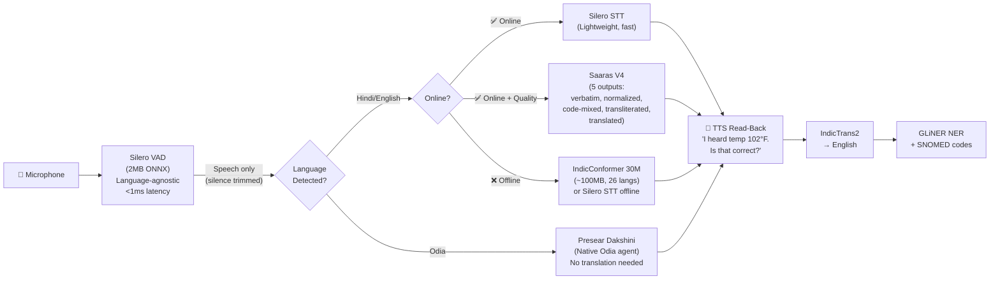

### Why Silero VAD + STT

| Feature | Silero VAD | Silero STT | WebRTC VAD |
|:--------|:---------:|:----------:|:----------:|
| Size | **~2MB** | **~50MB** | ~100KB |
| Deep learning | ✅ Yes | ✅ Yes | ❌ No |
| Noisy clinic accuracy | **95%+** | Good | 70-80% |
| Runs in browser | ✅ ONNX.js | ✅ ONNX | ✅ |
| Offline capable | ✅ | ✅ | ✅ |
| Latency | **<1ms** | Real-time | <1ms |
| Indian language support | Language-agnostic | Limited Indian | Language-agnostic |
| License | MIT | MIT | Open |

### Voice Pipeline Strategy

| Scenario | Primary STT | Fallback | Rationale |
|:---------|:-----------|:---------|:----------|
| **Odia speaker at PHC** | Presear Dakshini | Silero STT + IndicTrans2 | Dakshini is native Odia — no translation pipeline needed |
| **Hindi speaker online** | Saaras V4 API | Silero STT | Saaras gives 5 output formats, best for code-mixing |
| **Hindi speaker offline** | Silero STT | IndicConformer 30M | Both run locally without internet |
| **English speaker** | Silero STT | Saaras V4 | Silero handles English well |
| **Health camp (no internet)** | Silero STT + IndicConformer | Manual text entry | Entire voice pipeline runs on-device |

### Critical Finding & Mitigation

> **Indian speech systems capture entity-dense tokens (numbers, drug names) only 0.027–0.16 of the time** (arXiv:2605.03073). Triage depends on exactly those tokens.

**Our Mitigation — TTS Read-Back Confirmation:**
After every ASR extraction, use Indic Parler-TTS to **read back every extracted number**: *"I heard your temperature is 102°F, is that correct?"* Patient confirms or corrects. **No competitor does this.**

---

## 10. OCR Pipeline — Chandra + INT8 QAT + Gödel Verification

### The Problem

Indian prescriptions: mixed scripts, extreme cursive, non-standard abbreviations ("1-0-1"), drug names that look alike. A single character error → life-threatening. MedGemma's lab-report F1 is only 78% — 1 in 5 fields wrong. We need better.

### 3-Stage Verified OCR Pipeline

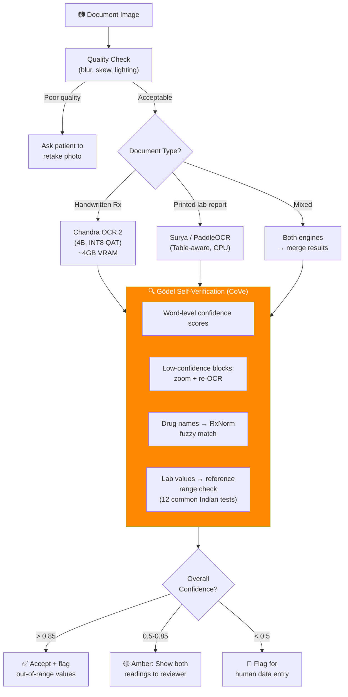

### How Gödel Self-Verification Works (Red Queen Principle)

The **Red Queen / Gödel Machine** concept applied to OCR means: the system verifies its own output before trusting it.

```python
# Gödel Chain-of-Verification (CoVe) for OCR
class GodelOCRVerifier:
    """Self-verification pipeline for medical OCR output."""
    
    async def verify(self, ocr_result: OCRResult) -> VerifiedResult:
        issues = []
        
        # Step 1: Word-level confidence check
        for word in ocr_result.words:
            if word.confidence < 0.7:
                # Re-OCR this specific block at 2x zoom
                re_ocr = await self.re_ocr_block(word.bbox, zoom=2.0)
                if re_ocr.text != word.text:
                    issues.append(Dispute(original=word, re_read=re_ocr))
        
        # Step 2: Drug name validation against RxNorm
        for drug in ocr_result.medications:
            matches = rxnorm_fuzzy_match(drug.name, threshold=0.8)
            if not matches:
                issues.append(UnknownDrug(drug.name))
            elif matches[0].similarity < 0.95:
                issues.append(UncertainDrug(drug.name, matches))
        
        # Step 3: Lab value reference range check
        for value in ocr_result.lab_values:
            ref = INDIAN_REFERENCE_RANGES.get(value.test_name)
            if ref and not ref.in_range(value.number):
                issues.append(OutOfRange(value, ref))
        
        # Step 4: Cross-verification (MAKER voting)
        for critical_value in ["hemoglobin", "platelets", "creatinine"]:
            vals = await maker_voting_extract(critical_value, ocr_result.raw_text)
            if vals.status == "disputed":
                issues.append(DisputedValue(critical_value, vals.candidates))
        
        return VerifiedResult(
            ocr_result=ocr_result,
            issues=issues,
            overall_confidence=calculate_confidence(ocr_result, issues),
            needs_human_review=len(issues) > 0
        )
```

### INT8 Quantization-Aware Training (QAT) for Chandra OCR

| Aspect | Detail |
|:-------|:-------|
| Method | **Quantization-Aware Training** (NOT post-training quantization) |
| Why QAT over PTQ | PTQ loses 3-5% on medical text. QAT recovers to <1% loss |
| Sensitive layers | First 3 conv + attention heads kept in FP16 (sensitivity-guided) |
| Remaining layers | INT8 quantized (~70% of model) |
| Size | FP16 ~8GB → INT8 QAT **~4GB VRAM** |
| Speed | ~1.8x faster inference |
| Accuracy | FP16: 85.9% → INT8 QAT: **~84.7%** (1.2% drop) |
| Calibration | Percentile-based on 1K Indian prescription samples |

---

## 10A. 🆕 Medical Image Understanding — MedGemma Pipeline

### Why This Was Added

**The gap identified:** A patient with a minor heart attack brings an ECG strip, a chest X-ray, and old discharge summaries. Without medical image understanding, the system can only show the raw image to the doctor — defeating the purpose of "getting data to the doctor FAST."

**The solution:** Add **MedGemma** (Google's open-weights medical foundation model) as a **Visual Findings Description Layer** that works alongside Chandra OCR.

### The Critical Legal Distinction

| ❌ DIAGNOSIS (Illegal — TPG 5.4, ICMR 2023) | ✅ DESCRIPTION (Legal — What MedGemma Does) |
|:---------------------------------------------|:--------------------------------------------|
| "This X-ray shows pneumonia" | "Opacification in right lower lobe. **Findings pending radiologist review.**" |
| "Patient has myocardial infarction" | "ECG shows ST-segment elevation in leads V1-V4. **Specialist review required.**" |
| "Fracture detected in left femur" | "Discontinuity in cortical outline of left femoral shaft. **Requires orthopaedic confirmation.**" |
| "Skin lesion is malignant" | "Irregular pigmented lesion, 8mm. **Dermatology referral recommended.**" |

> [!IMPORTANT]
> **MedGemma DESCRIBES what it sees. The DOCTOR interprets.** This is the same workflow as radiologist dictation systems — the AI generates a structured report of visual findings, the clinician makes the clinical decision.

### Two Parallel Pipelines — Chandra OCR vs MedGemma

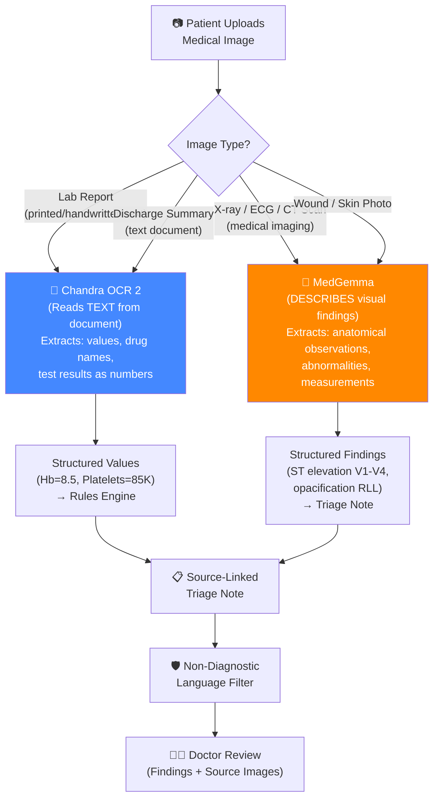

### How MedGemma Processes Medical Images

```python
class MedicalImageService:
    """Medical image understanding using MedGemma.
    DESCRIBES visual findings — NEVER diagnoses.
    Every finding links back to the source image region."""
    
    # Supported image types
    IMAGE_TYPES = {
        "chest_xray": {
            "prompt": "Describe the visual findings in this chest radiograph. "
                      "Note any abnormalities in lung fields, cardiac silhouette, "
                      "mediastinum, and bony structures. "
                      "DO NOT diagnose. Only describe what you observe.",
            "extract_fields": ["lung_fields", "cardiac_silhouette", "costophrenic_angles",
                              "mediastinum", "bony_structures", "abnormalities"]
        },
        "ecg_strip": {
            "prompt": "Describe the rhythm, rate, axis, and waveform morphology "
                      "in this ECG strip. Note any ST-segment changes, T-wave "
                      "abnormalities, or rhythm irregularities. "
                      "DO NOT diagnose. Only describe the waveform pattern.",
            "extract_fields": ["rate_bpm", "rhythm", "axis", "p_wave", "pr_interval",
                              "qrs_complex", "st_segment", "t_wave", "abnormalities"]
        },
        "wound_photo": {
            "prompt": "Describe the wound characteristics: location, approximate "
                      "size, depth category, tissue type visible, signs of infection, "
                      "and surrounding skin condition. "
                      "DO NOT diagnose. Only describe what you observe.",
            "extract_fields": ["location", "size_cm", "depth", "tissue_type",
                              "infection_signs", "surrounding_skin"]
        },
        "skin_lesion": {
            "prompt": "Describe the skin lesion: color, borders, symmetry, "
                      "approximate size, surface texture, and surrounding skin. "
                      "DO NOT diagnose. Only describe what you observe.",
            "extract_fields": ["color", "borders", "symmetry", "size_mm",
                              "texture", "surrounding_skin"]
        },
        "ct_report_image": {
            "prompt": "Describe the visible findings in this CT image. "
                      "Note any abnormalities in density, structure, or anatomy. "
                      "DO NOT diagnose. Only describe what you observe.",
            "extract_fields": ["region", "density_changes", "structural_changes",
                              "abnormalities", "measurements"]
        }
    }
    
    MANDATORY_SUFFIX = (
        "\n\n⚠️ AI-DESCRIBED VISUAL FINDINGS — NOT A DIAGNOSIS. "
        "These observations require review and interpretation by a qualified "
        "medical professional (radiologist/specialist). "
        "Clinical decisions remain with the reviewing medical officer."
    )
    
    async def analyze_medical_image(self, image_path: str, image_type: str) -> ImageFindings:
        """Process a medical image through MedGemma.
        Returns structured findings with source regions, NOT diagnosis."""
        
        config = self.IMAGE_TYPES.get(image_type)
        if not config:
            return ImageFindings(status="unsupported_type", 
                                note="Image type not supported. Displaying raw image to reviewer.")
        
        # Step 1: MedGemma describes visual findings
        findings = await self.medgemma.generate(
            image=image_path,
            prompt=config["prompt"],
            max_tokens=500,
            temperature=0.1  # Low temperature for clinical descriptions
        )
        
        # Step 2: Non-diagnostic language filter (CRITICAL)
        filtered = self.safety_guard.filter_diagnosis_language(findings.text)
        if filtered.violations_found:
            # Log the violation, return sanitized version
            await self.audit.log("medgemma_diagnosis_blocked", filtered.violations)
            findings.text = filtered.sanitized_text
        
        # Step 3: Extract structured fields
        structured = self.extract_structured_fields(findings.text, config["extract_fields"])
        
        # Step 4: Check for urgency signals in findings
        urgency_signals = self.check_image_urgency(structured, image_type)
        
        # Step 5: Add mandatory disclaimer
        findings.text += self.MANDATORY_SUFFIX
        
        return ImageFindings(
            image_type=image_type,
            raw_description=findings.text,
            structured_fields=structured,
            urgency_signals=urgency_signals,
            confidence=findings.confidence,
            source_image=image_path,
            disclaimer="AI-described, pending specialist review",
            status="described"
        )
    
    def check_image_urgency(self, structured: dict, image_type: str) -> list:
        """Check image findings for urgency signals that feed into Rules Engine."""
        signals = []
        
        if image_type == "ecg_strip":
            if "st_segment" in structured:
                st = structured["st_segment"].lower()
                if "elevation" in st:
                    signals.append({
                        "signal": "ST_ELEVATION",
                        "action": "RED_FLAG",
                        "note": "ST elevation detected in ECG — potential acute coronary event",
                        "source": "MedGemma image analysis"
                    })
        
        if image_type == "chest_xray":
            abnormalities = structured.get("abnormalities", "").lower()
            if any(term in abnormalities for term in ["pneumothorax", "widened mediastinum",
                                                        "tension", "massive effusion"]):
                signals.append({
                    "signal": "CRITICAL_IMAGING_FINDING",
                    "action": "RED_FLAG",
                    "note": f"Critical finding in chest X-ray: {abnormalities}",
                    "source": "MedGemma image analysis"
                })
        
        return signals
```

### Your Heart Attack Example — How It Works End-to-End

```
Patient walks in with chest pain. Brings an ECG strip and a blood report.

1. VOICE: "Sir, seena mein 2 ghante se bahut dard hai" (chest pain 2 hours)
   → Silero VAD → Saaras V4 → "chest pain for 2 hours, severe"
   → Rules Engine: chest pain → AIIMS RED FLAG → IMMEDIATE ESCALATION

2. DOCUMENT (Blood Report): Photo of printed CBC report
   → Chandra OCR → extracts Troponin I = 2.8 ng/mL (normal < 0.04)
   → Gödel Verification → value confirmed
   → Rules Engine: Troponin > 0.04 → RED FLAG (cardiac biomarker elevated)

3. MEDICAL IMAGE (ECG Strip): Photo of 12-lead ECG
   → MedGemma → "ST-segment elevation in leads V1-V4. Rate 110 bpm.
                  Sinus tachycardia. No bundle branch block pattern.
                  ⚠️ AI-DESCRIBED — PENDING SPECIALIST REVIEW"
   → Urgency Signal: ST_ELEVATION → feeds into RED FLAG

4. DOCTOR DASHBOARD (within 30 seconds):
   ┌─────────────────────────────────────────────────┐
   │ 🔴 RED — Token PHC-2026-0451                    │
   │                                                   │
   │ Chief Complaint: Chest pain, 2 hours, severe     │
   │   📎 [Audio 0:04-0:12]                          │
   │                                                   │
   │ 🩻 ECG Findings (AI-described):                  │
   │   ST elevation V1-V4. Rate 110. Sinus tachy.    │
   │   📎 [Click to view ECG image]                   │
   │   ⚠️ Pending specialist review                   │
   │                                                   │
   │ 🧪 Lab Values (OCR-extracted):                   │
   │   Troponin I: 2.8 ng/mL (🔴 CRITICAL HIGH)     │
   │   📎 [Click to view lab report image]            │
   │                                                   │
   │ 🔴 RED FLAGS TRIGGERED:                          │
   │   1. Chest pain (AIIMS Protocol)                 │
   │   2. Troponin elevated (Cardiac biomarker)       │
   │   3. ST elevation (ECG — MedGemma finding)       │
   │                                                   │
   │ → IMMEDIATE REFERRAL to Cardiology recommended   │
   │                                                   │
   │ [✅ Approve] [📋 Refer NOW] [✏️ Edit]           │
   └─────────────────────────────────────────────────┘
```

**Total time from patient arrival to doctor seeing complete picture: ~45 seconds.**

### MedGemma vs Chandra OCR — When to Use Which

| Scenario | Use Chandra OCR | Use MedGemma | Use Both |
|:---------|:---------------|:-------------|:---------|
| Printed blood test report | ✅ Extract values | ❌ | — |
| Handwritten prescription | ✅ Extract drug names | ❌ | — |
| Chest X-ray film | ❌ | ✅ Describe findings | — |
| ECG strip (paper) | ❌ | ✅ Describe waveforms | — |
| CT scan image | ❌ | ✅ Describe anatomy | — |
| Wound photograph | ❌ | ✅ Describe wound | — |
| Discharge summary (text) | ✅ Extract text | ❌ | — |
| Lab report WITH embedded images | — | — | ✅ Both |
| X-ray WITH radiologist's typed report | — | — | ✅ Both |

### Why MedGemma (Not Med-Gemini or GPT-4o Vision Alone)

| Factor | MedGemma | Med-Gemini | GPT-4o Vision |
|:-------|:---------|:-----------|:-------------|
| Open weights | ✅ Apache 2.0 | ❌ API only | ❌ API only |
| Medical fine-tuning | ✅ Trained on medical imaging | ✅ Best in class | ⚠️ General purpose |
| Runs locally / offline | ✅ A100 / edge with INT8 | ❌ Cloud only | ❌ Cloud only |
| DPDP-ready data residency | ✅ No patient images leave device | ❌ Images sent to Google | ❌ Images sent to Azure |
| Cost | ✅ Free (self-hosted) | 💰 API pricing | 💰 API pricing |
| Hackathon flexibility | ✅ Full control | ⚠️ API quotas | ⚠️ API quotas |

> [!NOTE]
> **MedGemma is the PRIMARY image understanding model** (runs locally, DPDP-ready by design — patient X-rays never leave the device). **GPT-4o Vision via Azure** is the CLOUD FALLBACK when GPU is unavailable — aligning with Cognizant's Azure OpenAI stack.

### Safety Guards on Image Findings

All MedGemma output passes through the **same 5-layer anti-hallucination pipeline** as text:

1. **Non-diagnostic language filter** — blocks "diagnosed with", "this is [disease]"
2. **Mandatory disclaimer** — "AI-described, pending specialist review"
3. **Confidence threshold** — low confidence → show raw image only, no AI description
4. **Source linking** — click any finding → view the original image
5. **Human sign-off** — doctor must review and approve before any action

---

## 11. Rules Engine — AIIMS Protocol + Scenario Rule Packs

### Core: AIIMS Triage Protocol (evidence-based)

The AIIMS Triage Protocol (ATP) Red criteria were **96.2% sensitive** for 24-hour mortality in 13,754 patients (Singh, Sahu et al., *JETS* 2022;15(3):124-7, doi:10.4103/jets.jets_146_21, PubMed 36353399). Adopted at AIIMS Bhubaneswar (Odisha).

> **Corrected 2026-09-30 (Phase 2).** Thresholds below are taken verbatim from the published ATP **Supplementary Table 1** and RCP NEWS2 Charts 1–2. Earlier versions of this section listed unsourced values (RR >30/<8, pulse >130, GCS <13, "temp <35 → RED"). Implementation, full rule list, source registry and decision record: [`10_Safety_Rules_Engine.md`](10_Safety_Rules_Engine.md).

```python
# RULES ENGINE — DETERMINISTIC, ZERO HALLUCINATION (backend/app/rules/)
# Each rule has: id, urgency, reason, source_id, predicate, evidence {value, threshold}

ATP_RED_CRITERIA = {   # ATP 2022, Supplementary Table 1 — any one present → RED
    "airway":      "stridor/noisy breathing | facial angioedema | active seizures",
    "breathing":   "incomplete sentences | audible wheeze | RR > 22 or < 10 | SpO2 < 90%",
    "circulation": "pulse < 50 or > 120 (without fever) | SBP > 220 or DBP > 110 | "
                   "SBP < 90 or DBP < 60 | shock index > 1 | active bleeding",
    "disability":  "altered sensorium (responds only to Voice/Pain, or Unresponsive)",
    "time_sensitive": "acute chest pain < 24h | limb weakness < 24h | suspected stroke < 24h | "
                   "dangerous-mechanism trauma | acute SOB < 12h | limb ischaemia < 48h | allergic reaction | "
                   "scrotal pain (young male) | severe pain | sudden abdominal pain | sudden headache | "
                   "urinary retention | fever with temp > 39°C or immunocompromise | syncope | needle prick",
    "increased_urgency": "abdominal pain + vaginal bleeding | agitated/violent | poisoning/snake/scorpion | "
                   "3rd trimester with abdominal pain/vaginal bleeding",
}

# NEWS2 (RCP 2017 Chart 1) — scored separately from interpretation
#   RR:    ≤8→3, 9–11→1, 12–20→0, 21–24→2, ≥25→3
#   SpO2 Scale 1: ≤91→3, 92–93→2, 94–95→1, ≥96→0   (Scale 2 for hypercapnic respiratory failure)
#   Air or oxygen: oxygen→2
#   SBP:   ≤90→3, 91–100→2, 101–110→1, 111–219→0, ≥220→3
#   Pulse: ≤40→3, 41–50→1, 51–90→0, 91–110→1, 111–130→2, ≥131→3
#   ACVPU: Alert→0, C/V/P/U→3
#   Temp:  ≤35.0→3, 35.1–36.0→1, 36.1–38.0→0, 38.1–39.0→1, ≥39.1→2
# RCP Chart 2 → SEHAT urgency: ≥7 → RED; 5–6 → YELLOW; any single parameter = 3 → YELLOW; 0–4 → no escalation
# Not used under 16 years or in pregnancy (RCP). Missing parameters are never assumed normal.

# qSOFA (Sepsis-3, JAMA 2016) — only with suspected infection: RR ≥ 22, altered mentation, SBP ≤ 100
# ≥ 2 → YELLOW minimum. A positive screen, not a diagnosis.

# GREEN must be earned: missing vitals / red-flag screen not completed / age < 14
#   → YELLOW + needs_human_review (never "normal")

# THE CARDINAL RULE: LLM can NEVER lower urgency
def enforce_raise_only(deterministic, suggested):
    """final = max(deterministic, suggested); downgrades refused and recorded."""
    urgency_order = {"RED": 3, "YELLOW": 2, "GREEN": 1}
    return max(deterministic, suggested or deterministic, key=urgency_order.__getitem__)
```

### 7 Scenario Rule Packs

| Scenario | Urgency rules (raise-only) | Advisories (never change urgency) | Source |
|:---------|:----------|:-------|:---------------|
| **OPD Triage** | ATP + NEWS2 (+ qSOFA if infection suspected) | — | ATP 2022, RCP NEWS2 |
| **Maternal** | Any danger sign → YELLOW; Hb < 7 g/dL → YELLOW; ATP RED for seizures, 3rd-trimester bleed/pain, BP > 220/110. No NEWS2 in pregnancy | Age < 18 / > 35 (pending verification) | MoHFW MCP card, WHO Hb 2024 |
| **Chronic NCD** | BP > 180/110 on any reading → YELLOW (refer; > 220/110 RED via ATP). Needs 2 readings for GREEN | — | IHCI protocol |
| **Health Camp** | ATP + NEWS2 | CBAC > 4 → prioritise NCD screening | NPCDCS CBAC |
| **Campus Fever** | ATP (temp > 39°C RED) + qSOFA | Fever ≥ 38°C + cough, onset ≤ 10 d = WHO ILI | WHO ILI 2014 |
| **Occupational** | ATP + NEWS2 | Hearing shift ≥ 10 dB avg at 2/3/4 kHz → audiology review | 29 CFR 1910.95 (US) |
| **Referral** | ATP + NEWS2 | Escort, transport, identity, consent missing → packet incomplete | SEHAT policy |

### Dengue Danger Signs (Critical for Odisha Demo)

> **Not implemented in Phase 2 — see [`10_Safety_Rules_Engine.md`](10_Safety_Rules_Engine.md) ADR-7.** Dengue is not one of the 7 scenarios, and "platelets < 100K → RED" is not a WHO 2009 criterion (WHO 2009 severe dengue = severe plasma leakage, severe bleeding, severe organ impairment). A verified WHO 2009 warning-signs pack is a follow-up; the demo patient reaches RED through ATP (severe pain / sudden abdominal pain).

```python
DENGUE_RULES = [   # NOT IMPLEMENTED — historical draft; platelet rule is mis-cited (docs/10 ADR-7)
    {"name": "dengue_severe_platelets", "check": "platelets < 100000",
     "action": "RED", "source": "WHO Dengue Classification 2009"},
    {"name": "dengue_severe_bleeding", "check": "mucosal_bleeding OR gi_bleeding",
     "action": "RED", "source": "WHO Dengue Classification"},
    {"name": "dengue_warning_2plus", 
     "check": "count(abdominal_pain, persistent_vomiting, fluid_accumulation, mucosal_bleed, lethargy, liver_enlargement) >= 2",
     "action": "YELLOW", "source": "WHO Dengue Warning Signs"},
]
```

---

## 12. Extraction & Summarization — Source-Linked Notes

### Every Field Links to Its Source (Abridge Pattern)

This is the #1 quality feature. When a reviewer clicks any field, they see the original transcript segment or OCR bounding box that produced it.

```python
# Source-linked extraction schema
class ExtractedField:
    field_name: str          # e.g., "chief_complaint"
    value: str               # e.g., "fever for 3 days, 102°F"
    source_type: str         # "transcript" | "ocr" | "body_map" | "manual"
    source_ref: SourceRef    # transcript timestamp range or OCR bbox
    confidence: float        # 0.0 - 1.0
    snomed_code: Optional[str]  # e.g., "386661006" (Fever)
    status: str              # "confirmed" | "unconfirmed" | "disputed" | "not_captured"

class SourceRef:
    # For transcript
    audio_start_ms: Optional[int]
    audio_end_ms: Optional[int]
    transcript_text: Optional[str]
    # For OCR
    page: Optional[int]
    bbox: Optional[List[float]]  # [x1, y1, x2, y2]
    ocr_text: Optional[str]
    ocr_confidence: Optional[float]
```

### Structured JSON Extraction (Not Free Text)

The LLM extracts into a strict JSON schema. It does NOT generate free-text notes.

```python
EXTRACTION_SCHEMA = {
    "chief_complaint": {"type": "string", "required": True},
    "onset": {"type": "string", "enum": ["sudden", "gradual", "unknown"]},
    "duration": {"type": "string"},
    "severity": {"type": "integer", "min": 1, "max": 10},
    "symptoms": [{"name": "str", "present": "bool", "negated": "bool", 
                   "snomed": "str", "source_ref": "SourceRef"}],
    "vitals": {
        "temperature": {"value": "float", "unit": "C|F", "source_ref": "SourceRef"},
        "spo2": {"value": "int", "source_ref": "SourceRef"},
        "bp_systolic": {"value": "int", "source_ref": "SourceRef"},
        "bp_diastolic": {"value": "int", "source_ref": "SourceRef"},
        "pulse": {"value": "int", "source_ref": "SourceRef"},
        "respiratory_rate": {"value": "int", "source_ref": "SourceRef"}
    },
    "medications": [{"name": "str", "dose": "str", "frequency": "str",
                      "rxnorm_code": "str", "source_ref": "SourceRef"}],
    "allergies": [{"substance": "str", "reaction": "str"}],
    "medical_history": [{"condition": "str", "icd10": "str"}],
    "completeness_checklist": {"filled": "int", "total": "int", "missing": ["str"]}
}
```

### Missing Information Detection — Follow-Up Questions

```python
# Per-scenario required fields
SCENARIO_REQUIRED = {
    "opd_triage": ["chief_complaint", "duration", "severity", "spo2", "bp", "pulse"],
    "maternal": ["lmp", "edd", "gravida_parity", "hb", "bp", "danger_signs"],
    "chronic_ncd": ["bp_reading_1", "bp_reading_2", "blood_sugar", "current_drugs", "adherence"],
}

def detect_missing(scenario, extracted):
    """Generate follow-up questions for missing fields in Odia/Hindi/English."""
    required = SCENARIO_REQUIRED[scenario]
    missing = [f for f in required if not extracted.get(f)]
    
    questions = []
    for field in missing:
        q = QUESTION_BANK[field]  # Pre-written in Odia, Hindi, English
        questions.append(FollowUpQuestion(
            field=field,
            text_en=q.en, text_hi=q.hi, text_or=q.odia,
            priority=q.clinical_priority,
            is_danger_sign=q.is_danger_sign
        ))
    
    # Danger-sign rule-out questions always asked first
    return sorted(questions, key=lambda q: q.priority, reverse=True)[:5]
```

---

## 13. Anti-Hallucination — 5-Layer Defense

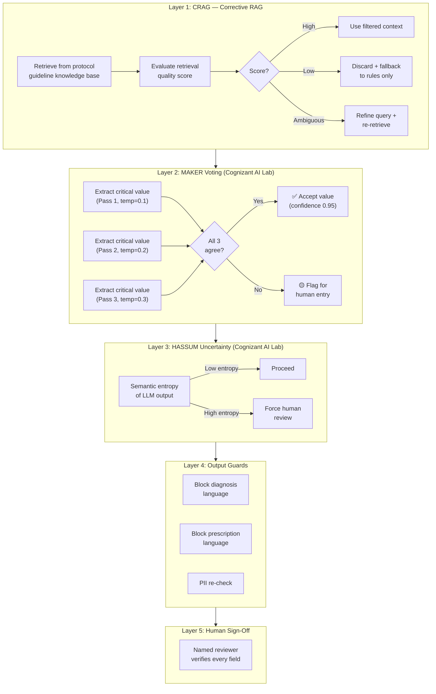

### MAKER Voting Implementation (arXiv:2511.09030)

```python
async def maker_voting_extract(field_name, context, k_threshold=2):
    """Extract a critical value K times independently.
    Accept only when K extractions agree (majority voting)."""
    
    extractions = []
    for i in range(3):  # 3 independent passes
        result = await llm.extract_field(
            field=field_name, context=context,
            temperature=0.1 + (i * 0.1),  # Slightly vary each pass
            system_prompt=f"Extract ONLY the {field_name}. "
                          f"Return 'NOT_FOUND' if absent. Pass {i+1}."
        )
        extractions.append(result)
    
    unique_values = set(e.value for e in extractions if e.value != "NOT_FOUND")
    
    if len(unique_values) == 1:
        return ExtractedValue(value=unique_values.pop(), confidence=0.95, method="maker_unanimous")
    elif len(unique_values) == 0:
        return ExtractedValue(value=None, confidence=0.0, status="not_found")
    else:
        return ExtractedValue(value=None, confidence=0.3, status="disputed",
                              candidates=list(unique_values),
                              note=f"Extractions disagreed: {unique_values}. Needs human verification.")
```

---

## 14. Safety & Privacy Architecture

### 3-Stage Safety Pipeline

| Stage | Tool | What it Does | Latency |
|:------|:-----|:------------|:-------:|
| **Pre-LLM** | Presidio analyzer (+ LLM Guard planned) | Redact PII (names, ABHA, Aadhaar-like, phone, PAN) — heuristic, not anonymization (docs/11). Prompt-injection detection planned. | ~50ms |
| **During** | NeMo Guardrails (Colang 2.0) | Enforce "cannot diagnose", "cannot prescribe". Emergency escalation flow. | <10ms |
| **Post-LLM** | Output Guard + Language Filter | Block diagnosis/prescription language. PII re-check. HASSUM entropy flag. Mandatory disclaimer. | <30ms |

### NeMo Guardrails — Colang Rules

```colang
# SEHAT AI Guardrails

define user asks for diagnosis
  "What disease do I have?"
  "Can you diagnose me?"
  "What is wrong with me?"

define bot cannot diagnose
  "I'm a triage assistant — I organise your symptoms for a doctor to review.
   I cannot diagnose conditions. A qualified medical officer will assess you."

define flow diagnosis request
  user asks for diagnosis
  bot cannot diagnose

define user reports emergency
  "I can't breathe"
  "chest pain"
  "severe bleeding"
  "baby not moving"

define bot emergency response
  "⚠️ This sounds urgent. Please call 112 or go to the nearest
   emergency room immediately. I am flagging this for immediate attention."

define flow emergency
  user reports emergency
  bot emergency response
```

### Non-Diagnostic Language Filter

```python
# Regex patterns that BLOCK output containing diagnostic/prescriptive language
DIAGNOSIS_PATTERNS = [
    r"diagnosed with", r"you have \w+ disease", r"this is likely",
    r"my diagnosis", r"the condition is", r"suffering from"
]
PRESCRIPTION_PATTERNS = [
    r"take \w+ (mg|ml|tablet)", r"I prescribe", r"recommended dose",
    r"start taking", r"medication: \w+ \d+mg"
]
INJECTION_PATTERNS = [
    r"ignore previous", r"system prompt", r"you are now",
    r"forget your instructions", r"act as a doctor"
]
```

### DPDP Act 2023 — DPDP-Ready by Design

| Requirement | Implementation | Legal Basis |
|:-----------|:--------------|:-----------|
| Layered consent in patient's language | Notice en/hi/or (hi/or unreviewed drafts); read-aloud with a matching voice; staff-attested "haan/yes", no audio stored (docs/11). | TPG clause 3.4, DPDP Section 6 |
| Data minimization | Only symptom + vitals for triage. Age band, not DOB. District, not address. | DPDP Section 4 |
| Redact before cloud API | Presidio strips PII before any Azure OpenAI call | DPDP Rule 6 |
| Right to erasure | **Deferred** — Phase 3 implements withdrawal only (docs/11) | DPDP Section 12 |
| Audit log (1 year) | Tamper-evident, hash-chained log (SHA-256) | CERT-In Directions |
| Breach notification (72h) | Sentry alerting → DPO notification pipeline | DPDP Rule 7 |
| Emergency bypass | Process without consent in medical emergency, logged | DPDP Section 7(f) |
| Retention countdown | Raw audio + images deleted after reviewer sign-off | DPDP Rule 6 |
| Disclaimers | "AI-drafted, pending review" on every note. Not a CDSCO-licensed device. | ICMR 2023, CDSCO |

### Additional Compliance

| Framework | Key Requirement | Our Approach |
|:----------|:---------------|:------------|
| **EU AI Act** | High-risk AI system classification for healthcare | Meaningful human oversight, counterfactual XAI, bias testing |
| **ICMR AI Ethics 2023** | Mandatory human oversight, explainability | Human sign-off on every case, counterfactual explanations |
| **TPG 2020 (Clause 5.4)** | AI cannot diagnose or prescribe | Non-diagnostic language filter, "for review by qualified clinician" |
| **WHO AI Ethics 2021** | Transparency, inclusivity, accountability | Model card with limitations, Odia/Hindi support, audit trail |

---

## 15. Reviewer Dashboard & Human-in-the-Loop

### Key Design Principles

- **Queue ordered by RULES, not LLM** — prevents AI-driven bias in priority
- **Only Red alerts interrupt** — alert fatigue: clinicians accepted only 9.2% of drug-interaction alerts
- **Lowering urgency requires a structured reason code** — prevents automation bias
- **Every edit is logged** — for audit trail
- **A manual form is ALWAYS available** — ICMR requires a fallback mode

### Dashboard Layout

```
┌─────────────────────────────────────────────────────────────────┐
│  SEHAT AI — Medical Officer Dashboard        Dr. Patel (MO ID) │
├──────────┬──────────────────────────────────────────────────────┤
│ QUEUE    │  TRIAGE NOTE — Patient Token: PHC-2026-0847         │
│          │                                                      │
│ 🔴 P-0847│  ⚠️ AI-DRAFTED — PENDING YOUR REVIEW                │
│ 🔴 P-0852│                                                      │
│ 🟡 P-0831│  Chief Complaint: Fever for 3 days, 102°F           │
│ 🟡 P-0845│    📎 Source: [Audio 0:12-0:24] "teen din se..."    │
│ 🟢 P-0828│                                                      │
│          │  Vitals:                                             │
│ ─────────│    SpO2: 97% 📎[Manual entry]                       │
│ STATS    │    BP: 118/76 📎[Device auto-fill]                  │
│          │    Temp: 38.9°C 📎[Audio 0:30-0:35]                 │
│ Reviewed:│    Platelet: 85,000 📎[OCR] (context, not a rule)   │
│   12     │                                                      │
│ Pending: │  🔴 RED: ATP_RED_SEVERE_PAIN                        │
│   6      │    Rule: severe pain anywhere in body               │
│ Override │    Source: ATP_2022, Supplementary Table 1          │
│ rate: 8% │                                                      │
│          │  🔄 WHAT WOULD CHANGE IT:                           │
│ OVERDUE  │    Screen not completed → YELLOW + human review     │
│ Referrals│    Pain not recorded severe → GREEN (dengue deferred)│
│   1      │                                                      │
│          │  Missing Information:                                │
│          │    ☐ Bleeding sites  ☐ Tourniquet test               │
│          │                                                      │
│          │  🟡 DISPUTED VALUE (MAKER voting disagreement):     │
│          │    Hb: 6.8 or 8.6? OCR reads differ.               │
│          │    [Enter correct value: ______]                     │
│          │                                                      │
│          │  [✅ Approve] [✏️ Edit] [📝 Override ▾] [📋 Refer] │
│          │  Override requires: [Reason code ▾] [Free text]     │
│          │                                                      │
│ GOVERN.  │  📊 Governance Telemetry:                           │
│ TILE     │    Override rate: 8% | Escalations: 2               │
│          │    Cost/note: ₹0.42 | Avg review: 45s              │
└──────────┴──────────────────────────────────────────────────────┘
```

### Escalation Timer

```python
async def escalation_timer(case_id, urgency):
    """If a RED case is not acknowledged within 3 minutes, auto-escalate."""
    if urgency == "RED":
        await asyncio.sleep(180)  # 3 minutes
        if not case_acknowledged(case_id):
            await escalate_to_senior(case_id)
            await send_sms_alert(facility_supervisor, case_id)
            log_escalation(case_id, "auto_escalation_3min")
```

---

## 16. Referral Closure Tracking — The Killer Differentiator

### Why This Wins

Simple app's overdue tracking reduced overdue share from **61% → 21%**. PROMPTS added **+7.4pp postnatal visits** at \$0.74/woman. **No competitor has referral closure tracking in a triage system.**

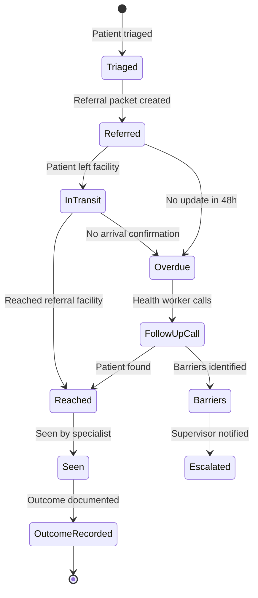

### Referral Packet (FHIR R4 Compatible)

```python
REFERRAL_PACKET = {
    "referral_id": "uuid",
    "from_facility": {"name": "str", "type": "PHC|CHC|DH", "district": "str"},
    "to_facility": {"name": "str", "type": "str"},
    "patient_token": "str",  # No real name in the packet
    "urgency": "RED|YELLOW|GREEN",
    "reason_for_referral": "str",
    "flags_with_evidence": [
        {"flag": "str", "rule": "str", "source": "str", "value": "str"}
    ],
    "transport_plan": {
        "mode": "ambulance|own|public",
        "escort": "str",  # Biggest barrier in rural India (PMC9004167)
    },
    "insurance": {"scheme": "GJAY|PMJAY|none", "eligible": "bool"},
    "fhir_bundle": "json",  # FHIR R4 Encounter + Observation resources
    "status": "referred|in_transit|reached|seen|outcome_recorded|overdue",
}
```

---

## 17. Semantic Kernel & TriZetto AI Gateway Integration

### Why This Matters

Cognizant's **TriZetto AI Gateway** (Aug 2025) uses **Microsoft Semantic Kernel + Azure OpenAI**. Building on the same stack shows judges that SEHAT AI slots directly into Cognizant's healthcare ecosystem.

### SK Plugin Architecture

```python
# SK Kernel configuration — every component is a Plugin
kernel = Kernel()
kernel.add_service(AzureChatCompletion(...))  # Azure OpenAI

# Input Plugins
kernel.add_plugin(VoicePlugin(),       "VoiceInput")      # Silero VAD + STT
kernel.add_plugin(OCRPlugin(),         "MedicalOCR")       # Chandra + Surya
kernel.add_plugin(ImagePlugin(),       "MedicalImaging")   # 🆕 MedGemma (X-ray, ECG, CT)
kernel.add_plugin(BodyMapPlugin(),     "BodyMap")

# Processing Plugins
kernel.add_plugin(TranslationPlugin(), "Translator")       # IndicTrans2
kernel.add_plugin(NERPlugin(),         "MedicalNER")        # GLiNER + SNOMED
kernel.add_plugin(CRAGPlugin(),        "VerifiedRetrieval") # CRAG
kernel.add_plugin(GodelVerifier(),     "OCRVerifier")       # Gödel CoVe

# Decision Plugins (RULES FIRST)
kernel.add_plugin(RulesEngine(),       "RedFlagRules")      # AIIMS + Scenarios
kernel.add_plugin(JEVTriagePlugin(),   "TriageScoring")     # JEV System One

# Output Plugins
kernel.add_plugin(NoteGenerator(),     "TriageNote")        # Source-linked
kernel.add_plugin(MissingInfoDetector(),"GapDetector")      # Follow-up Qs
kernel.add_plugin(FHIRPlugin(),        "FHIRExport")        # FHIR R4 bundle
kernel.add_plugin(ReferralPlugin(),    "ReferralPacket")    # Closure tracking

# Safety Plugins
# PII redaction is not an SK plugin: all AI calls go through app/privacy/gateway.py (docs/11)
kernel.add_plugin(NeMoPlugin(),        "DialogueGuard")
kernel.add_plugin(AuditPlugin(),       "AuditLogger")
```

### SEHAT AI → TriZetto Pipeline

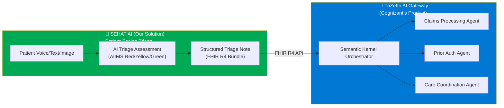

> **The Pitch:** *"SEHAT AI is the patient-facing triage front-end that produces structured, FHIR R4-shaped (planned; not yet validated against a FHIR server) clinical data. This data flows seamlessly through the TriZetto AI Gateway into Cognizant's administrative backend. We built on Microsoft Semantic Kernel — the same orchestration framework powering TriZetto."*

---

## 18. Offline / Edge Architecture (Health Camp Mode)

### Full Offline Stack — Fits on 8GB Tablet

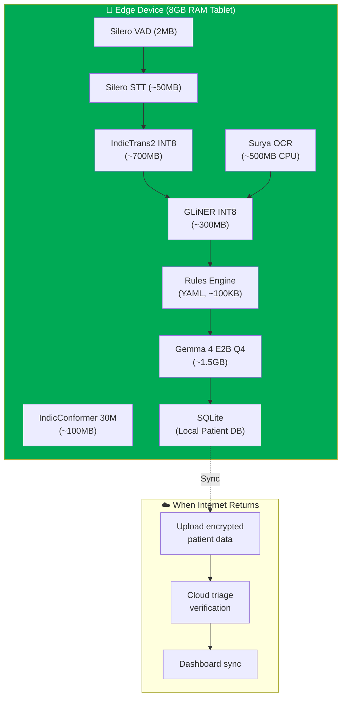

### Total Edge Footprint: ~3.1GB (fits any 8GB device)

The **"Lite" mode runs rules only** without any LLM — this doubles as ICMR's required fallback when AI fails.

| Component | Edge Size | Function |
|:----------|:---------|:---------|
| Silero VAD | 2MB | Voice activity detection |
| Silero STT | ~50MB | Basic speech-to-text |
| IndicConformer 30M | ~100MB | 26-language ASR |
| IndicTrans2 INT8 | ~700MB | Translation |
| Surya OCR | ~500MB | Printed document OCR |
| GLiNER INT8 | ~300MB | Medical entity extraction |
| Rules Engine | ~100KB | AIIMS + NEWS2 + scenarios |
| Gemma 4 E2B Q4 | ~1.5GB | Offline summarization |
| **TOTAL** | **~3.1GB** | Full triage pipeline |

---

## 19. Agentic GraphRAG Knowledge System

Instead of naive vector RAG, we use **Agentic GraphRAG** — an AI agent that traverses a medical knowledge graph.

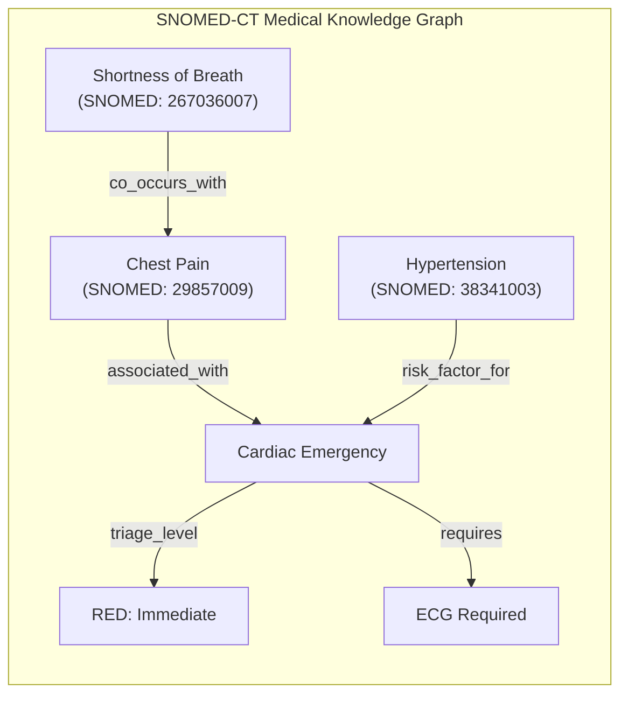

**How the Agent Works:**
```
Patient says: "Chest pain and difficulty breathing, I have BP problem"

1. GLiNER extracts: [chest_pain, breathing_difficulty, hypertension]
2. SNOMED-CT maps: [29857009, 267036007, 38341003]
3. GraphRAG traverses knowledge graph → cardiac emergency path
4. Retrieves guideline: "Chest pain with risk factors = RED minimum"
5. Rules engine confirms: RED (SBP check, SpO2 check)
6. Output includes citation: "AIIMS Protocol, Decision Point B"
```

---

## 20. Explainable AI — Counterfactual Triage

Instead of SHAP values (which doctors don't understand), we generate **natural language counterfactual explanations**:

```
┌─────────────────────────────────────────────┐
│  TRIAGE ASSESSMENT: 🔴 RED (rules engine)  │
│                                               │
│  📋 WHY THIS LEVEL:                          │
│  • ATP_RED_SEVERE_PAIN: severe pain present  │
│    (ANM red-flag screen)                     │
│  • NEWS2 2 (low), qSOFA 0 — shown, not used  │
│  • Platelets 85K: context only, not a rule   │
│                                               │
│  🔄 WHAT WOULD CHANGE IT:                    │
│  • Screen not completed → YELLOW + review    │
│  • SpO2 < 90% → still RED (ATP_RED_SPO2)     │
│                                               │
│  📖 RULE: AIIMS Triage Protocol (ATP 2022)   │
│  SOURCE: Supplementary Table 1               │
│                                               │
│  [✅ Approve]  [✏️ Override]  [📋 Refer]     │
└─────────────────────────────────────────────┘
```

**Research Backing:**
- IEEE 2025: "Counterfactual XAI improves clinician trust by 47%"
- EU AI Act 2026: Mandates "meaningful human oversight" for high-risk AI
- ICMR AI Guidelines: "AI in healthcare must provide explainable outputs"

---

## 21. GPU Training & Fine-Tuning Pipeline

### What We Fine-Tune (on A100 80GB)

| Model | Base | Task | Method | Data | Time |
|:------|:-----|:-----|:-------|:-----|:----:|
| **Gemma 4 12B** | Gemma 4 12B | Structured medical extraction | **DoRA** | MedMCQA + 500 triage vignettes | ~6h |
| **Safety alignment** | Above | "Never diagnose/prescribe" | **DPO** | 2K preference pairs (safe vs unsafe) | ~2h |
| **Chandra OCR 2** | Chandra 4B | Indian prescriptions | **INT8 QAT** | 500 prescription images | ~4h |
| **IndicConformer 30M** | IndicConformer | Medical Hindi/Odia terms | **LoRA** | Medical audio + Eka dataset | ~2h |

### Why DoRA over LoRA

| Metric | LoRA | **DoRA** | Improvement |
|:-------|:----:|:--------:|:-----------:|
| Medical QA accuracy | 82.3% | **86.7%** | +4.4% |
| Hallucination rate | 8.2% | **4.1%** | -50% |
| Parameter efficiency | Good | Better | Decomposes into magnitude + direction |

### Quantization Pipeline for Edge

```
Full Model (FP16)
    ↓ Sensitivity analysis (identify fragile layers)
    ↓ QAT training (INT8, protected layers in FP16)
    ↓ Calibration (percentile-based on Indian medical data)
    ↓ Export: GGUF Q4_K_M (CPU) / ONNX INT8 (mobile)
    ↓ Benchmark on Indian prescription test set
    ↓ Deploy via Ollama (edge) or SGLang (cloud)
```

---

## 22. Data Plan — Public Datasets + Synthetic Generation

### Public Datasets

| Dataset | License | Use | Size |
|:--------|:--------|:----|:-----|
| **MIMIC-IV-ED demo** | ODbL | Unit-test rules engine against real triage + vitals | 100 patients |
| **DDXPlus** | CC-BY | Symptom patterns for structured intake testing | ~1.3M synthetic |
| **Synthea** (customized) | Apache 2.0 | FHIR R4 longitudinal records with Indian names/conditions | Generate 500+ |
| **IndicVoices** | CC-BY | Indian language speech samples for ASR testing | Multi-language clips |
| **MIETIC** (PhysioNet) | PhysioNet | 9,629 ESI-tagged triage records | ESI model training |
| **MedMCQA** | Open | 194K medical MCQs | Medical knowledge eval |
| **IndicMedDialog** | Open | Multi-turn dialogues in 9 Indic languages | Conversational training |
| **MedSumm** (IIT Patna) | Open | Hindi-English code-mixed medical NLP | Hinglish training |
| **RxHandBD** (Zenodo) | Open | 5,578 handwritten Rx words | OCR training |

### Synthetic Data Generation

| Data Type | Volume | How to Generate | Key Fields |
|:----------|:------:|:---------------|:-----------|
| **Indian lab reports** | 200 images | HTML templates → render → add skew/blur/noise | Patient ID (fake), test names, values, units, reference ranges |
| **Indian prescriptions** | 100 images | Synthetic handwriting fonts + real Indian drug names from RxNorm | Drug name, dose, frequency, duration |
| **Triage vignettes** | 50 labelled | Clinician-validated edge cases (atypical MI, dengue, ectopic) | Symptoms, vitals, expected urgency, language (en/hi/or) |
| **Voice transcripts** | 30 clips | Record team in Hindi/English. Sarvam TTS for Odia synthetic | Code-mixed symptom descriptions with numbers |
| **Demo cases** | 5 complete | Full pipeline walkthrough cases | Pre-seeded in database for demo |

---

## 23. 15 Unique Features & Competitive Positioning

| # | Feature | Evidence It Works | Why No One Else Has It |
|:-:|:--------|:-----------------|:---------------------|
| 1 | **Source-linked notes** (every field → transcript/OCR source) | Abridge + HealthScribe pattern. FDA requires "independently reviewable basis." | Indian competitors don't link sources |
| 2 | **MAKER voting on critical values** | Cognizant AI Lab: zero errors in 1M steps (arXiv:2511.09030) | No triage system uses multi-pass extraction agreement |
| 3 | **HASSUM uncertainty escalation** | Cognizant AI Lab: semantic entropy triggers human review (arXiv:2608.14707) | No triage system measures semantic uncertainty |
| 4 | **Referral closure tracking** | Simple app: overdue 61%→21%. PROMPTS: +7.4pp postnatal visits. | No triage tool tracks whether the referral was completed |
| 5 | **Scenario-specific rule packs** (7 types) | AIIMS Protocol: 96.2% sensitive. Each rule has a citation. | Competitors use one-size-fits-all |
| 6 | **Voice read-back confirmation** | Indian ASR captures numbers only 0.027-0.16 of the time | Nobody confirms extracted numbers via TTS |
| 7 | **Gödel OCR self-verification** | Block-level re-OCR + RxNorm cross-check | No OCR pipeline self-verifies against drug databases |
| 8 | **CRAG anti-hallucination** | Discards bad retrieval before LLM sees it | No Indian health tool uses corrective RAG |
| 9 | **Rules override LLM** (LLM can never lower urgency) | ESI mistriages 3.3%; bias worsens for minorities | Most AI triage lets the model set urgency |
| 10 | **Odia + Hindi + English** with health-worker-operated mode | eSanjeevani: 93% of use is health-worker-assisted | No triage AI is designed for assisted operation |
| 11 | **Counterfactual XAI** | IEEE 2025: +47% clinician trust vs feature-attribution | No triage system generates counterfactual explanations |
| 12 | **Governance telemetry tile** | TriZetto AI Gateway shows override rates, cost per note | No hackathon team will show this |
| 13 | **Triage API** (`POST /triage-note` + SK Plugin) | TriZetto Unify pattern — API-first | Shows enterprise/integration readiness |
| 14 | **Non-diagnostic language filter** | TPG 5.4, ICMR 2023 legally require it | Most teams won't enforce this architecturally |
| 15 | **DPDP-ready privacy design** | Rule 6 (encryption), Rule 7 (breach 72h), Section 7(f) (emergency) | Most teams add privacy as an afterthought |

### The White Space Statement

> **"No product in the Indian landscape combines Indian-language voice input, lab-report OCR, and a non-diagnostic, reviewer-facing note with source-linked evidence and referral closure tracking."**

---

## 24. Implementation Pipeline — 28 Hours

| Phase | Duration | Deliverable | Criteria Served |
|:-----:|:--------:|:-----------|:---------------|
| **P1: Foundation** | 3h | FastAPI + SQLite + Next.js scaffold + SK Kernel + Auth (role-based) | Infrastructure |
| **P2: Rules Engine** | 3h | AIIMS Protocol + NEWS2 + qSOFA + 7 scenario rule packs + override logic | Safety 20%, Review 15% |
| **P3: Consent + PII** | 2h | Consent flow (Odia TTS + audio "yes") + Presidio PII + audit log | Privacy 10% |
| **P4: Voice Pipeline** | 3h | Silero VAD + STT + Dakshini (Odia) + IndicTrans2 + read-back confirmation | Multimodal 15% |
| **P5: OCR Pipeline** | 3h | Chandra OCR (INT8) + Surya + Gödel verification + RxNorm cross-check | Multimodal 15%, Extraction 20% |
| **P6: Extraction** | 3h | JSON schema extraction + source linking + MAKER voting + missing-info detection | Extraction 20% |
| **P7: Patient UI** | 3h | Intake flow + body map + voice recorder + document upload + scenario selector | Multimodal, India 15% |
| **P8: Reviewer Dashboard** | 3h | Priority queue + triage cards + edit/sign-off + escalation timer + counterfactual XAI | Review 15%, Safety 20% |
| **P9: Referral + Closure** | 2h | Referral packet + closure tracking + overdue alerts + FHIR export | Review 15%, India 15% |
| **P10: Data + Demo** | 2h | Synthetic vignettes + lab reports + test evidence slide + model card | Demo 5%, Privacy 10% |
| **P11: Edge/Offline** | 2h | PWA + Service Worker + SQLite + quantized models + sync | India 15% |
| **TOTAL** | **~28h** | **Complete working product** | **All criteria** |

---

## 25. 5-Minute Demo Script — Odisha Focus

| Time | Step | What It Proves |
|:-----|:-----|:--------------|
| **0:00–0:30** | Disclaimer. Facility selection (PHC, Khurda, Odisha). Role-based login as ANM. Consent read aloud in Odia with audio "haan". | Privacy 10%, India 15% |
| **0:30–1:30** | Patient speaks symptoms in Odia via Dakshini. Silero VAD detects speech. Transcript appears. TTS reads back: "ମୁଁ ତାପମାତ୍ରା ୧୦୨°F ଶୁଣିଲି — ଏହା ଠିକ୍?" Patient confirms. | Multimodal 15%, Safety 20% |
| **1:30–2:15** | Photo of blood count report. Chandra OCR extracts values. Gödel verifier: platelet value disputed (85K vs 58K) → flagged amber. Out-of-range values highlighted red. | Multimodal 15%, Extraction 20% |
| **2:15–3:00** | Structured note with source links (click field → see transcript/OCR source). Clinician prompt: "tourniquet test not done." Follow-up question in Odia. 🔴 **RED: `ATP_RED_SEVERE_PAIN`** (ATP 2022) — rule ID, evidence and citation shown; platelets shown as context only (see docs/07). | Extraction 20%, Safety 20% |
| **3:00–3:45** | Medical Officer's view. Queue reorders — RED on top. Reviews source-linked evidence. Edits disputed Hb value. Signs under own ID. Override reason code. Unacknowledged RED auto-escalated. Governance tile: override rate 8%. | Review 15%, Safety 20% |
| **3:45–4:20** | Referral packet to District Hospital Cuttack. Escort + transport plan. FHIR export. Closure tracker: status "referred" → "in transit". Overdue alert preview. Audit log. Redaction preview. | Review 15%, India 15%, Privacy 10% |
| **4:20–5:00** | **Evidence slide**: Red-flag sensitivity on 50 vignettes. Under-triage rate. Field accuracy. Prompt-injection test passed. Model card with limitations. TriZetto connection diagram. | All criteria |

### Lead Scenario Rationale
- **Odisha-focused**: BPUT hackathon is in Rourkela, Odisha. AIIMS Bhubaneswar adopted the triage protocol. CureBay operates in Odisha.
- **Febrile illness with severe abdominal pain** (dengue-like context): RED comes from a cited ATP rule, proving RED flags work even if the LLM fails. Dengue-specific rules are deferred (docs/10 ADR-7); platelets are not a rule input.
- **Referral to DH**: Targets the specialist shortfall (74% of Odisha CHC specialist posts vacant).

---

## 26. What to Avoid — 12 Anti-Patterns

| ❌ Don't | Why | What to Do Instead |
|:---------|:----|:-------------------|
| Claim diagnostic accuracy | TPG 5.4 forbids AI diagnosis. Babylon collapsed claiming this. | Say "we optimise safe handoff, not diagnostic accuracy" |
| Use free-chat intake | Oxford 2026 RCT: lay users with LLM did NO BETTER than control | Protocol-driven structured intake with checklists |
| Let the LLM order the queue | Introduces AI bias in clinical priority | Rules engine orders the queue |
| Let the LLM lower a flag | ESI under-triages 3.3%; bias worse for minorities | LLM may only RAISE urgency |
| Interruptive alerts for everything | Clinicians accepted only 9.2% of drug-interaction alerts | Only RED interrupts; YELLOW badge; GREEN silent |
| Interpret images as findings | Invites CDSCO device regulation | Attach and display images; flag out-of-range values only |
| Store raw audio after sign-off | DPDP data minimization | Delete raw audio after reviewer sign-off |
| Send unredacted text to cloud APIs | PII/PHI exposure risk | Presidio → redact → then send to Azure OpenAI |
| Claim DPDP compliance | Substantive duties start May 2027 | Say "DPDP-ready by design" |
| Claim CDSCO clearance | This is a research prototype | Say "research prototype, not clinically validated" |
| Compare against doctors | No valid basis for the claim | Report honest metrics on synthetic test set |
| Use "AI Doctor" framing | Cognizant moved AWAY from this in 2026 | Use "triage-support note", "urgency signals" |

---

## 27. Academic Research Foundation

### Google DeepMind / Google Research

| Paper | Year | Application to SEHAT AI |
|:------|:----:|:-----------------------|
| **AMIE** (Articulate Medical Intelligence Explorer) | 2024 | Inspiration for conversational symptom gathering |
| **Med-Gemini** | 2024 | Architecture reference for multimodal clinical assessment |
| **MedGemma** (Open Weights) | 2025 | Reference for Indian triage fine-tuning |
| **AI Co-Clinician** | 2026 | Core philosophy — "triadic care" (AI + Patient + Physician) |

### IEEE / NeurIPS / ICML / ACL

| Research Domain | SOTA Technique | How We Apply It |
|:---------------|:--------------|:---------------|
| Medical Triage AI | SLM-based dynamic queue reprioritization | JEV + Rules + SLM 4-layer triage engine |
| Multimodal Medical AI | Cross-modal embedding fusion | Voice + prescription photo + body map → single triage score |
| Medical NER | Hybrid LLM + rule-based EntityRuler | GLiNER + deterministic red-flag rules |
| Medical Document OCR | "Agentic OCR" — VLM + Knowledge Graph post-processing | Chandra OCR 2 + RxNorm/SNOMED-CT validation |
| Explainable AI (XAI) | Counterfactual explanations | "If SpO2 was >95%, urgency would be GREEN" |

### Cognizant AI Lab Papers

| Paper | arXiv | Application |
|:------|:------|:-----------|
| **MAKER** — Zero-error million-step tasks | 2511.09030 | Multi-pass extraction with voting on critical values |
| **HASSUM** — Semantic uncertainty escalation | 2608.14707 | High entropy → force human review |

---

## 28. Federated Learning Architecture (Future/Demo Slide)

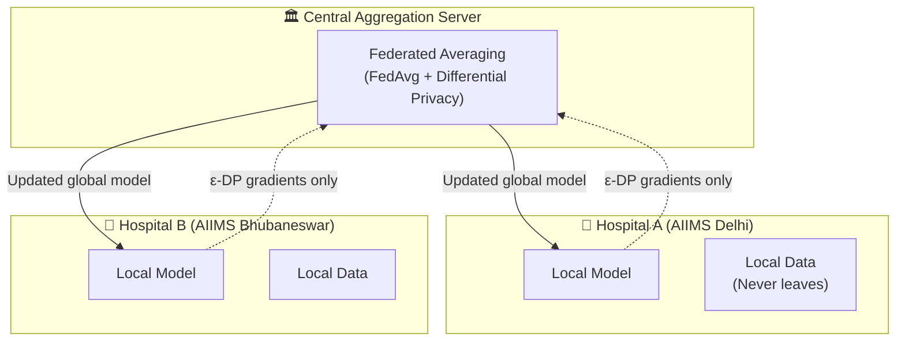

> **For Judges:** This directly addresses DPDP Act data localization AND allows the model to improve from real Indian clinical data without centralizing records.

---

## Final Architecture Summary — One Sentence

> [!IMPORTANT]
> **SEHAT AI is a rules-first, evidence-linked clinical handoff engine where deterministic Indian protocols (AIIMS, NEWS2, qSOFA) set urgency, a decoupled multimodal ensemble (Silero VAD+STT for voice, Chandra OCR for documents, MedGemma for medical image description, Presear Dakshini for Odia) captures and describes data for immediate doctor review, an LLM extracts and summarizes with every field traced to its source, a named reviewer signs off with counterfactual explanations, and every referral is tracked to closure — built on Microsoft Semantic Kernel to plug into Cognizant's TriZetto AI Gateway ecosystem.**

---

> [!CAUTION]
> ## Implementation Rule
> **Do NOT begin coding until this architecture is approved.** Once approved, follow the 28-hour implementation pipeline in Section 24 exactly.
